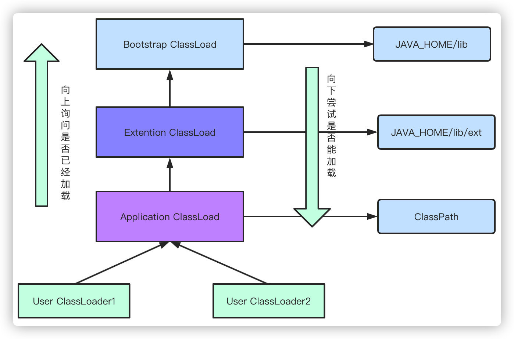
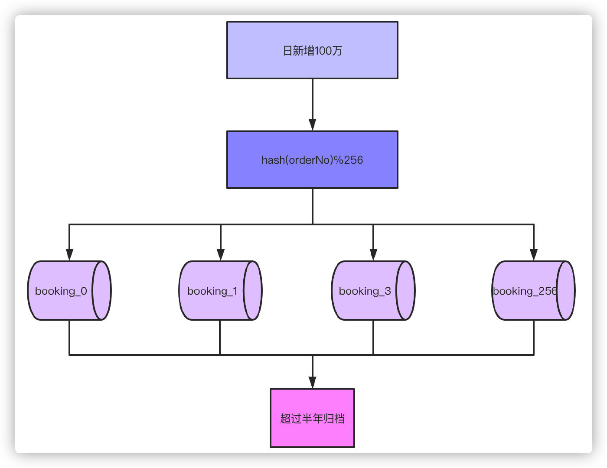

## 前言

文档来自微信公众号 艾小仙


## MySQL

### 能说下 myisam 和 innodb 的区别吗？

myisam 引擎是5.1版本之前的默认引擎，⽀持全文检索、压缩、空间函数等，但是不⽀持事务和行级锁，所以⼀般用于有大量查询少量插入的场景来使用，而且 myisam 不⽀持外键，并且索引和数据是分开存储的。

innodb 是基于聚簇索引建⽴的，和 myisam 相反它⽀持事务、外键，并且通过MVCC来⽀持高并发，索引和数据存储在⼀起。


### 说下 MySQL 的索引有哪些吧，聚簇和非聚簇索引又是什说下MySQL的索引有哪些吧，聚簇和非聚簇索引又是什么？

索引按照数据结构来说主要包含 B+ 树和 Hash 索引。

假设我们有张表，结构如下：

```mysql
CREATE TABLE USER (
    id INT ( 11 ) NOT NULL,
    age INT ( 11 ) NOT NULL,
    PRIMARY KEY ( id ),
    KEY ( age ) 
);
```

B+树是左小右大的顺序存储结构，节点只包含id索引列，而叶子节点包含索引列和数据，这种数据和索引在⼀起存储的索引方式叫做聚簇索引，⼀张表只能有⼀个聚簇索引。假设没有定义主键，InnoDB 会选择⼀个唯⼀的非空索引代替，如果没有的话则会隐式定义⼀个主键作为聚簇索引。


这是主键聚簇索引存储的结构，那么非聚簇索引的结构是什么样子呢？非聚簇索引(二级索引)保存的是主键id值，这⼀点和myisam保存的是数据地址是不同的。


最终，我们⼀张图看看 InnoDB 和 Myisam 聚簇和非聚簇索引的区别


### 那你知道什么是覆盖索引和回表吗？

覆盖索引指的是在⼀次查询中，如果⼀个索引包含或者说覆盖所有需要查询的字段的值，我们就称之为覆盖索引，而不再需要回表查询。

而要确定⼀个查询是否是覆盖索引，我们只需要 explain sql 语句看Extra的结果是否是“Using index”即可。

以上面的user表来举例，我们再增加⼀个 name 字段，然后做⼀些查询试试。

```sql
explain select * from user where age=1; //如果新增了name字段，查询的name无法从索引数据获取

explain select id,age from user where age=1; //可以直接从索引获取
```


### 锁的类型有哪些呢

MySQL锁分为**共享锁**和**排他锁**，也叫做读锁和写锁。

读锁是共享的，可以通过lock in share mode实现，这时候只能读不能写。

写锁是排他的，它会阻塞其他的写锁和读锁。从颗粒度来区分，可以分为**表锁**和**行锁**两种。

表锁会锁定整张表并且阻塞其他用户对该表的所有读写操作，比如alter修改表结构的时候会锁表。

行锁又可以分为**乐观锁**和**悲观锁**，悲观锁可以通过for update实现，乐观锁则通过版本号实现。


### 你能说下事务的基本特性和隔离级别吗？

事务基本特性ACID分别是：

**原子性**指的是⼀个事务中的操作要么全部成功，要么全部失败。

**⼀致性**指的是数据库总是从⼀个⼀致性的状态转换到另外⼀个⼀致性的状态。比如A转账给B100块钱，假设中间sql执行过程中系统崩溃A也不会损失100块，因为事务没有提交，修改也就不会保存到数据库。

**隔离性**指的是⼀个事务的修改在最终提交前，对其他事务是不可见的。

**持久性**指的是⼀旦事务提交，所做的修改就会永久保存到数据库中。

而隔离性有4个隔离级别，分别是：

**read uncommit** 读未提交，可能会读到其他事务未提交的数据，也叫做脏读。

用户本来应该读取到id=1的用户age应该是10，结果读取到了其他事务还没有提交的事务，结果读取结果age=20，这就是脏读。


**read commit** 读已提交，两次读取结果不⼀致，叫做不可重复读。

不可重复读解决了脏读的问题，他只会读取已经提交的事务。

用户开启事务读取id=1用户，查询到age=10，再次读取发现结果=20，在同⼀个事务里同⼀个查询读取到不同的结果叫做不可重复读。


**repeatable read** 可重复读，这是MySQL的默认级别，就是每次读取结果都⼀样，但是有可能产生幻读。

**serializable** 串行，⼀般是不会使用的，他会给每⼀行读取的数据加锁，会导致大量超时和锁竞争的问题。


### 那ACID靠什么保证的呢？

A原子性由undo log日志保证，它记录了需要回滚的日志信息，事务回滚时撤销已经执行成功的sql

C⼀致性⼀般由代码层面来保证

I隔离性由MVCC来保证

D持久性由内存+redo log来保证，MySQL修改数据同时在内存和redo log记录这次操作，事务提交的时候通过redo log刷盘，宕机的时候可以从redo log恢复


### 那你说说什么是幻读，什么是MVCC？

要说幻读，⾸先要了解MVCC，MVCC叫做多版本并发控制，实际上就是保存了数据在某个时间节点的快照。

我们每行数实际上隐藏了两列，创建版本号，过期(删除)版本号，每开始⼀个新的事务，版本号都会⾃动递增。

还是拿上面的user表举例子，假设我们插入两条数据，他们实际上应该长这样。

| **id** | **name** | **create_version** | **delete_version** |
| ------ | -------- | ------------------ | ------------------ |
| 1      | 张三     | 1                  |                    |
| 2      | 李四     | 2                  |                    |

这时候假设小明去执行查询，此时current_version=3

```mysql
select * from user where id<=3;
```

同时，小红在这时候开启事务去修改id=1的记录，current_version=4

```mysql
 update user set name='张三三' where id=1;
```

执行成功后的结果是这样的

| **id** | **name** | **create_version** | **delete_version** |
| ------ | -------- | ------------------ | ------------------ |
| 1      | 张三     | 1                  |                    |
| 2      | 李四     | 2                  |                    |
| 1      | 张三三   | 4                  |                    |

如果这时候还有小⿊在删除id=2的数据，current_version=5，执行后结果是这样的。

| **id** | **name** | **create_version** | **delete_version** |
| ------ | -------- | ------------------ | ------------------ |
| 1      | 张三     | 1                  |                    |
| 2      | 李四     | 2                  | 5                  |
| 1      | 张三三   | 4                  |                    |

由于MVCC的原理是查找创建版本小于或等于当前事务版本，删除版本为空或者大于当前事务版本，小明的真实的查询应该是这样

```mysql
select * from user where id<=3 and create_version<=3 and (delete_version>3 or delete_version is null);
```

所以小明最后查询到的id=1的名字还是'张三'，并且id=2的记录也能查询到。这样做是**为了保证事务读取的数据是在事务开始前就已经存在的，要么是事务自己插入或者修改的**。

明白MVCC原理，我们来说什么是幻读就简单多了。举⼀个常见的场景，用户注册时，我们先查询用户名是否存在，不存在就插入，假定用户名是唯⼀索引。

1. 小明开启事务 current_version=6 查询名字为'王五'的记录，发现不存在。

2. 小红开启事务 current_version=7 插入⼀条数据，结果是这样：

   | **id** | **name** | **create_version** | **delete_version** |
   | ------ | -------- | ------------------ | ------------------ |
   | 1      | 张三     | 1                  |                    |
   | 2      | 李四     | 2                  |                    |
   | 1      | 王五     | 7                  |                    |

3. 小明执行插入名字'王五'的记录，发现唯⼀索引冲突，无法插入，这就是幻读。


### 那你知道什么是间隙锁吗？

间隙锁是可重复读级别下才会有的锁，结合MVCC和间隙锁可以解决幻读的问题。我们还是以user举例，假设现在user表有几条记录

| id   | age  |
| ---- | ---- |
| 1    | 10   |
| 2    | 20   |
| 3    | 30   |

当我们执行：

```mysql
begin;
select * from user where age=20 for update;

begin;
insert into user(age) values(10); #成功
insert into user(age) values(11); #失败
insert into user(age) values(20); #失败
insert into user(age) values(21); #失败
insert into user(age) values(30); #失败
```

1只有10可以插入成功，那么因为表的间隙MySQL⾃动帮我们生成了区间(左开右闭)

```mysql
(negative infinity，10],(10,20],(20,30],(30,positive infinity)
```

由于20存在记录，所以(10,20]，(20,30]区间都被锁定了无法插入、删除。

如果查询21呢？就会根据21定位到(20,30)的区间(都是开区间)。

需要注意的是唯⼀索引是不会有间隙索引的。


### 你们数据量级多大？分库分表怎么做的？

⾸先分库分表分为垂直和水平两个方式，⼀般来说我们拆分的顺序是先垂直后水平。

#### 垂直分库

基于现在微服务拆分来说，都是已经做到了垂直分库了


#### 垂直分表

如果表字段比较多，将不常用的、数据较大的等等做拆分


#### 水平分表

⾸先根据业务场景来决定使用什么字段作为分表字段(sharding_key)，比如我们现在日订单1000万，我们大部分的场景来源于C端，我们可以用user_id作为sharding_key，数据查询⽀持到最近3个⽉的订单，超过3个⽉的做归档处理，那么3个⽉的数据量就是9亿，可以分1024张表，那么每张表的数据大概就在100万左右。

比如用户id为100，那我们都经过hash(100)，然后对1024取模，就可以落到对应的表上了。


### 那分表后的ID怎么保证唯⼀性的呢？

因为我们主键默认都是⾃增的，那么分表之后的主键在不同表就肯定会有冲突了。有几个办法考虑：

1. 设定步长，比如1-1024张表我们设定1024的基础步长，这样主键落到不同的表就不会冲突了。

2. 分布式ID，自己实现⼀套分布式ID生成算法或者使用开源的比如雪花算法这种

3. 分表后不使用主键作为查询依据，而是每张表单独新增⼀个字段作为唯⼀主键使用，比如订单表订

   单号是唯⼀的，不管最终落在哪张表都基于订单号作为查询依据，更新也⼀样。


### 分表后非 sharding_key的查询怎么处理呢？

1. 可以做⼀个mapping表，比如这时候商家要查询订单列表怎么办呢？不带user_id查询的话你总不能扫全表吧？所以我们可以做⼀个映射关系表，保存商家和用户的关系，查询的时候先通过商家查询到用户列表，再通过user_id去查询。
2. 打宽表，⼀般而⾔，商户端对数据实时性要求并不是很高，比如查询订单列表，可以把订单表同步到离线（实时）数仓，再基于数仓去做成⼀张宽表，再基于其他如es提供查询服务。
3. 数据量不是很大的话，比如后台的⼀些查询之类的，也可以通过多线程扫表，然后再聚合结果的方式来做。或者异步的形式也是可以的。

```java
List<Callable<List<User>>> taskList = Lists.newArrayList();
for (int shardingIndex = 0; shardingIndex < 1024; shardingIndex++) {
    taskList.add(() ->
                 (userMapper.getProcessingAccountList(shardingIndex)));
}
List<ThirdAccountInfo> list = null;
try {
    list = taskExecutor.executeTask(taskList);
} catch (Exception e) {
    //do something
}
public class TaskExecutor {
    public <T> List<T> executeTask(Collection<? extends Callable<T>>
                                   tasks) throws Exception {
        List<T> result = Lists.newArrayList();
        List<Future<T>> futures = ExecutorUtil.invokeAll(tasks);
        for (Future<T> future : futures) {
            result.add(future.get());
        }
        return result;
    }
}
```


### 说说 MySQL 主从同步怎么做的吧？

⾸先先了解MySQL主从同步的原理

1. master提交完事务后，写入binlog
2. slave连接到master，获取binlog
3. master创建dump线程，推送binglog到slave
4. slave启动⼀个IO线程读取同步过来的master的binlog，记录到relay log中继日志中
5. slave再开启⼀个sql线程读取relay log事件并在slave执行，完成同步
6. slave记录自己的binglog


由于MySQL默认的复制方式是异步的，主库把日志发送给从库后不关心从库是否已经处理，这样会产生⼀个问题就是假设主库挂了，从库处理失败了，这时候从库升为主库后，日志就丢失了。由此产生两个概念。

**全同步复制**

主库写入binlog后强制同步日志到从库，所有的从库都执行完成后才返回给客户端，但是很显然这个方式的话性能会受到严重影响。

**半同步复制**

和全同步不同的是，半同步复制的逻辑是这样，从库写入日志成功后返回ACK确认给主库，主库收到⾄少⼀个从库的确认就认为写操作完成。

**那主从的延迟怎么解决呢？**

1. 针对特定的业务场景，读写请求都强制⾛主库
2. 读请求⾛从库，如果没有数据，去主库做二次查询


## Redis

### 说说 Redis 基本数据类型有哪些吧

1. 字符串：redis 没有直接使用C语⾔传统的字符串表示，而是自己实现的叫做简单动态字符串SDS的抽象类型。C语⾔的字符串不记录⾃身的长度信息，而SDS则保存了长度信息，这样将获取字符串长度的时间由O(N)降低到了O(1)，同时可以避免缓冲区溢出和减少修改字符串长度时所需的内存重分配次数。

2. 链表linkedlist：redis链表是⼀个双向无环链表结构，很多发布订阅、慢查询、监视器功能都是使用到了链表来实现，每个链表的节点由⼀个listNode结构来表示，每个节点都有指向前置节点和后置节点的指针，同时表头节点的前置和后置节点都指向NULL。

3. 字典hashtable：用于保存键值对的抽象数据结构。redis使用hash表作为底层实现，每个字典带有两个hash表，供平时使用和rehash时使用，hash表使用链地址法来解决键冲突，被分配到同⼀个索引位置的多个键值对会形成⼀个单向链表，在对hash表进行扩容或者缩容的时候，为了服务的可用性，rehash的过程不是⼀次性完成的，而是渐进式的。

4. 跳跃表skiplist：跳跃表是有序集合的底层实现之⼀，redis中在实现有序集合键和集群节点的内部结构中都是用到了跳跃表。redis跳跃表由zskiplist和zskiplistNode组成，zskiplist用于保存跳跃表信息（表头、表尾节点、长度等），zskiplistNode用于表示表跳跃节点，每个跳跃表的层高都是1-32的随机数，在同⼀个跳跃表中，多个节点可以包含相同的分值，但是每个节点的成员对象必须是唯⼀的，节点按照分值大小排序，如果分值相同，则按照成员对象的大小排序。

5. 整数集合intset：用于保存整数值的集合抽象数据结构，不会出现重复元素，底层实现为数组。

6. 压缩列表ziplist：压缩列表是为节约内存而开发的顺序性数据结构，他可以包含多个节点，每个节点可以保存⼀个字节数组或者整数值。


基于这些基础的数据结构，redis封装了自己的对象系统，包含字符串对象string、列表对象list、哈希对象hash、集合对象set、有序集合对象zset，每种对象都用到了⾄少⼀种基础的数据结构。

redis通过encoding属性设置对象的编码形式来提升灵活性和效率，基于不同的场景redis会⾃动做出优化。不同对象的编码如下：

1. 字符串对象string：int整数、embstr编码的简单动态字符串、raw简单动态字符串

2. 列表对象list：ziplist、linkedlist

3. 哈希对象hash：ziplist、hashtable

4. 集合对象set：intset、hashtable

5. 有序集合对象zset：ziplist、skiplist


### Redis 为什么快呢？

redis的速度非常的快，单机的redis就可以⽀撑每秒10几万的并发，相对于MySQL来说，性能是MySQL的几⼗倍。速度快的原因主要有几点：

1. 完全基于内存操作

2. C语⾔实现，优化过的数据结构，基于几种基础的数据结构，redis做了大量的优化，性能极高

3. 使用单线程，无上下文的切换成本

4. 基于非阻塞的IO多路复用机制


### 那为什么 Redis6.0 之后又改用多线程呢?

redis使用多线程并非是完全摒弃单线程，redis还是使用单线程模型来处理客户端的请求，只是使用多线程来处理数据的读写和协议解析，执行命令还是使用单线程。

这样做的目的是因为redis的性能瓶颈在于网络IO而非CPU，使用多线程能提升IO读写的效率，从而整体提高redis的性能。

(见网络篇下单线程Reactor模型)


### 知道什么是热 key 吗？热 key 问题怎么解决？

所谓热key问题就是，突然有几⼗万的请求去访问redis上的某个特定key，那么这样会造成流量过于集中，达到物理网卡上限，从而导致这台redis的服务器宕机引发雪崩。


针对热key的解决方案：

1. 提前把热key打散到不同的服务器，降低压⼒

2. 加入二级缓存，提前加载热key数据到内存中，如果redis宕机，⾛内存查询


### 什么是缓存击穿、缓存穿透、缓存雪崩？

#### 缓存击穿

缓存击穿的概念就是单个key并发访问过高，过期时导致所有请求直接打到db上，这个和热key的问题比较类似，只是说的点在于过期导致请求全部打到DB上而已。

解决方案：

1. 加锁更新，比如请求查询A，发现缓存中没有，对A这个key加锁，同时去数据库查询数据，写入缓存，再返回给用户，这样后面的请求就可以从缓存中拿到数据了。

2. 将过期时间组合写在value中，通过异步的方式不断的刷新过期时间，防⽌此类现象。


#### 缓存穿透

缓存穿透是指查询不存在缓存中的数据，每次请求都会打到DB，就像缓存不存在⼀样。


针对这个问题，加⼀层布隆过滤器。布隆过滤器的原理是在你存入数据的时候，会通过散列函数将它映射为⼀个位数组中的K个点，同时把他们置为1。

这样当用户再次来查询A，而A在布隆过滤器值为0，直接返回，就不会产生击穿请求打到DB了。显然，使用布隆过滤器之后会有⼀个问题就是误判，因为它本身是⼀个数组，可能会有多个值落到同⼀个位置，那么理论上来说只要我们的数组长度够长，误判的概率就会越低，这种问题就根据实际情况来就好了。


#### 缓存雪崩

当某⼀时刻发生大规模的缓存失效的情况，比如你的缓存服务宕机了，会有大量的请求进来直接打到DB上，这样可能导致整个系统的崩溃，称为雪崩。雪崩和击穿、热key的问题不太⼀样的是，他是指大规模的缓存都过期失效了。


针对雪崩几个解决方案：

1. 针对不同key设置不同的过期时间，避免同时过期

2. 限流，如果redis宕机，可以限流，避免同时刻大量请求打崩DB

3. 二级缓存，同热key的方案。


### Redis 的过期策略有哪些？

redis主要有2种过期删除策略

#### 惰性删除

惰性删除指的是当我们查询key的时候才对key进行检测，如果已经达到过期时间，则删除。显然，他有⼀个缺点就是如果这些过期的key没有被访问，那么他就⼀直无法被删除，而且⼀直占用内存。


#### 定期删除

定期删除指的是redis每隔⼀段时间对数据库做⼀次检查，删除里面的过期key。由于不可能对所有key去

做轮询来删除，所以redis会每次随机取⼀些key去做检查和删除。


### 那么 定期 + 惰性 都没有删除过期的 key 怎么办？

假设redis每次定期随机查询key的时候没有删掉，这些key也没有做查询的话，就会导致这些key⼀直保存在redis里面无法被删除。

Redis配置文件中可以设置maxmemory，内存的最大使用量，到达限度时会执行`内存淘汰机制`。

1. **volatile-lru：**从已设置过期时间的key中，移出最近最少使用的key进行淘汰

2. **volatile-ttl：**从已设置过期时间的key中，移出将要过期的key

3. **volatile-random：**从已设置过期时间的key中随机选择key淘汰

4. **allkeys-lru：**从key中选择最近最少使用的进行淘汰

5. **allkeys-random：**从key中随机选择key进行淘汰

6. **noeviction：**当内存达到阈值的时候，新写入操作报错，**默认**。


### 持久化方式有哪些？有什么区别？

redis持久化方案分为RDB和AOF两种。

#### RDB

RDB持久化可以手动执行也可以根据配置定期执行，它的作用是将某个时间点上的数据库状态保存到RDB文件中，RDB文件是⼀个压缩的二进制文件，通过它可以还原某个时刻数据库的状态。由于RDB文件是保存在硬盘上的，所以即使redis崩溃或者退出，只要RDB文件存在，就可以用它来恢复还原数据库的状态。

可以通过SAVE或者BGSAVE来生成RDB文件。

SAVE命令会阻塞redis进程，直到RDB文件生成完毕，在进程阻塞期间，redis不能处理任何命令请求，这显然是不合适的。

BGSAVE则是会fork出⼀个子进程，然后由子进程去负责生成RDB文件，⽗进程还可以继续处理命令请求，不会阻塞进程。

#### AOF

AOF和RDB不同，AOF是通过保存redis服务器所执行的写命令来记录数据库状态的。

AOF通过追加、写入、同步三个步骤来实现持久化机制。

1. 当AOF持久化处于激活状态，服务器执行完写命令之后，写命令将会被追加append到aof_buf缓冲区的末尾

2. 在服务器每结束⼀个事件循环之前，将会调用flushAppendOnlyFile函数决定是否要将aof_buf的内容保存到AOF文件中，可以通过配置appendfsync来决定。

```
always ##aof_buf内容写入并同步到AOF文件
everysec ##将aof_buf中内容写入到AOF文件，如果上次同步AOF文件时间距离现在超过1秒，则再
次对AOF文件进⾏同步
no ##将aof_buf内容写入AOF文件，但是并不对AOF文件进⾏同步，同步时间由操作系统决定
```

如果不设置，默认选项将会是everysec，因为always来说虽然最安全（只会丢失⼀次事件循环的写命令），但是性能较差，而everysec模式只不过会可能丢失1秒钟的数据，而no模式的效率和everysec相仿，但是会丢失上次同步AOF文件之后的所有写命令数据。


### 怎么实现 Redis 的高可用？

要想实现高可用，⼀台机器肯定是不够的，而redis要保证高可用，有2个可选方案。

#### 主从架构

主从模式是最简单的实现高可用的方案，核心就是主从同步。主从同步的原理如下：

1. slave发送sync命令到master

2. master收到sync之后，执行bgsave，生成RDB全量文件

3. master把slave的写命令记录到缓存

4. bgsave执行完毕之后，发送RDB文件到slave，slave执行

5. master发送缓存中的写命令到slave，slave执行


这里我写的这个命令是sync，但是在redis2.8版本之后已经使用psync来替代sync了，原因是sync命令非常消耗系统资源，而psync的效率更高。

#### 哨兵

基于主从方案的缺点还是很明显的，假设master宕机，那么就不能写入数据，那么slave也就失去了作用，整个架构就不可用了，除非你手动切换，主要原因就是因为没有⾃动故障转移机制。而哨兵(sentinel)的功能比单纯的主从架构全面的多了，它具备⾃动故障转移、集群监控、消息通知等功能。


哨兵可以同时监视多个主从服务器，并且在被监视的master下线时，⾃动将某个slave提升为master，然后由新的master继续接收命令。整个过程如下：

1. 初始化sentinel，将普通的redis代码替换成sentinel专用代码

2. 初始化masters字典和服务器信息，服务器信息主要保存ip:port，并记录实例的地址和ID

3. 创建和master的两个连接，命令连接和订阅连接，并且订阅sentinel:hello频道

4. 每隔10秒向master发送info命令，获取master和它下面所有slave的当前信息

5. 当发现master有新的slave之后，sentinel和新的slave同样建⽴两个连接，同时每个10秒发送info命令，更新master信息

6. sentinel每隔1秒向所有服务器发送ping命令，如果某台服务器在配置的响应时间内连续返回无效回复，将会被标记为下线状态

7. 选举出领头sentinel，领头sentinel需要半数以上的sentinel同意

8. 领头sentinel从已下线的的master所有slave中挑选⼀个，将其转换为master

9. 让所有的slave改为从新的master复制数据

10. 将原来的master设置为新的master的从服务器，当原来master重新回复连接时，就变成了新 master的从服务器

sentinel会每隔1秒向所有实例（包括主从服务器和其他sentinel）发送ping命令，并且根据回复判断是否已经下线，这种方式叫做主观下线。当判断为主观下线时，就会向其他监视的sentinel询问，如果超过半数的投票认为已经是下线状态，则会标记为客观下线状态，同时触发故障转移。


### 能说说 redis 集群的原理吗？

如果说依靠哨兵可以实现redis的高可用，如果还想在⽀持高并发同时容纳海量的数据，那就需要redis集群。redis集群是redis提供的分布式数据存储方案，集群通过数据分⽚sharding来进行数据的共享，同时提供复制和故障转移的功能。

#### 节点

⼀个redis集群由多个节点node组成，而多个node之间通过cluster meet命令来进行连接，节点的握手过程：

1. 节点A收到客户端的cluster meet命令

2. A根据收到的IP地址和端口号，向B发送⼀条meet消息

3. 节点B收到meet消息返回pong

4. A知道B收到了meet消息，返回⼀条ping消息，握手成功

5. 最后，节点A将会通过gossip协议把节点B的信息传播给集群中的其他节点，其他节点也将和B进行握手


#### 槽slot

redis通过集群分⽚的形式来保存数据，整个集群数据库被分为16384个slot，集群中的每个节点可以处理0-16384个slot，当数据库16384个slot都有节点在处理时，集群处于上线状态，反之只要有⼀个slot没有得到处理都会处理下线状态。通过cluster addslots命令可以将slot指派给对应节点处理。

slot是⼀个位数组，数组的长度是16384/8=2048，而数组的每⼀位用1表示被节点处理，0表示不处理，如图所示的话表示A节点处理0-7的slot。


当客户端向节点发送命令，如果刚好找到slot属于当前节点，那么节点就执行命令，反之，则会返回⼀个MOVED命令到客户端指引客户端转向正确的节点。（MOVED过程是⾃动的）


如果增加或者移出节点，对于slot的重新分配也是非常方便的，redis提供了工具帮助实现slot的迁移，整个过程是完全在线的，不需要停⽌服务。


#### 故障转移

如果节点A向节点B发送ping消息，节点B没有在规定的时间内响应pong，那么节点A会标记节点B为pfail疑似下线状态，同时把B的状态通过消息的形式发送给其他节点，如果超过半数以上的节点都标记B为pfail状态，B就会被标记为fail下线状态，此时将会发生故障转移，优先从复制数据较多的从节点选择⼀个成为主节点，并且接管下线节点的slot，整个过程和哨兵非常类似，都是基于Raft协议做选举。


### 了解 Redis 事务机制吗？

redis通过MULTI、EXEC、WATCH等命令来实现事务机制，事务执行过程将⼀系列多个命令按照顺序⼀次性执行，并且在执行期间，事务不会被中断，也不会去执行客户端的其他请求，直到所有命令执行完毕。事务的执行过程如下：

1. 服务端收到客户端请求，事务以MULTI开始

2. 如果客户端正处于事务状态，则会把事务放入队列同时返回给客户端QUEUED，反之则直接执行这个命令

3. 当收到客户端EXEC命令时，WATCH命令监视整个事务中的key是否有被修改，如果有则返回空回复到客户端表示失败，否则redis会遍历整个事务队列，执行队列中保存的所有命令，最后返回结果给客户端

WATCH的机制本身是⼀个CAS的机制，被监视的key会被保存到⼀个链表中，如果某个key被修改，那么REDIS_DIRTY_CAS标志将会被打开，这时服务器会拒绝执行事务。

补充：

Redis事务命令

- **MULTI：**标记一个事务块的开始。
- **WATCH key[key...]：**监视一个（或多个）key，如果在事务执行之前这个（或这些）key 被其他命令所改动，那么事务将会被打断。该命令要在事务前使用。
- **UNWATCH：**取消 WATCH 命令对所有 key 的监视。
- **DISCARD：**取消事务，放弃执行事务块的所有命令。
- **EXEC：**执行所有事务块内的命令。


Demo

console1

```bash

```


console2

```bash

```


## 消息队列 MQ

### 你们为什么使用 mq ？具体的使用场景是什么？

mq的作用很简单，削峰填⾕。以电商交易下单的场景来说，正向交易的过程可能涉及到创建订单、扣减库存、扣减活动预算、扣减积分等等。每个接口的耗时如果是100ms，那么理论上整个下单的链路就需要耗费400ms，这个时间显然是太长了。


如果这些操作全部同步处理的话，⾸先调用链路太长影响接口性能，其次分布式事务的问题很难处理，这时候像扣减预算和积分这种对实时⼀致性要求没有那么高的请求，完全就可以通过mq异步的方式去处理了。同时，考虑到异步带来的不⼀致的问题，我们可以通过job去重试保证接口调用成功，而且⼀般公司都会有核对的平台，比如下单成功但是未扣减积分的这种问题可以通过核对作为兜底的处理方案。


使用mq之后我们的链路变简单了，同时异步发送消息我们的整个系统的抗压能⼒也上升了。


### 那你们使用什么 mq ？基于什么做的选型？

我们主要调研了几个主流的mq，kafka、rabbitmq、rocketmq、activemq，选型我们主要基于以下几个点去考虑：

1. 由于我们系统的qps压⼒比较大，所以性能是⾸要考虑的要素。

2. 开发语⾔，由于我们的开发语⾔是java，主要是为了方便二次开发。

3. 对于高并发的业务场景是必须的，所以需要⽀持分布式架构的设计。

4. 功能全面，由于不同的业务场景，可能会用到顺序消息、事务消息等。

基于以上几个考虑，我们最终选择了RocketMQ。


### 你上面提到异步发送，那消息可靠性怎么保证？

消息丢失可能发生在生产者发送消息、MQ本身丢失消息、消费者丢失消息3个方面。

#### 生产者丢失

生产者丢失消息的可能点在于程序发送失败抛异常了没有重试处理，或者发送的过程成功但是过程中网络闪断MQ没收到，消息就丢失了。

由于同步发送的⼀般不会出现这样使用方式，所以我们就不考虑同步发送的问题，我们基于异步发送的场景来说。

异步发送分为两个方式：**异步有回调和异步无回调**，无回调的方式，生产者发送完后不管结果可能就会造成消息丢失，而通过异步发送+回调通知+本地消息表的形式我们就可以做出⼀个解决方案。以下单的场景举例。

1. 下单后先保存本地数据和MQ消息表，这时候消息的状态是发送中，如果本地事务失败，那么下单失败，事务回滚。

2. 下单成功，直接返回客户端成功，异步发送MQ消息

3. MQ回调通知消息发送结果，对应更新数据库MQ发送状态

4. JOB轮询超过⼀定时间（时间根据业务配置）还未发送成功的消息去重试

5. 在监控平台配置或者JOB程序处理超过⼀定次数⼀直发送不成功的消息，告警，⼈工介入。


⼀般而⾔，对于大部分场景来说异步回调的形式就可以了，只有那种需要完全保证不能丢失消息的场景我们做⼀套完整的解决方案。


#### MQ丢失

如果生产者保证消息发送到MQ，而MQ收到消息后还在内存中，这时候宕机了又没来得及同步给从节点，就有可能导致消息丢失。

比如RocketMQ：

RocketMQ分为同步刷盘和异步刷盘两种方式，默认的是异步刷盘，就有可能导致消息还未刷到硬盘上就丢失了，可以通过设置为同步刷盘的方式来保证消息可靠性，这样即使MQ挂了，恢复的时候也可以从磁盘中去恢复消息。

比如Kafka也可以通过配置做到：

```
acks=all 只有参与复制的所有节点全部收到消息，才返回生产者成功。这样的话除⾮所有的节点都挂了，消息才会丢失。
replication.factor=N,设置大于1的数，这会要求每个partion⾄少有2个副本
min.insync.replicas=N，设置大于1的数，这会要求leader⾄少感知到⼀个follower还保持着连接
retries=N，设置⼀个⾮常大的值，让生产者发送失败⼀直重试
```

虽然我们可以通过配置的方式来达到MQ本身高可用的目的，但是都对性能有损耗，怎样配置需要根据业务做出权衡。


#### 消费者丢失

消费者丢失消息的场景：消费者刚收到消息，此时服务器宕机，MQ认为消费者已经消费，不会重复发送消息，消息丢失。

RocketMQ默认是需要消费者回复ack确认，而kafka需要手动开启配置关闭⾃动offset。

消费方不返回ack确认，重发的机制根据MQ类型的不同发送时间间隔、次数都不尽相同，如果重试超过次数之后会进入死信队列，需要手工来处理了。（Kafka没有这些）


### 你说到消费者消费失败的问题，那么如果⼀直消费失败导致消息积压怎么处理？

因为考虑到时消费者消费⼀直出错的问题，那么我们可以从以下几个⻆度来考虑：

1. 消费者出错，肯定是程序或者其他问题导致的，如果容易修复，先把问题修复，让consumer恢复正常消费

2. 如果时间来不及处理很麻烦，做转发处理，写⼀个临时的consumer消费方案，先把消息消费，然后再转发到⼀个新的topic和MQ资源，这个新的topic的机器资源单独申请，要能承载住当前积压的消息

3. 处理完积压数据后，修复consumer，去消费新的MQ和现有的MQ数据，新MQ消费完成后恢复原状


### 那如果消息积压达到磁盘上限，消息被删除了怎么办？

这。。。他妈都删除了我有啥办法啊。。。冷静，再想想。。有了。

最初，我们发送的消息记录是落库保存了的，而转发发送的数据也保存了，那么我们就可以通过这部分数据来找到丢失的那部分数据，再单独跑个脚本重发就可以了。如果转发的程序没有落库，那就和消费方的记录去做对比，只是过程会更艰难⼀点。


### 说了这么多，那你说说 RocketMQ 实现原理吧？

RocketMQ由NameServer注册中心集群、Producer生产者集群、Consumer消费者集群和若⼲Broker（RocketMQ进程）组成，它的架构原理是这样的：

1. Broker在启动的时候去向所有的NameServer注册，并保持长连接，每30s发送⼀次心跳

2. Producer在发送消息的时候从NameServer获取Broker服务器地址，根据负载均衡算法选择⼀台服务器来发送消息

3. Conusmer消费消息的时候同样从NameServer获取Broker地址，然后主动拉取消息来消费


### 为什么 RocketMQ 不使用 Zookeeper 作为注册中心呢？

我认为有以下几个点是不使用zookeeper的原因：

1. 根据CAP理论，同时最多只能满⾜两个点，而zookeeper满⾜的是CP，也就是说zookeeper并不能保证服务的可用性，zookeeper在进行选举的时候，整个选举的时间太长，期间整个集群都处于不可用的状态，而这对于⼀个注册中心来说肯定是不能接受的，作为服务发现来说就应该是为可用性而设计。

2. 基于性能的考虑，NameServer本身的实现非常轻量，而且可以通过增加机器的方式水平扩展，增加集群的抗压能⼒，而zookeeper的写是不可扩展的，而zookeeper要解决这个问题只能通过划分领域，划分多个zookeeper集群来解决，⾸先操作起来太复杂，其次这样还是又违反了CAP中的A的设计，导致服务之间是不连通的。

3. 持久化的机制来带的问题，ZooKeeper 的 ZAB 协议对每⼀个写请求，会在每个 ZooKeeper 节点上保持写⼀个事务日志，同时再加上定期的将内存数据镜像（Snapshot）到磁盘来保证数据的⼀致性和持久性，而对于⼀个简单的服务发现的场景来说，这其实没有太大的必要，这个实现方案太重了。而且本身存储的数据应该是高度定制化的。

4. 消息发送应该弱依赖注册中心，而RocketMQ的设计理念也正是基于此，生产者在第⼀次发送消息的时候从NameServer获取到Broker地址后缓存到本地，如果NameServer整个集群不可用，短时间内对于生产者和消费者并不会产生太大影响。


### 那 Broker 是怎么保存数据的呢？

RocketMQ主要的存储文件包括commitlog文件、consumequeue文件、indexfile文件。

Broker在收到消息之后，会把消息保存到commitlog的文件当中，而同时在分布式的存储当中，每个broker都会保存⼀部分topic的数据，同时，每个topic对应的messagequeue下都会生成consumequeue文件用于保存commitlog的物理位置偏移量offset，indexfile中会保存key和offset的对应关系。


CommitLog文件保存于${Rocket_Home}/store/commitlog目录中，从图中我们可以明显看出来文件名的偏移量，每个文件默认1G，写满后⾃动生成⼀个新的文件。


由于同⼀个topic的消息并不是连续的存储在commitlog中，消费者如果直接从commitlog获取消息效率非常低，所以通过consumequeue保存commitlog中消息的偏移量的物理地址，这样消费者在消费的时候先从consumequeue中根据偏移量定位到具体的commitlog物理文件，然后根据⼀定的规则（offset和文件大小取模）在commitlog中快速定位。


### Master 和 Slave 之间是怎么同步数据的呢？

而消息在master和slave之间的同步是根据raft协议来进行的：

1. 在broker收到消息后，会被标记为uncommitted状态

2. 然后会把消息发送给所有的slave

3. slave在收到消息之后返回ack响应给master

4. master在收到超过半数的ack之后，把消息标记为committed

5. 发送committed消息给所有slave，slave也修改状态为committed


### 你知道 RocketMQ 为什么速度快吗？

是因为使用了顺序存储、Page Cache和异步刷盘。

1. 我们在写入commitlog的时候是顺序写入的，这样比随机写入的性能就会提高很多

2. 写入commitlog的时候并不是直接写入磁盘，而是先写入操作系统的PageCache

3. 最后由操作系统异步将缓存中的数据刷到磁盘


### 什么是事务、半事务消息？怎么实现的？

事务消息就是MQ提供的类似XA的分布式事务能⼒，通过事务消息可以达到分布式事务的最终⼀致性。

半事务消息就是MQ收到了生产者的消息，但是没有收到二次确认，不能投递的消息。

实现原理如下：

1. 生产者先发送⼀条半事务消息到MQ

2. MQ收到消息后返回ack确认

3. 生产者开始执行本地事务

4. 如果事务执行成功发送commit到MQ，失败发送rollback

5. 如果MQ长时间未收到生产者的二次确认commit或者rollback，MQ对生产者发起消息回查

6. 生产者查询事务执行最终状态

7. 根据查询事务状态再次提交二次确认

最终，如果MQ收到二次确认commit，就可以把消息投递给消费者，反之如果是rollback，消息会保存下来并且在3天后被删除。


## Spring

### 说说 Spring 里用到了哪些设计模式?

**单例模式 ：**Spring 中的 Bean 默认情况下都是单例的。无需多说。

**工厂模式 ：**工厂模式主要是通过 BeanFactory 和 ApplicationContext 来生产 Bean 对象。

**代理模式 ：**最常见的AOP 的实现方式就是通过代理来实现，Spring主要是使用 JDK 动态代理和 CGLIB代理。

**模板方法模式 ：**主要是⼀些对数据库操作的类用到，比如 JdbcTemplate、JpaTemplate，因为查询数据库的建⽴连接、执行查询、关闭连接几个过程，非常适用于模板方法。


### 谈谈你对 IOC 和 AOP 的理解？他们的实现原理是什么？

IOC 叫做控制反转，指的是通过Spring来管理对象的创建、配置和生命周期，这样相当于把控制权交给了Spring，不需要⼈工来管理对象之间复杂的依赖关系，这样做的好处就是解耦。在Spring里面，主要提供了 BeanFactory 和 ApplicationContext 两种 IOC 容器，通过他们来实现对 Bean 的管理。

AOP 叫做面向切面编程，他是⼀个编程范式，目的就是提高代码的模块性。Srping AOP 基于动态代理的方式实现，如果是实现了接口的话就会使用 JDK 动态代理，反之则使用 CGLIB 代理，Spring中 AOP的应用主要体现在 事务、日志、异常处理等方面，通过在代码的前后做⼀些增强处理，可以实现对业务逻辑的隔离，提高代码的模块化能⼒，同时也是解耦。Spring主要提供了 Aspect 切面、JoinPoint 连接点、PointCut 切入点、Advice 增强等实现方式。


### JDK 动态代理和 CGLIB 代理有什么区别？

JDK 动态代理主要是针对类实现了某个接口，AOP 则会使用 JDK 动态代理。他基于反射的机制实现，生成⼀个实现同样接口的⼀个代理类，然后通过重写方法的方式，实现对代码的增强。

而如果某个类没有实现接口，AOP 则会使用 CGLIB 代理。他的底层原理是基于 asm 第三方框架，通过修改字节码生成成成⼀个子类，然后重写⽗类的方法，实现对代码的增强。

#### 静态代理

```java
public interface Human {

    void eat();

    void sleep();
}
```

```java
public class Woman implements Human{
    @Override
    public void eat() {
        System.out.println("吃");
    }

    @Override
    public void sleep() {
        System.out.println("睡");
    }

    public void say(){
        System.out.println("说话");
    }
}
```

```java
@AllArgsConstructor
public class ProxyWoman extends Woman implements Human{

    private Woman target;

    @Override
    public void eat() {
        System.out.println("代理吃饭前，喝点水。");
        target.eat();
        System.out.println("代理吃饭后，散散步。");
    }

    @Override
    public void sleep() {
        System.out.println("代理睡觉前，喝点水。");
        target.sleep();
        System.out.println("代理吃饭后，散散步。");

    }
}
```

```java
public class StaticProxy {

    public static void main(String[] args) {
        Human man1 = new Woman();
        Woman woman = new Woman();
        Human man2 = new ProxyWoman(woman);

        man1.eat();
        man1.sleep();

        man2.eat();
        man2.sleep();
    }
}
```


#### JDK动态代理

```java
/**
 * 动态代理 方法增强
 * JDK 方法
 */
public class JDKDynamicProxy {

    public static void main(String[] args) {

        Woman woman = new Woman();
        // JDK 的代理方式 此处只能使用上层接口来赋值，不然就会报错 cannot be cast to xxx
        Human dyProxyMan = (Human) Proxy.newProxyInstance(Woman.class.getClassLoader(), Woman.class.getInterfaces(), new InvocationHandler() {
            @Override
            public Object invoke(Object proxy, Method method, Object[] args) throws Throwable {
                String methodName = method.getName();
                if ("sleep".equals(methodName)){
                    System.out.println("睡觉喽");
                    Object invoke = method.invoke(woman, args);
                    return invoke;
                }
                // JDK 代理并不能代理接口中没有的方法，所以此处代码无效
                if("say".equals(methodName))  {
                    System.out.println("说话喽");
                    Object invoke = method.invoke(woman, args);
                    return invoke;
                }
                return null;
            }
        });
        dyProxyMan.eat();
        dyProxyMan.sleep();
        // 无法调用代理类中的有但是接口中没有的方法 say
        // dyProxyMan.say();
    }
}
```


#### CGLIB动态代理

```java
/**
 * 动态代理 方法增强
 * 底层使用继承
 * ASM实现
 */
@NoArgsConstructor
@AllArgsConstructor
public class CGlibFactroy implements MethodInterceptor {

    private Object target;

    public Object creatProxy(){
        // 官方推荐原型模式来创建 Enhancer
        Enhancer enhancer = new Enhancer();
        // 设置生成的类将扩展的类
        enhancer.setSuperclass(target.getClass());
        // 设置回调地址 this 代表本类的 intercept 方法
        enhancer.setCallback(this);
        return enhancer.create();
    }

    /**
     * 所有被代理的类本质上会回调到这个方法
     * @param o 被代理的类
     * @param method 被执行的方法
     * @param objects 参数列表
     * @param methodProxy 代理方法
     * @return
     * @throws Throwable
     */
    @Override
    public Object intercept(Object o, Method method, Object[] objects, MethodProxy methodProxy) throws Throwable {
        System.out.println("CGLib 动态代理，执行方法前处理 Before...");
        Object invoke = method.invoke(target, objects);
        System.out.println("CGLib 动态代理，执行方法前处理 After...");
        return invoke;
    }
}
```


```java
/**
 * 动态代理 方法增强
 *  CGLib 方式
 */
public class CGlibDynamicProxy {
    public static void main(String[] args) {
        Woman woman = new Woman();

        Human human = (Human) new CGlibFactroy(woman).creatProxy();
        human.eat();
        human.sleep();
    }
}
```


### Spring AOP 和 AspectJ AOP 有什么区别？

Spring AOP 基于动态代理实现，属于运行时增强。

AspectJ 则属于编译时增强，主要有3种方式：

1. 编译时织入：指的是增强的代码和源代码我们都有，直接使用 AspectJ 编译器编译就行了，编译之后生成⼀个新的类，他也会作为⼀个正常的 Java 类装载到JVM。

2. 编译后织入：指的是代码已经被编译成 class 文件或者已经打成 jar 包，这时候要增强的话，就是编译后织入，比如你依赖了第三方的类库，又想对他增强的话，就可以通过这种方式。

   

3. 加载时织入：指的是在 JVM 加载类的时候进行织入。

总结下来的话，就是 Spring AOP 只能在运行时织入，不需要单独编译，性能相比 AspectJ 编译织入的方式慢，而 AspectJ 只⽀持编译前后和类加载时织入，性能更好，功能更加强大。


### FactoryBean 和 BeanFactory 有什么区别？

BeanFactory 是 Bean 的工厂， ApplicationContext 的⽗类，IOC 容器的核心，负责生产和管理 Bean对象。其中常见的 getBean 等操作其实都是 BeanFactory  中的方法。

FactoryBean 是 Bean，可以通过实现 FactoryBean 接口定制实例化 Bean 的逻辑，通过代理⼀个Bean对象，对方法前后做⼀些操作。


### SpringBean的生命周期说说？

SpringBean 生命周期简单概括为4个阶段：

1. 实例化，创建⼀个Bean对象

2. 填充属性，为属性赋值

3. 初始化
   1. 如果实现了 xxxAware 接口，通过不同类型的Aware接口拿到Spring容器的资源
   2. 如果实现了BeanPostProcessor接口，则会回调该接口的 postProcessBeforeInitialzation 和 postProcessAfterInitialization 方法
   3. 如果配置了 init-method 方法，则会执行 init-method 配置的方法

4. 销毁
   1. 容器关闭后，如果Bean实现了 DisposableBean 接口，则会回调该接口的 destroy 方法
   2. 如果配置了 destroy-method 方法，则会执行 destroy-method 配置的方法


### Spring 是怎么解决循环依赖的？

⾸先，Spring 解决循环依赖有两个前提条件：

1. 不全是构造器方式的循环依赖

2. 必须是单例

基于上面的问题，我们知道Bean的生命周期，本质上解决循环依赖的问题就是三级缓存，通过三级缓存提前拿到未初始化的对象。

第⼀级缓存：用来保存实例化、初始化都完成的对象

第二级缓存：用来保存实例化完成，但是未初始化完成的对象

第三级缓存：用来保存⼀个对象工厂，提供⼀个匿名内部类，用于创建二级缓存中的对象


假设⼀个简单的循环依赖场景，A、B互相依赖。


A对象的创建过程：

1. 创建对象A，实例化的时候把A对象工厂放入三级缓存

   

2. A注入属性时，发现依赖B，转而去实例化B

3. 同样创建对象B，注入属性时发现依赖A，⼀次从⼀级到三级缓存查询A，从三级缓存通过对象工厂拿到A，把A放入二级缓存，同时删除三级缓存中的A，此时，B已经实例化并且初始化完成，把B放入⼀级缓存。

   

4. 接着继续创建A，顺利从⼀级缓存拿到实例化且初始化完成的B对象，A对象创建也完成，删除二级缓存中的A，同时把A放入⼀级缓存

5. 最后，⼀级缓存中保存着实例化、初始化都完成的A、B对象


因此，由于把实例化和初始化的流程分开了，所以如果都是用构造器的话，就没法分离这个操作，所以都是构造器的话就无法解决循环依赖的问题了。


### 为什么要三级缓存？二级不行吗？

不可以，主要是为了生成代理对象。

因为三级缓存中放的是生成具体对象的匿名内部类，他可以生成代理对象，也可以是普通的实例对象。

使用三级缓存主要是为了保证不管什么时候使用的都是⼀个对象。

假设只有二级缓存的情况，往二级缓存中放的显示⼀个普通的Bean对象， BeanPostProcessor 去生成代理对象之后，覆盖掉二级缓存中的普通Bean对象，那么多线程环境下可能取到的对象就不⼀致了。


### Spring 事务传播机制有哪些？

1. **PROPAGATION_REQUIRED**：如果当前没有事务，就创建⼀个新事务，如果当前存在事务，就加入该事务，这也是通常我们的默认选择。
2. **PROPAGATION_REQUIRES_NEW**：创建新事务，无论当前存不存在事务，都创建新事务。
3. PROPAGATION_NESTED：如果当前存在事务，则在嵌套事务内执行。如果当前没有事务，则按REQUIRED属性执行。
4. PROPAGATION_NOT_SUPPORTED：以非事务方式执行操作，如果当前存在事务，就把当前事务挂起。
5. PROPAGATION_NEVER：以非事务方式执行，如果当前存在事务，则抛出异常。
6. PROPAGATION_MANDATORY：⽀持当前事务，如果当前存在事务，就加入该事务，如果当前不存在事务，就抛出异常。
7. PROPAGATION_SUPPORTS：⽀持当前事务，如果当前存在事务，就加入该事务，如果当前不存在事务，就以非事务执行。


### 最后，说说 Spring Boot 启动流程吧？

这个流程，网上⼀搜基本都是这张图了，我也不想再画⼀遍了。那其实主要的流程就几个步骤：

1. 准备环境，根据不同的环境创建不同的Environment

2. 准备、加载上下文，为不同的环境选择不同的Spring Context，然后加载资源，配置Bean

3. 初始化，这个阶段刷新Spring Context，启动应用

4. 最后结束流程


## Java 基础

### 说说进程和线程的区别？

进程是程序的⼀次执行，是系统进行资源分配和调度的独⽴单位，他的作用是是程序能够并发执行提高资源利用率和吞吐率。

由于进程是资源分配和调度的基本单位，因为进程的创建、销毁、切换产生大量的时间和空间的开销，进程的数量不能太多，而线程是比进程更小的能独⽴运行的基本单位，他是进程的⼀个实体，可以减少程序并发执行时的时间和空间开销，使得操作系统具有更好的并发性。

线程基本不拥有系统资源，只有⼀些运行时必不可少的资源，比如程序计数器、寄存器和栈，进程则占有堆、栈。


### 知道 synchronized原理吗？

synchronized是java提供的原子性内置锁，这种内置的并且使用者看不到的锁也被称为**监视器锁**，使用synchronized之后，会在编译之后在同步的代码块前后加上monitorenter和monitorexit字节码指令，他依赖操作系统底层互斥锁实现。他的作用主要就是实现原子性操作和解决共享变量的内存可见性问题。

执行monitorenter指令时会尝试获取对象锁，如果对象没有被锁定或者已经获得了锁，锁的计数器+1。此时其他竞争锁的线程则会进入等待队列中。

执行monitorexit指令时则会把计数器-1，当计数器值为0时，则锁释放，处于等待队列中的线程再继续竞争锁。

synchronized是排它锁，当⼀个线程获得锁之后，其他线程必须等待该线程释放锁后才能获得锁，而且由于Java中的线程和操作系统原生线程是⼀⼀对应的，线程被阻塞或者唤醒时时会从用户态切换到内核态，这种转换非常消耗性能。

从内存语义来说，加锁的过程会清除工作内存中的共享变量，再从主内存读取，而释放锁的过程则是将工作内存中的共享变量写回主内存。

实际上大部分时候我认为说到*monitorenter*就行了，但是为了更清楚的描述，还是再具体⼀点。

如果再深入到源码来说，synchronized实际上有两个队列waitSet和entryList。

1. 当多个线程进入同步代码块时，⾸先进入entryList

2. 有⼀个线程获取到monitor锁后，就赋值给当前线程，并且计数器+1

3. 如果线程调用wait方法，将释放锁，当前线程置为null，计数器-1，同时进入waitSet等待被唤醒，调用notify或者notifyAll之后又会进入entryList竞争锁

4. 如果线程执行完毕，同样释放锁，计数器-1，当前线程置为null


### 那锁的优化机制了解吗？

从JDK1.6版本之后，synchronized本身也在不断优化锁的机制，有些情况下他并不会是⼀个很重量级的锁了。优化机制包括⾃适应锁、⾃旋锁、锁消除、锁粗化、轻量级锁和偏向锁。

锁的状态从低到高依次为**无锁->偏向锁->轻量级锁->重量级锁**，升级的过程就是从低到高，降级在⼀定条件也是有可能发生的。

**⾃旋锁**：由于大部分时候，锁被占用的时间很短，共享变量的锁定时间也很短，所有没有必要挂起线程，用户态和内核态的来回上下文切换严重影响性能。⾃旋的概念就是让线程执行⼀个忙循环，可以理解为就是啥也不⼲，防⽌从用户态转入内核态，⾃旋锁可以通过设置-XX:+UseSpining来开启，⾃旋的默认次数是10次，可以使用-XX:PreBlockSpin设置。

**⾃适应锁**：⾃适应锁就是⾃适应的⾃旋锁，⾃旋的时间不是固定时间，而是由前⼀次在同⼀个锁上的⾃旋时间和锁的持有者状态来决定。

**锁消除**：锁消除指的是JVM检测到⼀些同步的代码块，完全不存在数据竞争的场景，也就是不需要加锁，就会进行锁消除。

**锁粗化**：锁粗化指的是有很多操作都是对同⼀个对象进行加锁，就会把锁的同步范围扩展到整个操作序列之外。

**偏向锁**：当线程访问同步块获取锁时，会在对象头和栈帧中的锁记录里存储偏向锁的线程ID，之后这个线程再次进入同步块时都不需要CAS来加锁和解锁了，偏向锁会永远偏向第⼀个获得锁的线程，如果后续没有其他线程获得过这个锁，持有锁的线程就永远不需要进行同步，反之，当有其他线程竞争偏向锁时，持有偏向锁的线程就会释放偏向锁。可以用过设置-XX:+UseBiasedLocking开启偏向锁。

**轻量级锁**：JVM的对象的对象头中包含有⼀些锁的标志位，代码进入同步块的时候，JVM将会使用CAS方式来尝试获取锁，如果更新成功则会把对象头中的状态位标记为轻量级锁，如果更新失败，当前线程就尝试⾃旋来获得锁。

整个锁升级的过程非常复杂，我尽⼒去除⼀些无用的环节，简单来描述整个升级的机制。

简单点说，偏向锁就是通过对象头的偏向线程ID来对比，甚⾄都不需要CAS了，而轻量级锁主要就是通过CAS修改对象头锁记录和⾃旋来实现，重量级锁则是除了拥有锁的线程其他全部阻塞。


### 那对象头具体都包含哪些内容？

在我们常用的Hotspot虚拟机中，对象在内存中布局实际包含3个部分：

1. 对象头

2. 实例数据

3. 对⻬填充

而对象头包含两部分内容，Mark Word中的内容会随着锁标志位而发生变化，所以只说存储结构就好了。

1. 对象⾃身运行时所需的数据，也被称为Mark Word，也就是用于轻量级锁和偏向锁的关键点。具体的内容包含对象的hashcode、分代年龄、轻量级锁指针、重量级锁指针、GC标记、偏向锁线程ID、偏向锁时间戳。

2. 存储类型指针，也就是指向类的元数据的指针，通过这个指针才能确定对象是属于哪个类的实例。

如果是数组的话，则还包含了数组的长度


### 对于加锁，那再说下 ReentrantLock 原理？他和 synchronized 有什么区别？

相比于synchronized，ReentrantLock需要显式的获取锁和释放锁，相对现在基本都是用JDK7和JDK8的版本，ReentrantLock的效率和synchronized区别基本可以持平了。他们的主要区别有以下几点：

1. 等待可中断，当持有锁的线程长时间不释放锁的时候，等待中的线程可以选择放弃等待，转而处理其他的任务。

2. 公平锁：synchronized和ReentrantLock默认都是非公平锁，但是ReentrantLock可以通过构造函数传参改变。只不过使用公平锁的话会导致性能急剧下降。

3. 绑定多个条件：ReentrantLock可以同时绑定多个Condition条件对象。


ReentrantLock基于AQS(**AbstractQueuedSynchronizer** **抽象队列同步器**)实现。别说了，我知道问题了，AQS原理我来讲。

AQS内部维护⼀个state状态位，尝试加锁的时候通过CAS(CompareAndSwap)修改值，如果成功设置为1，并且把当前线程ID赋值，则代表加锁成功，⼀旦获取到锁，其他的线程将会被阻塞进入阻塞队列⾃旋，获得锁的线程释放锁的时候将会唤醒阻塞队列中的线程，释放锁的时候则会把state重新置为0，同时当前线程ID置为空。


### CAS 的原理呢？

CAS叫做CompareAndSwap，比较并交换，主要是通过处理器的指令来保证操作的原子性，它包含三个操作数：

1. 变量内存地址，V表示

2. 旧的预期值，A表示

3. 准备设置的新值，B表示

当执行CAS指令时，只有当V等于A时，才会用B去更新V的值，否则就不会执行更新操作。


### 那么 CAS 有什么缺点吗？

CAS的缺点主要有3点：

**ABA问题：**ABA的问题指的是在CAS更新的过程中，当读取到的值是A，然后准备赋值的时候仍然是A，但是实际上有可能A的值被改成了B，然后又被改回了A，这个CAS更新的漏洞就叫做ABA。只是ABA的问题大部分场景下都不影响并发的最终效果。

Java中有AtomicStampedReference来解决这个问题，他加入了预期标志和更新后标志两个字段，更新时不光检查值，还要检查当前的标志是否等于预期标志，全部相等的话才会更新。

**循环时间长开销大**：⾃旋CAS的方式如果长时间不成功，会给CPU带来很大的开销。

**只能保证⼀个共享变量的原子操作**：只对⼀个共享变量操作可以保证原子性，但是多个则不行，多个可以通过AtomicReference来处理或者使用锁synchronized实现。


### 好，说说HashMap原理吧？

HashMap主要由数组和链表组成，他不是线程安全的。核心的点就是put插入数据的过程，get查询数据以及扩容的方式。JDK1.7和1.8的主要区别在于头插和尾插方式的修改，头插容易导致HashMap链表死循环，并且1.8之后加入红⿊树对性能有提升。

**put插入数据流程**

往map插入元素的时候⾸先通过对key hash然后与数组长度-1进行与运算((n-1)&hash)，都是2的次幂所以等同于取模，但是位运算的效率更高。找到数组中的位置之后，如果数组中没有元素直接存入，反之则判断key是否相同，key相同就覆盖，否则就会插入到链表的尾部，如果链表的长度超过8，则会转换成红⿊树，最后判断数组长度是否超过默认的长度*负载因子也就是12，超过则进行扩容。


**get查询数据**

查询数据相对来说就比较简单了，⾸先计算出hash值，然后去数组查询，是红⿊树就去红⿊树查，链表就遍历链表查询就可以了。

**resize扩容过程**

扩容的过程就是对key重新计算hash，然后把数据拷⻉到新的数组。


### 那多线程环境怎么使用 Map 呢？ ConcurrentHashmap 了解过吗？

多线程环境可以使用Collections.synchronizedMap同步加锁的方式，还可以使用HashTable，但是同步的方式显然性能不达标，而ConurrentHashMap更适合高并发场景使用。

ConcurrentHashmap在JDK1.7和1.8的版本改动比较大，1.7使用Segment+HashEntry分段锁的方式实现，1.8则抛弃了Segment，改为使用CAS+synchronized+Node实现，同样也加入了红⿊树，避免链表过长导致性能的问题。


**1.7分段锁**

从结构上说，1.7版本的ConcurrentHashMap采用分段锁机制，里面包含⼀个Segment数组，Segment继承与ReentrantLock，Segment则包含HashEntry的数组，HashEntry本身就是⼀个链表的结构，具有保存key、value的能⼒能指向下⼀个节点的指针。

实际上就是相当于每个Segment都是⼀个HashMap，默认的Segment长度是16，也就是⽀持16个线程的并发写，Segment之间相互不会受到影响。


**put流程**

其实发现整个流程和HashMap非常类似，只不过是先定位到具体的Segment，然后通过ReentrantLock去操作而已，后面的流程我就简化了，因为和HashMap基本上是⼀样的。

1. 计算hash，定位到segment，segment如果是空就先初始化

2. 使用ReentrantLock加锁，如果获取锁失败则尝试⾃旋，⾃旋超过次数就阻塞获取，保证⼀定获取锁成功

3. 遍历HashEntry，就是和HashMap⼀样，数组中key和hash⼀样就直接替换，不存在就再插入链表，链表同样


**get流程**

get也很简单，key通过hash定位到segment，再遍历链表定位到具体的元素上，需要注意的是value是volatile的，所以get是不需要加锁的。


**1.8CAS+synchronized**

1.8抛弃分段锁，转为用CAS+synchronized来实现，同样HashEntry改为Node，也加入了红⿊树的实现。主要还是看put的流程。


**put流程**

1. ⾸先计算hash，遍历node数组，如果node是空的话，就通过CAS+⾃旋的方式初始化

2. 如果当前数组位置是空则直接通过CAS⾃旋写入数据

3. 如果hash==MOVED，说明需要扩容，执行扩容
4. 如果都不满⾜，就使用synchronized写入数据，写入数据同样判断链表、红⿊树，链表写入和HashMap的方式⼀样，key hash⼀样就覆盖，反之就尾插法，链表长度超过8就转换成红⿊树


**get查询**

get很简单，通过key计算hash，如果key hash相同就返回，如果是红⿊树按照红⿊树获取，都不是就遍历链表获取。


### volatile 原理知道吗？

相比synchronized的加锁方式来解决共享变量的内存可见性问题，volatile就是更轻量的选择，他没有上下文切换的额外开销成本。使用volatile声明的变量，可以确保值被更新的时候对其他线程⽴刻可见。volatile使用内存屏障来保证不会发生指令重排，解决了内存可见性的问题。

我们知道，线程都是从主内存中读取共享变量到工作内存来操作，完成之后再把结果写会主内存，但是这样就会带来可见性问题。举个例子，假设现在我们是两级缓存的双核CPU架构，包含L1、L2两级缓存。

1. 线程A⾸先获取变量X的值，由于最初两级缓存都是空，所以直接从主内存中读取X，假设X初始值为0，线程A读取之后把X值都修改为1，同时写回主内存。这时候缓存和主内存的情况如下图。

   

2. 线程B也同样读取变量X的值，由于L2缓存已经有缓存X=1，所以直接从L2缓存读取，之后线程B把X修改为2，同时写回L2和主内存。这时候的X值入下图所示。

   那么线程A如果再想获取变量X的值，因为L1缓存已经有x=1了，所以这时候变量内存不可见问题就产生了，B修改为2的值对A来说没有感知。

   

   那么，如果X变量用volatile修饰的话，当线程A再次读取变量X的话，CPU就会根据缓存⼀致性协议强制线程A重新从主内存加载最新的值到自己的工作内存，而不是直接用缓存中的值。

   再来说内存屏障的问题，volatile修饰之后会加入不同的内存屏障来保证可见性的问题能正确执行。这里写的屏障基于书中提供的内容，但是实际上由于CPU架构不同，重排序的策略不同，提供的内存屏障也不⼀样，比如x86平台上，只有StoreLoad⼀种内存屏障。

   1. StoreStore屏障，保证上面的普通写不和volatile写发生重排序

   2. StoreLoad屏障，保证volatile写与后面可能的volatile读写不发生重排序

   3. LoadLoad屏障，禁⽌volatile读与后面的普通读重排序

   4. LoadStore屏障，禁⽌volatile读和后面的普通写重排序


简单来说，不使用 volatile 的情况下，线程会把主存的共享变量加载到工作内存中，然后修改完了之后再写入到主存，但是使用 volatile 后会通过总线一致性协议、禁止指令重排序，当主存中的共享变量发生改变会让其他持有该共享变量的线程去强制更新。这样就减少了数据不同步的风险。


### 那么说说你对 JMM 内存模型的理解？为什么需要 JMM ？

本身随着CPU和内存的发展速度差异的问题，导致CPU的速度远快于内存，所以现在的CPU加入了高速缓存，高速缓存⼀般可以分为L1、L2、L3三级缓存。基于上面的例子我们知道了这导致了缓存⼀致性的问题，所以加入了缓存⼀致性协议，同时导致了内存可见性的问题，而编译器和CPU的重排序导致了原子性和有序性的问题，JMM内存模型正是对多线程操作下的⼀系列规范约束，因为不可能让程序员的代码去兼容所有的CPU，通过JMM我们才屏蔽了不同硬件和操作系统内存的访问差异，这样保证了Java程序在不同的平台下达到⼀致的内存访问效果，同时也是保证在高效并发的时候程序能够正确执行。


**原子性**：Java内存模型通过read、load、assign、use、store、write来保证原子性操作，此外还有lock和unlock，直接对应着synchronized关键字的monitorenter和monitorexit字节码指令。

**可见性**：可见性的问题在上面的回答已经说过，Java保证可见性可以认为通过volatile、synchronized、final来实现。

**有序性**：由于处理器和编译器的重排序导致的有序性问题，Java通过volatile、synchronized来保证。

**happen-before 规则**

虽然指令重排提高了并发的性能，但是Java虚拟机会对指令重排做出⼀些规则限制，并不能让所有的指令都随意的改变执行位置，主要有以下几点：

1. 单线程每个操作，happen-before于该线程中任意后续操作

2. volatile写happen-before与后续对这个变量的读

3. synchronized解锁happen-before后续对这个锁的加锁

4. final变量的写happen-before于final域对象的读，happen-before后续对final变量的读

5. 传递性规则，A先于B，B先于C，那么A⼀定先于C发生


### 说了半天，到底工作内存和主内存是什么？

主内存可以认为就是物理内存，Java内存模型中实际就是虚拟机内存的⼀部分。而工作内存就是CPU缓存，他有可能是寄存器也有可能是L1\L2\L3缓存，都是有可能的。


### 说说 ThreadLocal 原理？说说 ThreadLocal 原理？

ThreadLocal可以理解为线程本地变量，他会在每个线程都创建⼀个副本，那么在线程之间访问内部副本变量就行了，做到了线程之间互相隔离，相比于synchronized的做法是用空间来换时间。

ThreadLocal有⼀个静态内部类ThreadLocalMap，ThreadLocalMap又包含了⼀个Entry数组，Entry本身是⼀个弱引用，他的key是指向ThreadLocal的弱引用，Entry具备了保存key value键值对的能⼒。

弱引用的目的是为了防⽌内存泄露，如果是强引用那么ThreadLocal对象除非线程结束否则始终无法被回收，弱引用则会在下⼀次GC的时候被回收。

但是这样还是会存在内存泄露的问题，假如key和ThreadLocal对象被回收之后，entry中就存在key为null，但是value有值的entry对象，但是永远没办法被访问到，同样除非线程结束运行。

但是只要ThreadLocal使用恰当，在使用完之后调用remove方法删除Entry对象，实际上是不会出现这个问题的。


### 那引用类型有哪些？有什么区别？

引用类型主要分为强软弱虚四种：

1. 强引用指的就是代码中普遍存在的赋值方式，比如A a = new A()这种。强引用关联的对象，永远不会被GC回收。

2. 软引用可以用SoftReference来描述，指的是那些有用但是不是必须要的对象。系统在发生内存溢出前会对这类引用的对象进行回收。

3. 弱引用可以用WeakReference来描述，他的强度比软引用更低⼀点，弱引用的对象下⼀次GC的时候⼀定会被回收，而不管内存是否⾜够。

4. 虚引用也被称作幻影引用，是最弱的引用关系，可以用PhantomReference来描述，他必须和ReferenceQueue⼀起使用，同样的当发生GC的时候，虚引用也会被回收。可以用虚引用来管理堆外内存。


### 线程池原理知道吗？

⾸先线程池有几个核心的参数概念：

1. 最大线程数maximumPoolSize

2. 核心线程数corePoolSize

3. 活跃时间keepAliveTime

4. 阻塞队列workQueue

5. 拒绝策略RejectedExecutionHandler

当提交⼀个新任务到线程池时，具体的执行流程如下：

1. 当我们提交任务，线程池会根据corePoolSize大小创建若⼲任务数量线程执行任务

2. 当任务的数量超过corePoolSize数量，后续的任务将会进入阻塞队列阻塞排队

3. 当阻塞队列也满了之后，那么将会继续创建(maximumPoolSize-corePoolSize)个数量的线程来执行任务，如果任务处理完成，maximumPoolSize-corePoolSize额外创建的线程等待keepAliveTime之后被⾃动销毁

4. 如果达到maximumPoolSize，阻塞队列还是满的状态，那么将根据不同的拒绝策略对应处理


**拒绝策略有哪些？**

主要有4种拒绝策略：

1. AbortPolicy：直接丢弃任务，抛出异常，这是默认策略

2. CallerRunsPolicy：只用调用者所在的线程来处理任务

3. DiscardOldestPolicy：丢弃等待队列中最旧的任务，并执行当前任务

4. DiscardPolicy：直接丢弃任务，也不抛出异常


## 多线程&并发

### CountDownLatch

CountDownLatch适用于在多线程的场景需要等待所有子线程全部执行完毕之后再做操作的场景。

举个例子，早上部⻔开会，有⼈在上厕所，这时候需要等待所有⼈从厕所回来之后才能开始会议。

```java
public class CountDownLatchTest {
    private static int num = 3;
    private static CountDownLatch countDownLatch = new CountDownLatch(num);
    private static ExecutorService executorService = Executors.newFixedThreadPool(num);

    public static void main(String[] args) throws Exception {
        executorService.submit(() -> {
            System.out.println("A在上厕所");
            try {
                Thread.sleep(4000);
            } catch (InterruptedException e) {
                e.printStackTrace();
            } finally {
                countDownLatch.countDown();
                System.out.println("A上完了");
            }
        });
        executorService.submit(() -> {
            System.out.println("B在上厕所");
            try {
                Thread.sleep(2000);
            } catch (InterruptedException e) {
                e.printStackTrace();
            } finally {
                countDownLatch.countDown();
                System.out.println("B上完了");
            }
        });
        executorService.submit(() -> {
            System.out.println("C在上厕所");
            try {
                Thread.sleep(3000);
            } catch (InterruptedException e) {
                e.printStackTrace();
            } finally {
                countDownLatch.countDown();
                System.out.println("C上完了");
            }
        });
        System.out.println("等待所有⼈从厕所回来开会...");
        countDownLatch.await();
        System.out.println("所有⼈都好了，开始开会...");
        executorService.shutdown();
    }
}
```

代码执行结果：

```
A在上厕所
B在上厕所
等待所有⼈从厕所回来开会...
C在上厕所
B上完了
C上完了
A上完了
所有⼈都好了，开始开会...
```

初始化⼀个CountDownLatch实例传参3，因为我们有3个子线程，每次子线程执行完毕之后调用countDown()方法给计数器-1，主线程调用await()方法后会被阻塞，直到最后计数器变为0，await()方法返回，执行完毕。他和join()方法的区别就是join会阻塞子线程直到运行结束，而CountDownLatch可以在任何时候让await()返回，而且用ExecutorService没法用join了，相比起来，CountDownLatch更灵活。

CountDownLatch基于AQS实现，volatile变量state维持倒数状态，多线程共享变量可见。

1. CountDownLatch通过构造函数初始化传入参数实际为AQS的state变量赋值，维持计数器倒数状态

2. 当主线程调用await()方法时，当前线程会被阻塞，当state不为0时进入AQS阻塞队列等待。

3. 其他线程调用countDown()时，state值原子性递减，当state值为0的时候，唤醒所有调用await()方法阻塞的线程


### CyclicBarrier

CyclicBarrier叫做回环屏障，它的作用是**让⼀组线程全部达到⼀个状态之后再全部同时执行**，而且他有

⼀个特点就是所有线程执行完毕之后是可以重用的。

```java
public class CyclicBarrierTest {
    private static int num = 3;
    private static CyclicBarrier cyclicBarrier = new CyclicBarrier(num, ()
            -> {
        System.out.println("所有⼈都好了，开始开会...");
        System.out.println("-------------------");
    });
    private static ExecutorService executorService = Executors.newFixedThreadPool(num);

    public static void main(String[] args) throws Exception {
        executorService.submit(() -> {
            System.out.println("A在上厕所");
            try {
                Thread.sleep(4000);
                System.out.println("A上完了");
                cyclicBarrier.await();
                System.out.println("会议结束，A退出");
            } catch (Exception e) {
                e.printStackTrace();
            } finally {
            }
        });
        executorService.submit(() -> {
            System.out.println("B在上厕所");
            try {
                Thread.sleep(2000);
                System.out.println("B上完了");
                cyclicBarrier.await();
                System.out.println("会议结束，B退出");
            } catch (Exception e) {
                e.printStackTrace();
            } finally {
            }
        });
        executorService.submit(() -> {
            System.out.println("C在上厕所");
            try {
                Thread.sleep(3000);
                System.out.println("C上完了");
                cyclicBarrier.await();
                System.out.println("会议结束，C退出");
            } catch (Exception e) {
                e.printStackTrace();
            } finally {
            }
        });
        executorService.shutdown();
    }
}
```

输出结果为：

```
A在上厕所
B在上厕所
C在上厕所
B上完了
C上完了
A上完了
所有⼈都好了，开始开会...
-------------------
会议结束，A退出
会议结束，B退出
会议结束，C退出
```


从结果来看和CountDownLatch非常相似，初始化传入3个线程和⼀个任务，线程调用await()之后进入阻塞，计数器-1，当计数器为0时，就去执行CyclicBarrier中构造函数的任务，当任务执行完毕后，唤醒所有阻塞中的线程。这验证了CyclicBarrier**让⼀组线程全部达到⼀个状态之后再全部同时执行**的效果。

再举个例子来验证CyclicBarrier可重用的效果。

```java
public class CyclicBarrierTest2 {
    private static int num = 3;
    private static CyclicBarrier cyclicBarrier = new CyclicBarrier(num, ()
            -> {
        System.out.println("-------------------");
    });
    private static ExecutorService executorService = Executors.newFixedThreadPool(num);

    public static void main(String[] args) throws Exception {
        executorService.submit(() -> {
            System.out.println("A在上厕所");
            try {
                Thread.sleep(4000);
                System.out.println("A上完了");
                cyclicBarrier.await();
                System.out.println("会议结束，A退出，开始撸代码");
                cyclicBarrier.await();
                System.out.println("C⼯作结束，下班回家");
                cyclicBarrier.await();
            } catch (Exception e) {
                e.printStackTrace();
            } finally {
            }
        });
        executorService.submit(() -> {
            System.out.println("B在上厕所");
            try {
                Thread.sleep(2000);
                System.out.println("B上完了");
                cyclicBarrier.await();
                System.out.println("会议结束，B退出，开始摸⻥");
                cyclicBarrier.await();
                System.out.println("B摸⻥结束，下班回家");
                cyclicBarrier.await();
            } catch (Exception e) {
                e.printStackTrace();
            } finally {
            }
        });
        executorService.submit(() -> {
            System.out.println("C在上厕所");
            try {
                Thread.sleep(3000);
                System.out.println("C上完了");
                cyclicBarrier.await();
                System.out.println("会议结束，C退出，开始摸⻥");
                cyclicBarrier.await();
                System.out.println("C摸⻥结束，下班回家");
                cyclicBarrier.await();
            } catch (Exception e) {
                e.printStackTrace();
            } finally {
            }
        });
        executorService.shutdown();
    }
}
```

输出结果：

```
A在上厕所
B在上厕所
C在上厕所
B上完了
C上完了
A上完了
-------------------
会议结束，A退出，开始撸代码
会议结束，B退出，开始摸⻥
会议结束，C退出，开始摸⻥
-------------------
C摸⻥结束，下班回家
C⼯作结束，下班回家
B摸⻥结束，下班回家
-------------------
```

从结果来看，每个子线程调用await()计数器减为0之后才开始继续⼀起往下执行，会议结束之后⼀起进入摸⻥状态，最后⼀天结束⼀起下班，这就是**可重用**。

CyclicBarrier还是基于AQS实现的，内部维护parties记录总线程数，count用于计数，最开始count=parties，调用await()之后count原子递减，当count为0之后，再次将parties赋值给count，这就是复用的原理。

1. 当子线程调用await()方法时，获取独占锁，同时对count递减，进入阻塞队列，然后释放锁

2. 当第⼀个线程被阻塞同时释放锁之后，其他子线程竞争获取锁，操作同1

3. 直到最后count为0，执行CyclicBarrier构造函数中的任务，执行完毕之后子线程继续向下执行


### Semaphore

Semaphore叫做信号量，和前面两个不同的是，他的计数器是递增的。

```java
public class SemaphoreTest {
    private static int num = 3;
    private static int initNum = 0;
    private static Semaphore semaphore = new Semaphore(initNum);
    private static ExecutorService executorService = Executors.newFixedThreadPool(num);

    public static void main(String[] args) throws Exception {
        executorService.submit(() -> {
            System.out.println("A在上厕所");
            try {
                Thread.sleep(4000);
                semaphore.release();
                System.out.println("A上完了");
            } catch (Exception e) {
                e.printStackTrace();
            } finally {
            }
        });
        executorService.submit(() -> {
            System.out.println("B在上厕所");
            try {
                Thread.sleep(2000);
                semaphore.release();
                System.out.println("B上完了");
            } catch (Exception e) {
                e.printStackTrace();
            } finally {
                
            }
        });
        executorService.submit(() -> {
            System.out.println("C在上厕所");
            try {
                Thread.sleep(3000);
                semaphore.release();
                System.out.println("C上完了");
            } catch (Exception e) {
                e.printStackTrace();
            } finally {
            }
        });
        System.out.println("等待所有⼈从厕所回来开会...");
        semaphore.acquire(num);
        System.out.println("所有⼈都好了，开始开会...");
        executorService.shutdown();
    }
}
```

输出结果为：

```
A在上厕所
B在上厕所
等待所有⼈从厕所回来开会...
C在上厕所
B上完了
C上完了
A上完了
所有⼈都好了，开始开会...
```

稍微和前两个有点区别，构造函数传入的初始值为0，当子线程调用release()方法时，计数器递增，主线程acquire()传参为3则说明主线程⼀直阻塞，直到计数器为3才会返回。

Semaphore还还还是基于AQS实现的，同时获取信号量有公平和非公平两种策略

1. 主线程调用acquire()方法时，用当前信号量值-需要获取的值，如果小于0，则进入同步阻塞队列，大于0则通过CAS设置当前信号量为剩余值，同时返回剩余值

2. 子线程调用release()给当前信号量值计数器+1(增加的值数量由传参决定)，同时不停的尝试因为调用acquire()进入阻塞的线程


## JVM

### 说说 JVM 的内存布局？


Java虚拟机主要包含几个区域：

**堆**：堆Java虚拟机中最大的⼀块内存，是线程共享的内存区域，基本上所有的对象实例数组都是在堆上分配空间。堆区细分为Yound区年轻代和Old区老年代，其中年轻代又分为Eden、S0、S1 3个部分，他们默认的比例是8:1:1的大小。

**栈**：栈是线程私有的内存区域，每个方法执行的时候都会在栈创建⼀个栈帧，方法的调用过程就对应着栈的入栈和出栈的过程。每个栈帧的结构又包含局部变量表、操作数栈、动态连接、方法返回地址。

局部变量表用于存储方法参数和局部变量。当第⼀个方法被调用的时候，他的参数会被传递⾄从0开始的连续的局部变量表中。

操作数栈用于⼀些字节码指令从局部变量表中传递⾄操作数栈，也用来准备方法调用的参数以及接收方法返回结果。

动态连接用于将符号引用表示的方法转换为实际方法的直接引用。

**元数据**：在Java1.7之前，包含方法区的概念，常量池就存在于方法区（永久代）中，而方法区本身是⼀个逻辑上的概念，在1.7之后则是把常量池移到了堆内，1.8之后移出了永久代的概念(方法区的概念仍然保留)，实现方式则是现在的元数据。它包含类的元信息和运行时常量池。

Class文件就是类和接口的定义信息。

运行时常量池就是类和接口的常量池运行时的表现形式。

**本地方法栈**：主要用于执行本地native方法的区域

**程序计数器**：也是线程私有的区域，用于记录当前线程下虚拟机正在执行的字节码的指令地址


### 知道 new ⼀个对象的过程吗？


当虚拟机遇见new关键字时候，实现判断当前类是否已经加载，如果类没有加载，⾸先执行类的加载机制，加载完成后再为对象分配空间、初始化等。

1. ⾸先校验当前类是否被加载，如果没有加载，执行类加载机制

2. 加载：就是从字节码加载成二进制流的过程

3. 验证：当然加载完成之后，当然需要校验Class文件是否符合虚拟机规范，跟我们接口请求⼀样，第⼀件事情当然是先做个参数校验了

4. 准备：为静态变量、常量赋默认值

5. 解析：把常量池中符号引用(以符号描述引用的目标)替换为直接引用(指向目标的指针或者句柄等)的过程

6. 初始化：执行static代码块(cinit)进行初始化，如果存在⽗类，先对⽗类进行初始化

*Ps*：静态代码块是绝对线程安全的，只能隐式被*java*虚拟机在类加载过程中初始化调用！(此处该有问题 static代码块线程安全吗？)

当类加载完成之后，紧接着就是对象分配内存空间和初始化的过程

1. ⾸先为对象分配合适大小的内存空间

2. 接着为实例变量赋默认值

3. 设置对象的头信息，对象hash码、GC分代年龄、元数据信息等

4. 执行构造函数(init)初始化


### 知道双亲委派模型吗？

类加载器⾃顶向下分为：

1. Bootstrap ClassLoader启动类加载器：默认会去加载JAVA_HOME/lib目录下的jar

2. Extention ClassLoader扩展类加载器：默认去加载JAVA_HOME/lib/ext目录下的jar

3. Application ClassLoader应用程序类加载器：比如我们的web应用，会加载web程序中ClassPath下的类

4. User ClassLoader用户⾃定义类加载器：由用户自己定义

当我们在加载类的时候，⾸先都会向上询问自己的⽗加载器是否已经加载，如果没有则依次向上询问，如果没有加载，则从上到下依次尝试是否能加载当前类，直到加载成功。



### 说说有哪些垃圾回收算法？

#### 标记-清除

统⼀标记出需要回收的对象，标记完成之后统⼀回收所有被标记的对象，而由于标记的过程需要遍历所有的GC ROOT，清除的过程也要遍历堆中所有的对象，所以标记-清除算法的效率低下，同时也带来了内存碎⽚的问题。


#### 复制算法

为了解决性能的问题，复制算法应运而生，它将内存分为大小相等的两块区域，每次使用其中的⼀块，当⼀块内存使用完之后，将还存活的对象拷⻉到另外⼀块内存区域中，然后把当前内存清空，这样性能和内存碎⽚的问题得以解决。但是同时带来了另外⼀个问题，可使用的内存空间缩小了⼀半！

因此，诞生了我们现在的常见的年轻代+老年代的内存结构：Eden+S0+S1组成，因为根据IBM的研究显示，98%的对象都是朝生夕死，所以实际上存活的对象并不是很多，完全不需要用到⼀半内存浪费，所以默认的比例是8:1:1。

这样，在使用的时候只使用Eden区和S0S1中的⼀个，每次都把存活的对象拷⻉另外⼀个未使用的Survivor区，同时清空Eden和使用的Survivor，这样下来内存的浪费就只有10%了。

如果最后未使用的Survivor放不下存活的对象，这些对象就进入Old老年代了。

*PS*：所以有⼀些初级点的问题会问你为什么要分为*Eden*区和*2*个*Survior*区？有什么作用？就是为了节省内存和解决内存碎⽚的问题，这些算法都是为了解决问题而产生的，如果理解原因你就不需要死记硬背了


#### 标记-整理

针对老年代再用复制算法显然不合适，因为进入老年代的对象都存活率比较高了，这时候再频繁的复制对性能影响就比较大，而且也不会再有另外的空间进行兜底。所以针对老年代的特点，通过标记-整理算法，标记出所有的存活对象，让所有存活的对象都向⼀端移动，然后清理掉边界以外的内存空间。


### 那么什么是 GC ROOT ？有哪些 GC ROOT ？

上面提到的标记的算法，怎么标记⼀个对象是否存活？简单的通过引用计数法，给对象设置⼀个引用计数器，每当有⼀个地方引用他，就给计数器+1，反之则计数器-1，但是这个简单的算法无法解决循环引用的问题。

Java通过可达性分析算法来达到标记存活对象的目的，定义⼀系列的GC ROOT为起点，从起点开始向下开始搜索，搜索⾛过的路径称为引用链，当⼀个对象到GC ROOT没有任何引用链相连的话，则对象可以判定是可以被回收的。

而可以作为GC ROOT的对象包括：

1. 栈中引用的对象

2. 静态变量、常量引用的对象

3. 本地方法栈native方法引用的对象


### 垃圾回收器了解吗？年轻代和老年代都有哪些垃圾回收器？


年轻代的垃圾收集器包含有Serial、ParNew、Parallell，老年代则包括Serial Old老年代版本、CMS、Parallel Old老年代版本和JDK11中的船新的G1收集器。

**Serial**：单线程版本收集器，进行垃圾回收的时候会STW（Stop The World），也就是进行垃圾回收的时候其他的工作线程都必须暂停

**ParNew**：Serial的多线程版本，用于和CMS配合使用**Parallel Scavenge**：可以并行收集的多线程垃圾收集器

**Serial Old**：Serial的老年代版本，也是单线程

**Parallel Old**：Parallel Scavenge的老年代版本

**CMS（ Concurrent Mark Sweep ）**：CMS收集器是以获取最短停顿时间为目标的收集器，相对于其他的收集器STW的时间更短暂，可以并行收集是他的特点，同时他基于标记-清除算法，整个GC的过程分为4步。

1. 初始标记：标记GC ROOT能关联到的对象，需要STW

2. 并发标记：从GCRoots的直接关联对象开始遍历整个对象图的过程，不需要STW

3. 重新标记：为了修正并发标记期间，因用户程序继续运作而导致标记产生改变的标记，需要STW

4. 并发清除：清理删除掉标记阶段判断的已经死亡的对象，不需要STW

从整个过程来看，并发标记和并发清除的耗时最长，但是不需要停⽌用户线程，而初始标记和重新标记的耗时较短，但是需要停⽌用户线程，总体而⾔，整个过程造成的停顿时间较短，大部分时候是可以和用户线程⼀起工作的。

**G1（Garbage First）**：G1收集器是JDK9的默认垃圾收集器，而且不再区分年轻代和老年代进行回收。


### G1的原理了解吗？


G1作为JDK9之后的服务端默认收集器，且不再区分年轻代和老年代进行垃圾回收，他把内存划分为多个Region，每个Region的大小可以通过-XX：G1HeapRegionSize设置，大小为1~32M，对于大对象的存储则衍生出Humongous的概念，超过Region大小⼀半的对象会被认为是大对象，而超过整个Region大小的对象被认为是超级大对象，将会被存储在连续的N个Humongous Region中，G1在进行回收的时候会在后台维护⼀个优先级列表，每次根据用户设定允许的收集停顿时间优先回收收益最大的Region。

G1的回收过程分为以下四个步骤：

1. 初始标记：标记GC ROOT能关联到的对象，需要STW
2. 并发标记：从GCRoots的直接关联对象开始遍历整个对象图的过程，扫描完成后还会重新处理并发标记过程中产生变动的对象

3. 最终标记：短暂暂停用户线程，再处理⼀次，需要STW

4. 筛选回收：更新Region的统计数据，对每个Region的回收价值和成本排序，根据用户设置的停顿时间制定回收计划。再把需要回收的Region中存活对象复制到空的Region，同时清理旧的Region。需要STW

总的来说除了并发标记之外，其他几个过程也还是需要短暂的STW，G1的目标是在停顿和延迟可控的情况下尽可能提高吞吐量。


### 什么时候会触发 YGC 和 FGC ？对象什么时候会进入老年代？

当⼀个新的对象来申请内存空间的时候，如果Eden区无法满⾜内存分配需求，则触发YGC，使用中的Survivor区和Eden区存活对象送到未使用的Survivor区，如果YGC之后还是没有⾜够空间，则直接进入老年代分配，如果老年代也无法分配空间，触发FGC，FGC之后还是放不下则报出OOM异常。


YGC之后，存活的对象将会被复制到未使用的Survivor区，如果S区放不下，则直接晋升⾄老年代。而对于那些⼀直在Survivor区来回复制的对象，通过-XX：MaxTenuringThreshold配置交换阈值，默认15次，如果超过次数同样进入老年代。

此外，还有⼀种动态年龄的判断机制，不需要等到MaxTenuringThreshold就能晋升老年代。如果在Survivor空间中相同年龄所有对象大小的总和大于Survivor空间的⼀半，年龄大于或等于该年龄的对象就可以直接进入老年代。


### 频繁 FullGC 怎么排查？

这种问题最好的办法就是结合有具体的例子举例分析，如果没有就说⼀般的分析步骤。发生FGC有可能是内存分配不合理，比如Eden区太小，导致对象频繁进入老年代，这时候通过启动参数配置就能看出来，另外有可能就是存在内存泄露，可以通过以下的步骤进行排查：

1. jstat -gcutil或者查看gc.log日志，查看内存回收情况

   

   S0 S1 分别代表两个Survivor区占比

   E代表Eden区占比，图中可以看到使用78%

   O代表老年代，M代表元空间，YGC发生54次，YGCT代表YGC累计耗时，GCT代表GC累计耗时。

   

   [GC [FGC 开头代表垃圾回收的类型

   PSYoungGen: 6130K->6130K(9216K)] 12274K->14330K(19456K), 0.0034895 secs代表YGC前后内存使用情况

   Times: user=0.02 sys=0.00, real=0.00 secs，user表示用户态消耗的CPU时间，sys表示内核态消耗的CPU时间，real表示各种墙时钟的等待时间

   这两张图只是举例并没有关联关系，比如你从图里面看能到是否进行FGC，FGC的时间花费多长，GC后老年代，年轻代内存是否有减少，得到⼀些初步的情况来做出判断。


2. dump出内存文件在具体分析，比如通过jmap命令jmap -dump:format=b,file=dumpfile pid，导出之后再通过**Eclipse Memory Analyzer**等工具进行分析，定位到代码，修复

这里还会可能存在⼀个提问的点，比如CPU飙高，同时FGC怎么办？办法比较类似

1. 找到当前进程的pid，top -p pid -H 查看资源占用，找到线程

2. printf “%x\n” pid，把线程pid转为16进制，比如0x32d

3. jstack pid|grep -A 10 0x32d查看线程的堆栈日志，还找不到问题继续

4. dump出内存文件用MAT等工具进行分析，定位到代码，修复


### JVM 调优有什么经验吗？

要明白⼀点，所有的调优的目的都是为了用更小的硬件成本达到更高的吞吐，JVM的调优也是⼀样，通过对垃圾收集器和内存分配的调优达到性能的最佳。

#### 简单的参数含义

⾸先，需要知道几个主要的参数含义。


1. -Xms设置初始堆的大小，-Xmx设置最大堆的大小

2. -XX:NewSize年轻代大小，-XX:MaxNewSize年轻代最大值，-Xmn则是相当于同时配置-XX:NewSize和-XX:MaxNewSize为⼀样的值

3. -XX:NewRatio设置年轻代和年老代的比值，如果为3，表示年轻代与老年代比值为1:3，默认值为2

4. -XX:SurvivorRatio年轻代和两个Survivor的比值，默认8，代表比值为8:1:1

5. -XX:PretenureSizeThreshold 当创建的对象超过指定大小时，直接把对象分配在老年代。

6. -XX:MaxTenuringThreshold设定对象在Survivor复制的最大年龄阈值，超过阈值转移到老年代

7. -XX:MaxDirectMemorySize当Direct ByteBuffer分配的堆外内存到达指定大小后，即触发Full GC

#### 调优

1. 为了打印日志方便排查问题最好开启GC日志，开启GC日志对性能影响微乎其微，但是能帮助我们快速排查定位问题。-XX:+PrintGCTimeStamps -XX:+PrintGCDetails -Xloggc:gc.log

2. ⼀般设置-Xms=-Xmx，这样可以获得固定大小的堆内存，减少GC的次数和耗时，可以使得堆相对稳定

3. -XX:+HeapDumpOnOutOfMemoryError让JVM在发生内存溢出的时候⾃动生成内存快照，方便排查问题

4. -Xmn设置新生代的大小，太小会增加YGC，太大会减小老年代大小，⼀般设置为整个堆的1/4到1/3

5. 设置-XX:+DisableExplicitGC禁⽌系统System.gc()，防⽌手动误触发FGC造成问题


## Dubbo

### 说说 Dubbo 的分层？

从大的范围来说，dubbo分为三层，business业务逻辑层由我们自己来提供接口和实现还有⼀些配置信息，RPC层就是真正的RPC调用的核心层，封装整个RPC的调用过程、负载均衡、集群容错、代理，remoting则是对网络传输协议和数据转换的封装。

划分到更细的层面，就是图中的10层模式，整个分层依赖由上⾄下，除开business业务逻辑之外，其他的几层都是SPI机制。


### 能说下 Dubbo的工作原理吗？

1. 服务启动的时候，provider和consumer根据配置信息，连接到注册中心register，分别向注册中心注册和订阅服务

2. register根据服务订阅关系，返回provider信息到consumer，同时consumer会把provider信息缓存到本地。如果信息有变更，consumer会收到来⾃register的推送

3. consumer生成代理对象，同时根据负载均衡策略，选择⼀台provider，同时定时向monitor记录接口的调用次数和时间信息

4. 拿到代理对象之后，consumer通过代理对象发起接口调用

5. provider收到请求后对数据进行反序列化，然后通过代理调用具体的接口实现


### 为什么要通过代理对象通信？

主要是为了实现接口的透明代理，封装调用细节，让用户可以像调用本地方法⼀样调用远程方法，同时还可以通过代理实现⼀些其他的策略，比如：

1、调用的负载均衡策略

2、调用失败、超时、降级和容错机制

3、做⼀些过滤操作，比如加入缓存、mock数据

4、接口调用数据统计


### 说说服务暴露的流程？

1. 在容器启动的时候，通过ServiceConfig解析标签，创建dubbo标签解析器来解析dubbo的标签，容器创建完成之后，触发ContextRefreshEvent事件回调开始暴露服务

2. 通过ProxyFactory获取到invoker，invoker包含了需要执行的方法的对象信息和具体的URL地址

3. 再通过DubboProtocol的实现把包装后的invoker转换成exporter，然后启动服务器server，监听端口

4. 最后RegistryProtocol保存URL地址和invoker的映射关系，同时注册到服务中心


### 说说服务引用的流程？

服务暴露之后，客户端就要引用服务，然后才是调用的过程。

1. ⾸先客户端根据配置文件信息从注册中心订阅服务

2. 之后DubboProtocol根据订阅的得到provider地址和接口信息连接到服务端server，开启客户端client，然后创建invoker

3. invoker创建完成之后，通过invoker为服务接口生成代理对象，这个代理对象用于远程调用provider，服务的引用就完成了


### 有哪些负载均衡策略？

1. 加权随机：假设我们有⼀组服务器 servers = [A, B, C]，他们对应的权重为 weights = [5, 3, 2]，权重总和为10。现在把这些权重值平铺在⼀维坐标值上，[0, 5) 区间属于服务器 A，[5, 8) 区间属于服务器 B，[8, 10) 区间属于服务器 C。接下来通过随机数生成器生成⼀个范围在 [0, 10) 之间的随机数，然后计算这个随机数会落到哪个区间上就可以了。

2. 最小活跃数：每个服务提供者对应⼀个活跃数 active，初始情况下，所有服务提供者活跃数均为0。每收到⼀个请求，活跃数加1，完成请求后则将活跃数减1。在服务运行⼀段时间后，性能好的服务提供者处理请求的速度更快，因此活跃数下降的也越快，此时这样的服务提供者能够优先获取到新的服务请求。

3. ⼀致性hash：通过hash算法，把provider的invoke和随机节点生成hash，并将这个 hash 投射到[0, 2^32 - 1] 的圆环上，查询的时候根据key进行md5然后进行hash，得到第⼀个节点的值大于等于当前hash的invoker。

   

4. 加权轮询：比如服务器 A、B、C 权重比为 5:2:1，那么在8次请求中，服务器 A 将收到其中的5次请求，服务器 B 会收到其中的2次请求，服务器 C 则收到其中的1次请求。


### 集群容错方式有哪些？

1. Failover Cluster失败⾃动切换：dubbo的默认容错方案，当调用失败时⾃动切换到其他可用的节点，具体的重试次数和间隔时间可用通过引用服务的时候配置，默认重试次数为1也就是只调用⼀次。

2. Failback Cluster失败⾃动恢复：在调用失败，记录日志和调用信息，然后返回空结果给consumer，并且通过定时任务每隔5秒对失败的调用进行重试

3. Failfast Cluster快速失败：只会调用⼀次，失败后⽴刻抛出异常

4. Failsafe Cluster失败安全：调用出现异常，记录日志不抛出，返回空结果

5. Forking Cluster并行调用多个服务提供者：通过线程池创建多个线程，并发调用多个provider，结果保存到阻塞队列，只要有⼀个provider成功返回了结果，就会⽴刻返回结果

6. Broadcast Cluster⼴播模式：逐个调用每个provider，如果其中⼀台报错，在循环调用结束后，抛出异常。


### 了解 Dubbo SPI 机制吗？

SPI 全称为 Service Provider Interface，是⼀种服务发现机制，本质是将接口实现类的全限定名配置在文件中，并由服务加载器读取配置文件，加载实现类，这样可以在运行时，动态为接口替换实现类。

Dubbo也正是通过SPI机制实现了众多的扩展功能，而且dubbo没有使用java原生的SPI机制，而是对⻬进行了增强和改进。

SPI在dubbo应用很多，包括协议扩展、集群扩展、路由扩展、序列化扩展等等。

使用方式可以在META-INF/dubbo目录下配置：

```
key=com.xxx.value
```

然后通过dubbo的ExtensionLoader按照指定的key加载对应的实现类，这样做的好处就是可以按需加载，性能上得到优化。


### 如果让你实现⼀个 RPC 框架怎么设计？

1. ⾸先需要⼀个服务注册中心，这样consumer和provider才能去注册和订阅服务

2. 需要负载均衡的机制来决定consumer如何调用客户端，这其中还当然要包含容错和重试的机制

3. 需要通信协议和工具框架，比如通过http或者rmi的协议通信，然后再根据协议选择使用什么框架和工具来进行通信，当然，数据的传输序列化要考虑

4. 除了基本的要素之外，像⼀些监控、配置管理⻚面、日志是额外的优化考虑因素。

那么，本质上，只要熟悉⼀两个RPC框架，就很容易想明白我们自己要怎么实现⼀个RPC框架。


## Linux

### CPU 负载和 CPU 利用率的区别是什么？

⾸先，我们可以通过 uptime ， w 或者 top 命令看到CPU的平均负载。


**Load Average** ：负载的3个数字，比如上图的4.86，5.28，5.00，分别代表系统在过去的1分钟，5分钟，15分钟内的系统平均负载。他代表的是**当前系统正在运行的和处于等待运行的进程数之和**。也指的是处于**可运行状态**和**不可中断状态**的平均进程数。

如果单核CPU的话，负载达到1就代表CPU已经达到满负荷的状态了，超过1，后面的进行就需要排队等待处理了。

如果是是多核多CPU的话，假设现在服务器是2个CPU，每个CPU2个核，那么总负载不超过4都没什么问题。

怎么查看CPU有多少核呢？

通过命令 `cat /proc/cpuinfo | grep "model name"` 查看CPU的情况。


通过 `cat /proc/cpuinfo | grep "cpu cores"` 查看CPU的核数


**CPU** **利用率**：和负载不同，CPU利用率指的是当前**正在运行**的进程实时占用CPU的百分比，他是对⼀段时间内CPU使用状况的统计。

我举个栗子 ：

假设你们公司厕所有1个坑位，有⼀个⼈占了坑位，这时候负载就是1，如果还有⼀个⼈在排队，那么负载就是2。

如果在1个小时内，A上厕所花了10分钟，B上厕所花了20分钟，剩下30分钟厕所都没⼈使用，那么这⼀个小时内利用率就是50%。


### 那如果 CPU 负载很高，利用率却很低该怎么办？

CPU负载很高，利用率却很低，说明处于等待状态的任务很多，负载越高，代表可能很多僵死的进程。通常这种情况是IO密集型的任务，大量请求在请求相同的IO，导致任务队列堆积。

同样，可以先通过 top 命令观察(截图只是示意，不代表真实情况)，假设发现现在确实是高负载低使用率。


然后，再通过命令 ps -axjf 查看是否存在状态为 D+ 状态的进程，这个状态指的就是不可中断的睡眠状态的进程。处于这个状态的进程无法终⽌，也无法⾃行退出，只能通过恢复其依赖的资源或者重启系统来解决。(对不起，我截不到D+的状态)


### 那如果负载很低，利用率却很高呢？

如果你的公司只有⼀个厕所，外面没⼈排队，却有⼀个⼈在里面上了大半个小时，这说明什么？

两种可能：他没带纸，或者⼀些奇怪的事情发生了？

这表示CPU的任务并不多，但是任务执行的时间很长，大概率就是你写的代码本身有问题，通常是计算密集型任务，生成了大量耗时短的计算任务。

怎么排查？直接 top 命令找到使用率最高的任务，定位到去看看就行了。如果代码没有问题，那么过段时间CPU使用率就会下降的。


### 那如果 CPU 使用率达到 100% 呢？怎么排查？

1. 通过 top 找到占用率高的进程。

   

2. 通过 top -Hp pid 找到占用CPU高的线程ID。这里找到958的线程ID

   

3. 再把线程ID转化为16进制， printf "0x%x\n" 958 ，得到线程ID 0x3be

    

4. 通过命令 jstack 163 | grep '0x3be' -C5 --color 或者 jstack 163|vim +/0x3be - 找到有问题的代码

   


### 说说常见的 Linux 命令吧？

**常用的文件、目录命令**

ls ：用户查看目录下的文件， ls -a 可以用来查看隐藏文件， ls -l 可以用于查看文件的详细信息，包括权限、大小、所有者等信息。


touch ：用于创建文件。如果文件不存在，则创建⼀个新的文件，如果文件已存在，则会修改文件的时间戳。

cat ：cat是英文 concatenate 的缩写，用于查看文件内容。使用 cat 查看文件的话，不管文件的内容有多少，都会⼀次性显示，所以他不适合查看太大的文件。

more ：more和cat有点区别，more用于分屏显示文件内容。可以用 空格键 向下翻⻚， b 键向上翻⻚

less ：和more类似，less用于分行显示

tail ：可能是平时用的最多的命令了，查看日志文件基本靠他了。⼀般用户 tail -fn 100 xx.log 查看最后的100行内容


**常用的权限命令**

chmod ：修改权限命令。⼀般用 + 号添加权限， - 号删除权限， x 代表执行权限， r 代表读取权限， w代表写入权限，常见写法比如 chmod +x 文件名 添加执行权限。

还有另外⼀种写法，使用数字来授权，因为 r =4， w =2， x =1，平时执行命令 chmod 777 文件名 这就是最高权限了。

第⼀个数字7=4+2+1代表着所有者的权限，第二个数字7代表所属组的权限，第三个数字代表其他⼈的权限。

常见的权限数字还有644，所有者有读写权限，其他⼈只有只读权限，755代表其他⼈有只读和执行权限。

chown ：用于修改文件和目录的所有者和所属组。⼀般用法 chown user 文件 用于修改文件所有者，

chown user:user 文件 修改文件所有者和组，冒号前面是所有者，后面是组。


**常用的压缩命令**

zip ：压缩zip文件命令，比如 zip test.zip 文件 可以把文件压缩成zip文件，如果压缩目录的话则需添加 -r 选项。

unzip ：与zip对应，解压zip文件命令。 unzip xxx.zip 直接解压，还可以通过 -d 选项指定解压目录。


gzip ：用于压缩.gz后缀文件，gzip命令不能打包目录。需要注意的是直接使用 gzip 文件名 源文件会消失，如果要保留源文件，可以使用 gzip -c 文件名 > xx.gz ，解压缩直接使用 gzip -d xx.gz

tar ：tar常用几个选项， -x 解打包， -c 打包， -f 指定压缩包文件名， -v 显示打包文件过程，⼀般常用 tar -cvf xx.tar 文件 来打包，解压则使用 tar -xvf xx.tar 。

Linux的打包和压缩是分开的操作，如果要打包并且压缩的话，按照前面的做法必须先用tar打包，然后再用gzip压缩。当然，还有更好的做法就是 -z 命令，打包并且压缩。

使用命令 tar -zcvf xx.tar.gz 文件 来打包压缩，使用命令 tar -zxvf xx.tar.gz 来解压缩


## 网络

### 谈⼀谈你对 TCP/IP 四层模型， OSI 七层模型的理解？

为了增强通用性和兼容性，计算机网络都被设计成层次机构，每⼀层都遵守⼀定的规则。

因此有了OSI这样⼀个抽象的网络通信参考模型，按照这个标准使计算机网络系统可以互相连接。

**物理层**：通过网线、光缆等这种物理方式将电脑连接起来。传递的数据是**比特流**，0101010100。

**数据链路层**： ⾸先，把比特流封装成数据**帧**的格式，对0、1进行分组。电脑连接起来之后，数据都经过网卡来传输，而网卡上定义了全世界唯⼀的MAC地址。然后再通过⼴播的形式向局域网内所有电脑发送数据，再根据数据中MAC地址和⾃身对比判断是否是发给自己的。

**网络层**：⼴播的形式太低效，为了区分哪些MAC地址属于同⼀个子网，网络层定义了IP和子网掩码，通过对IP和子网掩码进行与运算就知道是否是同⼀个子网，再通过路由器和交换机进行传输。IP协议属于网络层的协议。

**传输层**：有了网络层的MAC+IP地址之后，为了确定数据包是从哪个进程发送过来的，就需要端口号，通过端口来建⽴通信，比如TCP和UDP属于这⼀层的协议。

**会话层**：负责建⽴和断开连接

**表示层**：为了使得数据能够被其他的计算机理解，再次将数据转换成另外⼀种格式，比如文字、视频、图⽚等。

**应用层**：最高层，面对用户，提供计算机网络与最终呈现给用户的界面


TCP/IP则是四层的结构，相当于是对OSI模型的简化。

1. 数据链路层，也有称作网络访问层、网络接口层。他包含了OSI模型的物理层和数据链路层，把电脑连接起来。

2. 网络层，也叫做IP层，处理IP数据包的传输、路由，建⽴主机间的通信。

3. 传输层，就是为两台主机设备提供端到端的通信。

4. 应用层，包含OSI的会话层、表示层和应用层，提供了⼀些常用的协议规范，比如FTP、SMPT、HTTP等。

总结下来，就是物理层通过物理手段把电脑连接起来，数据链路层则对比特流的数据进行分组，网络层来建⽴主机到主机的通信，传输层建⽴端口到端口的通信，应用层最终负责建⽴连接，数据格式转换，最终呈现给用户。


### 说说 TCP 3 次握手的过程？

建⽴连接前server端需要监听端口，所以初始状态是LISTEN。

1. client端建⽴连接，发送⼀个SYN同步包，发送之后状态变成SYN_SENT

2. server端收到SYN之后，同意建⽴连接，返回⼀个ACK响应，同时也会给client发送⼀个SYN包，发送完成之后状态变为SYN_RCVD

3. client端收到server的ACK之后，状态变为ESTABLISHED，返回ACK给server端。server收到之后状态也变为ESTABLISHED，连接建⽴完成。


### 为什么要 3 次？ 2 次， 4 次不行吗？

因为TCP是双工传输模式，不区分客户端和服务端，连接的建⽴是双向的过程。

如果只有两次，无法做到双向连接的建⽴，从建⽴连接server回复的SYN和ACK合并成⼀次可以看出来，他也不需要4次。

挥手为什么要四次？因为挥手的ACK和FIN不能同时发送，因为数据发送的截⽌时间不同。


**那么四次挥手的过程呢？**

1. client端向server发送FIN包，进入FIN_WAIT_1状态，这代表client端已经没有数据要发送了

2. server端收到之后，返回⼀个ACK，进入CLOSE_WAIT等待关闭的状态，因为server端可能还有没有发送完成的数据

3. 等到server端数据都发送完毕之后，server端就向client发送FIN，进入LAST_ACK状态

4. client收到ACK之后，进入TIME_WAIT的状态，同时回复ACK，server收到之后直接进入CLOSED状态，连接关闭。但是client要等待2MSL(报文最大生存时间)的时间，才会进入CLOSED状态。


### 为什么要等待 2MSL的时间才关闭？

1. 为了保证连接的可靠关闭。如果server没有收到最后⼀个ACK，那么就会重发FIN。

2. 为了避免端口重用带来的数据混淆。如果client直接进入CLOSED状态，又用相同端口号向server建⽴⼀个连接，上⼀次连接的部分数据在网络中延迟到达server，数据就可能发生混淆了。


### TCP 怎么保证传输过程的可靠性？

**校验和**：发送方在发送数据之前计算校验和，接收方收到数据后同样计算，如果不⼀致，那么传输有误。

**确认应答，序列号**：TCP进行传输时数据都进行了编号，每次接收方返回ACK都有确认序列号。

**超时重传**：如果发送方发送数据⼀段时间后没有收到ACK，那么就重发数据。

**连接管理**：三次握手和四次挥手的过程。

**流量控制**：TCP协议报头包含16位的窗口大小，接收方会在返回ACK时同时把自己的即时窗口填入，发送方就根据报文中窗口的大小控制发送速度。

**拥塞控制**：刚开始发送数据的时候，拥塞窗口是1，以后每次收到ACK，则拥塞窗口+1，然后将拥塞窗口和收到的窗口取较小值作为实际发送的窗口，如果发生超时重传，拥塞窗口重置为1。这样做的目的就是为了保证传输过程的高效性和可靠性。


### 说下浏览器请求⼀个网址的过程？

1. ⾸先通过DNS服务器把域名解析成IP地址，通过IP和子网掩码判断是否属于同⼀个子网

2. 构造应用层请求http报文，传输层添加TCP/UDP头部，网络层添加IP头部，数据链路层添加以太网协议头部
3. 数据经过路由器、交换机转发，最终达到目标服务器，目标服务器同样解析数据，最终拿到http报文，按照对应的程序的逻辑响应回去。


### 知道 HTTPS 的工作原理吗？

1. 用户通过浏览器请求https网站，服务器收到请求，选择浏览器⽀持的加密和hash算法，同时返回数字证书给浏览器，包含颁发机构、网址、公钥、证书有效期等信息。

2. 浏览器对证书的内容进行校验，如果有问题，则会有⼀个提示警告。否则，就生成⼀个随机数X，同时使用证书中的公钥进行加密，并且发送给服务器。

3. 服务器收到之后，使用私钥解密，得到随机数X，然后使用X对网⻚内容进行加密，返回给浏览器

4. 浏览器则使用X和之前约定的加密算法进行解密，得到最终的网⻚内容


### 负载均衡有哪些实现方式？

**DNS**：这是最简单的负载均衡的方式，⼀般用于实现地理级别的负载均衡，不同地域的用户通过DNS的解析可以返回不同的IP地址，这种方式的负载均衡简单，但是扩展性太差，控制权在域名服务商。

**Http重定向**：通过修改Http响应头的Location达到负载均衡的目的，Http的302重定向。这种方式对性能有影响，而且增加请求耗时。

**反向代理**：作用于应用层的模式，也被称作为**七层负载均衡**，比如常见的Nginx，性能⼀般可以达到万级。这种方式部署简单，成本低，而且容易扩展。

**IP**：作用于网络层的和传输层的模式，也被称作**四层负载均衡**，通过对数据包的IP地址和端口进行修改来达到负载均衡的效果。常见的有LVS（Linux Virtual Server），通常性能可以⽀持10万级并发。

按照类型来划分的话，还可以分成DNS负载均衡、硬件负载均衡、软件负载均衡。

其中硬件负载均衡价格昂贵，性能最好，能达到百万级，软件负载均衡包括Nginx、LVS这种。


### 说说 BIO/NIO/AIO的区别？

**BIO**：同步阻塞IO，每⼀个客户端连接，服务端都会对应⼀个处理线程，对于没有分配到处理线程的连接就会被阻塞或者拒绝。相当于是**⼀个连接⼀个线程**。


**NIO**：同步非阻塞IO，基于Reactor模型，客户端和channel进行通信，channel可以进行读写操作，通过多路复用器selector来轮询注册在其上的channel，而后再进行IO操作。这样的话，在进行IO操作的时候再用⼀个线程去处理就可以了，也就是**⼀个请求⼀个线程**。


**AIO**：异步非阻塞IO，相比NIO更进⼀步，完全由操作系统来完成请求的处理，然后通知服务端开启线程去进行处理，因此是**⼀个有效请求⼀个线程**。


### 那么你怎么理解同步和阻塞？

⾸先，可以认为⼀个IO操作包含两个部分：

1. 发起IO请求

2. 实际的IO读写操作

同步和异步在于第二个，实际的IO读写操作，如果操作系统帮你完成了再通知你，那就是异步，否则都叫做同步。

阻塞和非阻塞在于第⼀个，发起IO请求，对于NIO来说通过channel发起IO操作请求后，其实就返回了，所以是非阻塞。


### 谈⼀下你对 Reactor 模型的理解？

Reactor模型包含两个组件：

1. Reactor：负责查询、响应IO事件，当检测到IO事件时，分发给Handlers处理。

2. Handler：与IO事件绑定，负责IO事件的处理。

它包含几种实现方式：

**单线程 Reactor**

这个模式reactor和handler在⼀个线程中，如果某个handler阻塞的话，会导致其他所有的handler无法执行，而且无法充分利用多核的性能。


**单 Reactor 多线程**

由于decode、compute、encode的操作并非IO的操作，多线程Reactor的思路就是充分发挥多核的特性，同时把非IO的操作剥离开。

但是，单个Reactor承担了所有的事件监听、响应工作，如果连接过多，还是可能存在性能问题。


**多 Reactor 多线程**

为了解决单Reactor的性能问题，就产生了多Reactor的模式。其中mainReactor建⽴连接，多个subReactor则负责数据读写。


## 进阶系列

### 大公司的分库分表都是怎么玩的？

当业务规模达到⼀定规模之后，像淘宝日订单量在5000万单以上，美团3000万单以上。数据库面对海量的数据压⼒，分库分表就是必须进行的操作了。而分库分表之后⼀些常规的查询可能都会产生问题，最常见的就是比如分⻚查询的问题。⼀般我们把分表的字段称作shardingkey，比如订单表按照用户ID作为shardingkey，那么如果查询条件中不带用户ID查询怎么做分⻚？又比如更多的多维度的查询都没有shardingkey又怎么查询？

#### 唯⼀主键

⼀般我们数据库的主键都是⾃增的，那么分表之后主键冲突的问题就是⼀个无法避免的问题，最简单的办法就是以⼀个唯⼀的业务字段作为唯⼀的主键，比如订单表的订单号肯定是全局唯⼀的。

常见的分布式生成唯⼀ID的方式很多，最常见的雪花算法Snowflake、滴滴Tinyid、美团Leaf。以雪花算法举例来说，⼀毫秒可以生成**4194304**多个ID。

**第⼀位**不使用，默认都是0，**41**位时间戳**精确到毫秒，可以容纳69年的时间，**10位工作机器ID**高5位是数据中心ID，低5位是节点ID，**12位序列号**每个节点每毫秒累加，累计可以达到2^12 4096个ID。


#### 分表

第⼀步，分表后要怎么保证订单号的唯⼀搞定了，现在考虑下分表的问题。⾸先根据⾃身的业务量和增量来考虑分表的大小。

举个例子，现在我们日单量是10万单，预估⼀年后可以达到日100万单，根据业务属性，⼀般我们就⽀持查询半年内的订单，超过半年的订单需要做归档处理。

那么以日订单100万半年的数量级来看，不分表的话我们订单量将达到100万X180=1.8亿，以这个数据量级部分表的话肯定单表是扛不住的，就算你能扛RT的时间你也根本无法接受吧。根据经验单表几百万的数量对于数据库是没什么压⼒的，那么只要分256张表就⾜够了，1.8亿/256≈70万，如果为了保险起见，也可以分到512张表。那么考虑⼀下，如果业务量再增长10倍达到1000万单每天，分表1024就是比较合适的选择。

通过分表加上超过半年的数据归档之后，单表70万的数据就⾜以应对大部分场景了。接下来对订单号hash，然后对256取模的就可以落到具体的哪张表了。



那么，因为唯⼀主键都是以订单号作为依据，以前你写的那些根据主键ID做查询的就不能用了，这就涉及到了历史⼀些查询功能的修改。不过这都不是事⼉对吧，都改成以订单号来查就行了。这都不是问题，问题在我们的标题说的点上。


#### C 端查询

说了半天，总算到了正题了，那么分表之后查询和分⻚查询的问题怎么解决？

⾸先说带shardingkey的查询，比如就通过订单号查询，不管你分⻚还是怎么样都是能直接定位到具体的表来查询的，显然查询是不会有什么问题的。

如果不是shardingkey的话，上面举例说的以订单号作为shardingkey的话，像APP、小程序这种⼀般都是通过用户ID查询，那这时候我们通过订单号做的sharding怎么办？很多公司订单表直接用用户ID做shardingkey，那么很简单，直接查就完了。那么订单号怎么办，⼀个很简单的办法就是在订单号上带上用户ID的属性。举个很简单的例子，原本41位的时间戳你觉得用不完，用户ID是10位的，订单号的生成规则带上用户ID，落具体表的时候根据订单号中10位用户ID hash取模，这样无论根据订单号还是用户ID查询效果都是⼀样的。

当然，这种方式只是举例，具体的订单号生成的规则，多少位，包含哪些因素根据自己的业务和实现机制来决定。


好，那么无论你是订单号还是用户ID作为shardingkey，按照以上的两种方式都可以解决问题了。那么还有⼀个问题就是如果既不是订单号又不是用户ID查询怎么办？最直观的例子就是来⾃商户端或者后台的查询，商户端都是以商户或者说卖家的ID作为查询条件来查的，后台的查询条件可能就更复杂了，像我碰到的有些后台查询条件能有几⼗个，这怎么查？？？别急，接下来分开说B端和后台的复杂查询。

现实中真正的流量大头都是来⾃于用户端C端，所以本质上解决了用户端的问题，这个问题就解了大半，剩下来⾃商户卖家端B端、后台⽀持运营业务的查询流量并不会很大，这个问题就好解。


#### 其他端查询

针对B端的非shardingkey的查询有两个办法解决。

**双写**，双写就是下单的数据落两份，C端和B端的各⾃保存⼀份，C端用你可以用单号、用户ID做shardingkey都行，B端就用商家卖家的ID作为shardingkey就好了。有些同学会说了，你双写不影响性能吗？因为对于B端来说轻微的延迟是可以接受的，所以可以采取异步的方式去落B端订单。你想想你去淘宝买个东⻄下单了，卖家稍微延迟个⼀两秒收到这个订单的消息有什么关系吗？你点个外卖商户晚⼀两秒收到这个订单有什么太大影响吗？


这是⼀个解决方案，另外⼀个方案就是⾛**离线数仓或者 ES**查询，订单数据落库之后，不管你通过binlog还是MQ消息的都形式，把数据同步到数仓或者ES，他们⽀持的数量级对于这种查询条件来说就很简单了。同样这种方式肯定是稍微有延迟的，但是这种可控范围的延迟是可以接受的。


而针对管理后台的查询，比如运营、业务、产品需要看数据，他们天然需要复杂的查询条件，同样⾛ES或者数仓都可以做得到。如果不用这个方案，又要不带shardingkey的分⻚查询，兄弟，这就只能扫全表查询聚合数据，然后手动做分⻚了，但是这样查出来的结果是有限制的。

比如你256个⽚，查询的时候循环扫描所有的分⽚，每个⽚取20条数据，最后聚合数据手工分⻚，那必然是不可能查到全量的数据的。


#### 总结

分库分表后的查询问题，对于有经验的同学来说其实这个问题都知道，但是我相信其实大部分同学做的业务可能都没来到这个数量级，分库分表可能都停留在概念阶段，面试被问到后就手⾜无措了，因为没有经验不知道怎么办。

分库分表⾸先是基于现有的业务量和未来的增量做出判断，比如拼多多这种日单量5000万的，半年数据得有百亿级别了，那都得分到4096张表了对吧，但是实际的操作是⼀样的，对于你们的业务分4096那就没有必要了，根据业务做出合理的选择。

对于基于shardingkey的查询我们可以很简单的解决，对于非shardingkey的查询可以通过落双份数据和数仓、ES的方案来解决，当然，如果分表后数据量很小的话，建好索引，扫全表查询其实也不是什么问题。


### 秒杀系统设计

秒杀这个话题到现在来说已经是⼀个老生常谈的话题了，不过因为又临近⼀年⼀度的双11，而且发现前段时间无论是阿里还是腾讯⼀些大厂其实还是在频繁的问到这个场景题，所以还是准备拿出来说说。

秒杀从规模上来说可以分为大秒和小秒。大秒指的是比如双11这种特定的节日，商品规模超大、价格超低、流量超大的这种类型活动，小秒⼀般指的是商家自己配置的⼀些时段类型的活动，由商家自己指定时间上架。从形式来说还可以分为单时段秒杀和多时段秒杀。但是在这个场景里，我们⼀般就是指的单时段大型秒杀。秒杀设计要面对的压⼒和难度有几点：

1. 怎么保证超高的流量和并发下系统的稳定性？如果峰值的QPS达到几⼗万，面对巨大的流量的压⼒系统怎么设计保证不被打崩？

2. 怎么保证数据最终⼀致性？比如库存不能超卖，超卖了那亏本的要么就是商家要么就是平台，用户反正不背这个锅，超卖了就今年325预订。

当然，涉及到这种大型的活动，还需要考虑到数据统计分析，总不能活动做完了，效果不知道怎么样。


#### 系统架构

假设今年的双11预估峰值QPS将会有50万(我随便扯的)，而根据我们平时的经验单机8C8G的机器可以达到1000左右的QPS，那么从理论上来说我们只要500台机器就可以抗住了，就有钱任性不行？这么设计的话只能出⻔右转不送了。

##### 流量过滤

本质上，参与秒杀的用户很多，但是商品的数量是有限的，真正能抢到的用户并不多，那么第⼀步就是要过滤掉大部分无效的流量。

1. 活动开始前前端⻚面的Button置灰，防⽌活动未开始无效的点击产生流量

2. 前端添加验证码或者答题，防⽌瞬间产生超高的流量，可以很好的起到错峰的效果，现在的验证码花样繁多，题库有的还要做个小学题，而且题库更新频繁，想暴⼒破解怕是很难。当然我知道的还有⼀种⼈工打码的方式，不过这个也是需要时间的，不像机器无限刷你的接口。

3. 活动校验，既然是活动，那么活动的参与用户，参加条件，用户白名单之类的要⾸先做⼀层校验拦截，还有其他的比如用户终端、IP地址、参与活动次数、⿊名单用户的校验。比如活动主要针对APP端的用户校验，那么根据参数其他端的用户将被拦截，针对IP、mac地址、设备ID和用户ID可以对用户参与活动的次数做校验，⿊名单根据平时的活动经验拦截掉⼀部分⽺⽑党等异常用户。

4. 非法请求拦截，做了以上拦截如果还有用户能绕过限制，那不得不说太⽜X了。比如双11零点开始还做了答题限制，那么正常⼈怎么也需要1秒的时间来答题吧，就算单身30年手速我想也不能超过0.5秒了，那么针对刚好0点或者在0.5秒以内的请求就可以完全拦截掉。

5. 限流，假设秒杀10000件商品，我们有10台服务器，单机的QPS在1000，那么理论上1秒就可以抢完，针对微服务就可以做限流配置，避免后续无效的流量打到数据库造成不必要的压⼒。针对限流还有另外⼀种栅栏方式限流，这是⼀种纯靠运⽓的限流方式，就是在系统约定的请求开始的时间内随机偏移⼀段时间，针对每个请求的偏移量不同，如果在偏移时间之内就会被拦截，反之通过。


##### 性能优化

做完无效流量的过滤，那么可能你的无效请求已经过滤掉了90%，剩下的有效流量会大大的降低系统的压⼒。之后就是需要针对系统的性能做出优化了。

1. ⻚面静态化，参与秒杀活动的商品⼀般都是已知的，可以针对活动⻚面做静态化处理，缓存到CDN。假设我们⼀个⻚面300K大小，1千万用户的流量是多少？这些请求要请求后端服务器、数据库，压⼒可想而知，缓存到CDN用户请求不经过服务器，大大减小了服务器的压⼒。

2. 活动预热，针对活动的活动库存可以独⽴出来，不和普通的商品库存共享服务，活动库存活动开始前提前加载到redis，查询全部⾛缓存，最后扣减库存再视情况而定。

3. 独⽴部署，资源充⾜的情况下可以考虑针对秒杀活动单独部署⼀套环境，这套环境中可以剥离⼀些可能无用的逻辑，比如不用考虑使用优惠券、红包、下单后赠送积分的⼀些场景，或者这些场景可以活动结束后异步的统⼀发放。这只是⼀个举例，实际上单独针对秒杀活动的话你肯定有很多无用的业务代码是可以剥离的，这样可以提高不少性能。

经过这两步之后，最终我们的流量应该是呈漏⽃状。


#### 超卖

秒杀除开高并发高流量下的服务稳定性之外，剩下的核心大概就是怎么保证库存不超卖了，也可以说要保证的是最终⼀致性。⼀般来说，针对下单和库存有两种方式:

1. 下单即扣库存，这是最常规的大部分的做法。但是可能在活动中会碰到第二点说到的情况。

2. ⽀付完成扣库存，这种设计我碰到过就是酒店行业，廉价房放出来之后被⻩⽜下单抢占库存导致正常用户无法下单，然后⻩⽜可以用稍高的价格再售卖给用户从中牟利，所以会有在⼀些活动的时候采取⽀付成功后才占用库存的做法。**不过这种方式实现起来比较复杂，可能造成大量的无效订单，在秒杀的场景中不太适用**。

针对秒杀建议选择下单扣库存的方式，实现相对简单而且是常规做法。

##### 方案


1. ⾸先查询redis缓存库存是否充⾜

2. 先扣库存再落订单数据，可以防⽌订单生成了没有库存的超卖问题

3. 扣库存的时候先扣数据库库存，再扣减redis库存，保证在同⼀个事务里，无论两者哪⼀个发生了异常都会回滚。有⼀个问题是可能redis扣成功了由于网络问题返回失败，事务回滚，导致数据库和缓存不⼀致，这样实际少卖了，可以放到下轮秒杀去。

这种做法能⼀定程度上解决问题，但是也有可能会有其他问题。比如当大量请求落在同⼀条库存记录上去做update时，行锁导致大量的锁竞争会使得数据库的tps急剧下降，性能无法满⾜要求。

另外⼀种做法就是排队，在服务层进行排队，针对同⼀个商品ID的也就是数据库是⼀条库存记录的做⼀个内存队列，串行化去扣减库存，可以⼀定程度上缓解数据库的并发压⼒。


#### 质量保障

为了保证系统的稳定性，防⽌你的系统被秒杀，⼀些质量监控就不得不做。

1. 熔断限流降级，老生常谈，根据压测情况进行限流，可以使用sentinel或者hystrix。另外前端后端都该有降级开关。

2. 监控，该上的都上，QPS监控、容器监控、CPU、缓存、IO监控等等。

3. 演练，大型秒杀事前演练少不了，不能冒冒失失的就上了吧。

4. 核对、预案，事后库存订单 金额、数量核对，是否发生超卖了?金额是否正常？都是必须的。预案可以在紧急情况下进行降级。


#### 数据统计

活动做完了，数据该怎么统计？

1. 前端埋点

2. 数据大盘，通过后台服务的打点配合监控系统可以通过大盘直观的看到⼀些活动的监控和数据

3. 离线数据分析，事后活动的数据可以同步到离线数仓做进⼀步的分析统计


### 缓存⼀致性问题

关于Redis的其他的⼀些面试问题已经写过了，比如常见的缓存穿透、雪崩、击穿、热点的问题，但是还有⼀个比较麻烦的问题就是如何保证缓存⼀致性。

对于缓存和数据库的操作，主要有以下两种方式。


#### 先删缓存，再更新数据库

先删除缓存，数据库还没有更新成功，此时如果读取缓存，缓存不存在，去数据库中读取到的是旧值，缓存不⼀致发生。


**解决方案**

**延时双删**

延时双删的方案的思路是，为了避免更新数据库的时候，其他线程从缓存中读取不到数据，就在更新完数据库之后，再sleep⼀段时间，然后再次删除缓存。

sleep的时间要对业务读写缓存的时间做出评估，sleep时间大于读写缓存的时间即可。

流程如下：

1. 线程1删除缓存，然后去更新数据库

2. 线程2来读缓存，发现缓存已经被删除，所以直接从数据库中读取，这时候由于线程1还没有更新完成，所以读到的是旧值，然后把旧值写入缓存

3. 线程1，根据估算的时间，sleep，由于sleep的时间大于线程2读数据+写缓存的时间，所以缓存被再次删除

4. 如果还有其他线程来读取缓存的话，就会再次从数据库中读取到最新值


#### 先更新数据库，再删除缓存

如果反过来操作，先更新数据库，再删除缓存呢？

这个就更明显的问题了，更新数据库成功，如果删除缓存失败或者还没有来得及删除，那么，其他线程从缓存中读取到的就是旧值，还是会发生不⼀致。


**解决方案**

**消息队列**

这是网上很多文章里都有写过的方案。但是这个方案的缺陷会更明显⼀点。

先更新数据库，成功后往消息队列发消息，消费到消息后再删除缓存，借助消息队列的重试机制来实现，达到最终⼀致性的效果。


这个解决方案其实问题更多。

1. 引入消息中间件之后，问题更复杂了，怎么保证消息不丢失更麻烦

2. 就算更新数据库和删除缓存都没有发生问题，消息的延迟也会带来短暂的不⼀致性，不过这个延迟相对来说还是可以接受的


**进阶版消息队列**

为了解决缓存⼀致性的问题单独引入⼀个消息队列，太复杂了。

其实，⼀般大公司本身都会有监听binlog消息的消息队列存在，主要是为了做⼀些核对的工作。

这样，我们可以借助监听binlog的消息队列来做删除缓存的操作。这样做的好处是，不用你自己引入，侵入到你的业务代码中，中间件帮你做了解耦，同时，中间件的这个东⻄本身就保证了高可用。

当然，这样消息延迟的问题依然存在，但是相比单纯引入消息队列的做法更好⼀点。

而且，如果并发不是特别高的话，这种做法的实时性和⼀致性都还算可以接受的。


**其他解决方案**

**设置缓存过期时间**

每次放入缓存的时候，设置⼀个过期时间，比如5分钟，以后的操作只修改数据库，不操作缓存，等待缓存超时后从数据库重新读取。

如果对于⼀致性要求不是很高的情况，可以采用这种方案。

这个方案还会有另外⼀个问题，就是如果数据更新的特别频繁，不⼀致性的问题就很大了。

在实际生产中，我们有⼀些活动的缓存数据是使用这种方式处理的。

因为活动并不频繁发生改变，而且对于活动来说，短暂的不⼀致性并不会有什么大的问题。


#### 为什么是删除，而不是更新缓存？

我们以**先更新数据库，再删除缓存**来举例。

如果是更新的话，那就是**先更新数据库，再更新缓存**。

举个例子：如果数据库1小时内更新了1000次，那么缓存也要更新1000次，但是这个缓存可能在1小时内只被读取了1次，那么这1000次的更新有必要吗？

反过来，如果是删除的话，就算数据库更新了1000次，那么也只是做了1次缓存删除，只有当缓存真正被读取的时候才去数据库加载。


#### 总结

⾸先，我们要明确⼀点，缓存不是更新，而应该是删除。

删除缓存有两种方式：

1. 先删除缓存，再更新数据库。解决方案是使用延迟双删。

2. 先更新数据库，再删除缓存。解决方案是消息队列或者其他binlog同步，引入消息队列会带来更多的问题，并不推荐直接使用。

针对缓存⼀致性要求不是很高的场景，那么只通过设置超时时间就可以了。

其实，如果不是很高的并发，无论你选择先删缓存还是后删缓存的方式，都几乎很少能产生这种问题，但是在高并发下，你应该知道怎么解决问题。


### OOM 问题以及解决方案

这个面试题是⼀个朋友在面试的时候碰到的，什么时候会抛出OutOfMemery异常呢？初看好像挺简单的，其实深究起来考察的是对整个JVM的了解，而且这个问题从网上可以翻到⼀些乱七⼋糟的答案，其实在总结下来基本上4个场景可以概括下来。

#### 堆内存溢出

堆内存溢出太常见，大部分⼈都应该能想得到这⼀点，堆内存用来存储对象实例，我们只要不停的创建对象，并且保证GC Roots和对象之间有可达路径避免垃圾回收，那么在对象数量超过最大堆的大小限制后很快就能出现这个异常。

写⼀段代码测试⼀下，设置堆内存大小2M。


```java
public class HeapOOM {
    public static void main(String[] args) {
        List<HeapOOM> list = new ArrayList<>();
        while (true) {
            list.add(new HeapOOM());
        }
    }
}
```

运行代码，很快能看见OOM异常出现，这里的提示是*Java heap space*堆内存溢出。


⼀般的排查方式可以通过设置-XX: +HeapDumpOnOutOfMemoryError在发生异常时dump出当前的内存转储快照来分析，分析可以使用Eclipse Memory Analyzer(MAT)来分析，独⽴文件可以在[官网](https://www.eclipse.org/mat/downloads.php)下载。

另外如果使用的是IDEA的话，可以使用商业版JProfiler或者开源版本的JVM-Profiler，此外IDEA2018版本之后内置了分析工具，包括Flame Graph(⽕焰图)和Call Tree(调用树)功能。


#### 方法区(运行时常量池)和元空间溢出

方法区和堆⼀样，是线程共享的区域，包含Class文件信息、运行时常量池、常量池，运行时常量池和常量池的主要区别是具备动态性，也就是不⼀定非要是在Class文件中的常量池中的内容才能进入运行时常量池，运行期间也可以可以将新的常量放入池中，比如String的intern()方法。

我们写⼀段代码验证⼀下String.intern()，同时我们设置-XX:MetaspaceSize=50m -XX:MaxMetaspaceSize=50m 元空间大小。由于我使用的是1.8版本的JDK，而1.8版本之前方法区存在于永久代(PermGen)，1.8之后取消了永久代的概念，转为元空间(Metaspace)，如果是之前版本可以设置PermSize MaxPermSize永久代的大小。

```java
private static String str = "test";
public static void main(String[] args) {
    List<String> list = new ArrayList<>();
    while (true){
        String str2 = str + str;
        str = str2;
        list.add(str.intern());
    }
}
```

运行代码，会发现代码报错。


再次修改配置，去除元空间限制，修改堆内存大小-Xms20m -Xmx20m，可以看见堆内存报错。


这是为什么呢？intern()本身是⼀个native方法，它的作用是：如果字符串常量池中已经包含⼀个等 于此String对象的字符串，则返回代表池中这个字符串的String对象;否则，将此String对象包含的字符串添加到常量池中，并且返回String对象的引用。

而在1.7版本之后，字符串常量池已经转移到堆区，所以会报出堆内存溢出的错误，如果1.7之前版本的话会看见PermGen space的报错。


#### 直接内存溢出

直接内存并不是虚拟机运行时数据区域的⼀部分，并且不受堆内存的限制，但是受到机器内存大小的限制。常见的比如在NIO中可以使用native函数直接分配堆外内存就容易导致OOM的问题。

直接内存大小可以通过-XX:MaxDirectMemorySize指定，如果不指定，则默认与Java 堆最大值-Xmx⼀样。

由直接内存导致的内存溢出，⼀个明显的特征是在Dump文件中不会看见明显的异常，如果发现OOM之 后Dump文件很小，而程序中又直接或间接使用了NIO，那就可以考虑检查⼀下是不是这方面的原因。


#### 栈内存溢出

栈是线程私有，它的生命周期和线程相同。每个方法在执行的同时都会创建⼀个栈帧用于存储局部变量表、操作数栈、动态链接、方法出口等信息，方法调用的过程就是栈帧入栈和出栈的过程。

在java虚拟机规范中，对虚拟机栈定义了两种异常：

1. 如果线程请求的栈深度大于虚拟机所允许的深度，将抛出StackOverflowError异常

2. 如果虚拟机栈可以动态扩展，并且扩展时无法申请到⾜够的内存，抛出OutOfMemoryError异常


先写⼀段代码测试⼀下，设置-Xss160k，-Xss代表每个线程的栈内存大小

```java
public class StackOOM {
    private int length = 1;

    public void stackTest() {
        System.out.println("stack lenght=" + length);
        length++;
        stackTest();
    }

    public static void main(String[] args) {
        StackOOM test = new StackOOM();
        test.stackTest();
    }
}
```

测试发现，单线程下无论怎么设置参数都是StackOverflow异常。


尝试把代码修改为多线程，调整-Xss2m，因为为每个线程分配的内存越大，栈空间可容纳的线程数量越少，越容易产生内存溢出。反之，如果内存不够的情况，可以调小该参数来达到⽀撑更多线程的目的。

```java
public class StackOOM2 {
    private void dontStop() {
        while (true) {
        }
    }

    public void stackLeakByThread() {
        while (true) {
            new Thread(() -> dontStop()).start();
        }
    }

    public static void main(String[] args) throws Throwable {
        StackOOM2 stackOOM2 = new StackOOM2();
        stackOOM2.stackLeakByThread();
    }
}
```


### DDD 的理解

> 领域模型(domain model)是对领域内的概念类或现实世界中对象的可视化表示。领域模型也称为概念模型、领域对象模型和分析对象模型。	——《UML和模式应用》
>

我们在日常开发中，经常针对⼀些功能点争论“这个功能不应该我改，应该是你那边改”，最终被妥协改了之后都改不明白为什么这个功能要在自己这边改。区别于传统的架构设计，领域驱动设计（DDD）也许在这个时候能帮助你做到清晰的划分。


#### 什么是 DDD

领域驱动设计最初由Eric Evans提出，但是多年以来⼀直停留在理念阶段，真正能实现并且落地的项目和公司少之又少，而进来阿里内部其实在大⼒推行DDD的理念，它主要可以帮助我们解决传统单体式集中架构难以快速响应业务需求落地的问题，并且针对中台和微服务盛行的场景做出指导。

DDD为我们提供的是架构设计的方法论，既面向技术也面向业务，从业务的⻆度来把握设计方案。


#### DDD 的作用


**统⼀思想**：统⼀项目各方业务、产品、开发对问题的认知，而不是开发和产品统⼀，业务又和产品统⼀从而产生分歧。

**明确分工**：域模型需要明确定义来解决方方面面的问题，而针对这些问题则形成了团队分钟的理解。

**反映变化**：需求是不断变化的，因此我们的模型也是在不断的变化的。领域模型则可以真实的反映这些变化。

**边界分离**：领域模型与数据模型分离，用领域模型来界定哪些需求在什么地方实现，保持结构清晰。


#### DDD 的概念

##### 实体

有唯⼀标志的核心领域对象，且这个标志在整个软件生命周期中都不会发生变化。这个概念和我们平时软件模型中和数据库打交道的Model实例比较接近，唯⼀不同的是DDD中这些实体会包含与该实体相关的业务逻辑，它是操作行为的载体。

##### 值对象

依附于实体存在，通过对象属性来识别的对象，它将⼀些相关的实体属性打包在⼀起处理，形成⼀个新的对象。

举个栗子：比如用户实体，包含用户名、密码、年龄、地址，地址又包含省市区等属性，而将省市区这些属性打包成⼀个属性集合就是值对象。

##### 聚合

实体和值对象表现的是个体的能⼒，而我们的业务逻辑往往很复杂，依赖个体是无法完成的，这时候就需要多个实体和值对象⼀起协同工作，而这个协同的组织就是聚合。聚合是数据修改和持久化的基本单元，同⼀个聚合内要保证事务的⼀致性，所以在设计的时候要保证聚合的设计拆分到最小化以保证效率和性能。

##### 聚合根

也叫做根实体，⼀个特殊的实体，它是聚合的管理者，代表聚合的入口，抓住聚合根可以抓住整个聚合。

##### 领域服务

有些领域的操作是⼀些动词，并不能简单的把他们归类到某个实体或者值对象中。这样的行为从领域中识别出来之后应该将它声明成⼀个服务，它的作用仅仅是为领域提供相应的功能。

##### 领域事件

在特定的领域由用户动作触发，表示发生在过去的事件。比如充值成功、充值失败的事件。


#### 四种模式


##### 失血模型

模型中只有简单的get set方法，是对⼀个实体最简单的封装，其他所有的业务行为由服务类来完成。

```java
@Data
@ToString
public class User {
    private Long id;
    private String username;
    private String password;
    private Integer status;
    private Date createdAt;
    private Date updatedAt;
    private Integer isDeleted;
}

public class UserService {
    public boolean isActive(User user) {
        return user.getStatus().equals(StatusEnum.ACTIVE.getCode());
    }
}
```

##### 贫血模型

在失血模型基础之上聚合了业务领域行为，领域对象的状态变化停留在内存层面，不关心数据持久化。

```java
@Data
@ToString
public class User {
    private Long id;
    private String username;
    private String password;
    private Integer status;
    private Date createdAt;
    private Date updatedAt;
    private Integer isDeleted;

    public boolean isActive(User user) {
        return user.getStatus().equals(StatusEnum.ACTIVE.getCode());
    }

    public void setUsername(String username) {
        return username.trim();
    }
}
```


##### 充血模型

在贫血模型基础上，负责数据的持久化。

```java
@Data
@ToString
public class User {
    private Long id;
    private String username;
    private String password;
    private Integer status;
    private Date createdAt;
    private Date updatedAt;
    private Integer isDeleted;

    private UserRepository userRepository;

    public boolean isActive(User user) {
        return user.getStatus().equals(StatusEnum.ACTIVE.getCode());
    }

    public void setUsername(String username) {
        this.username = username.trim();
        userRepository.update(user);
    }
}
```


##### 胀血模型

service都不需要，所有的业务逻辑、数据存储都放到⼀个类中。

对于DDD来说，失血和胀血都是不合适的，失血太轻量没有聚合，胀血那是初学者才这样写代码。那么充血模型和贫血模型该怎么选择？充血模型依赖repository接口，与数据存储紧密相关，有破坏程序稳定性的风险。

#### 建模方法


##### 用例分析法

用例分析法是领域建模最简单可行的方式。大致可以分为获取用例、收集实体、添加关联、添加属性、模型精化几个步骤。

1. 获取用例：提取领域规则描述

2. 收集实体：定位实体，

3. 添加关联：两个实体间用动词关联起来

4. 添加属性：获取实体属性

5. 模型精化：可选的步骤，可以用UML的泛华和组合来表达模型间的关系，同时可以做子领域的划分

##### 四色建模法

四色建模法源于《Java Modeling In Color With UML》，它是⼀种模型的分析和设计方法，通过把所有模型分为四种类型，帮助模型做到清晰、可追溯。

简单来说，四色关注的是某个⼈的⻆色在某个地点的⻆色用某个东⻄的⻆色做了某件事情。


##### 事件风暴法

事件风暴法类似头脑风暴，简单来说就是谁在何时基于什么做了什么，产生了什么，影响了什么事情。


#### 架构分层

区别于左图传统架构的分层，⼀般DDD分层会有⼀些变化。

Application：包含事件注册、业务逻辑等

Domain：聚合、实体、值对象

InfraStructure：基础设施封装、数据库访问等


### 超高流量系统设计思路

这是⼀道很常见的面试题，但是大多数⼈并不知道怎么回答，这种问题其实可以有很多形式的提问方式，你⼀定见过而且感觉无从下手：

面对业务急剧增长你怎么处理？

业务量增长10倍、100倍怎么处理？

你们系统怎么⽀撑高并发的？

怎么设计⼀个高并发系统？

高并发系统都有什么特点？

... ...

诸如此类，问法很多，但是面试这种类型的问题，看着很难无处下手，但是我们可以有⼀个常规的思路去回答，就是围绕⽀撑高并发的业务场景怎么设计系统才合理？如果你能想到这⼀点，那接下来我们就可以围绕硬件和软件层面怎么⽀撑高并发这个话题去阐述了。本质上，这个问题就是综合考验你对各个细节是否知道怎么处理，是否有经验处理过而已。

面对超高的并发，⾸先硬件层面机器要能扛得住，其次架构设计做好微服务的拆分，代码层面各种缓存、削峰、解耦等等问题要处理好，数据库层面做好读写分离、分库分表，稳定性方面要保证有监控，熔断限流降级该有的必须要有，发生问题能及时发现处理。这样从整个系统设计方面就会有⼀个初步的概念。


#### 微服务架构演化

在互联网早期的时候，单体架构就⾜以⽀撑起日常的业务需求，大家的所有业务服务都在⼀个项目里，部署在⼀台物理机器上。所有的业务包括你的交易系统、会员信息、库存、商品等等都夹杂在⼀起，当流量⼀旦起来之后，单体架构的问题就暴露出来了，机器挂了所有的业务全部无法使用了。


于是，集群架构的架构开始出现，单机无法抗住的压⼒，最简单的办法就是水平拓展横向扩容了，这样，通过负载均衡把压⼒流量分摊到不同的机器上，暂时是解决了单点导致服务不可用的问题。


但是随着业务的发展，在⼀个项目里维护所有的业务场景使开发和代码维护变得越来越困难，⼀个简单的需求改动都需要发布整个服务，代码的合并冲突也会变得越来越频繁，同时线上故障出现的可能性越大。微服务的架构模式就诞生了。


把每个独⽴的业务拆分开独⽴部署，开发和维护的成本降低，集群能承受的压⼒也提高了，再也不会出现⼀个小小的改动点需要牵⼀发而动全身了。

以上的点从高并发的⻆度而⾔，似乎都可以归类为通过服务拆分和集群物理机器的扩展提高了整体的系统抗压能⼒，那么，随之拆分而带来的问题也就是高并发系统需要解决的问题。


#### RPC

微服务化的拆分带来的好处和便利性是显而易见的，但是与此同时各个微服务之间的通信就需要考虑了。传统HTTP的通信方式性能⾸先并不太好，大量的请求头之类无效的信息是对性能的浪费，此外，对服务治理、追踪和易用性的要求也更高，这时候就需要引入诸如Dubbo类的RPC框架。


我们假设原来来⾃客户端的QPS是9000的话，那么通过负载均衡策略分散到每台机器就是3000，而HTTP改为RPC之后接口的耗时缩短了，单机和整体的QPS就提升了。而RPC框架本身⼀般都⾃带负载均衡、熔断降级的机制，可以更好的维护整个系统的高可用性。

那么说完RPC，作为基本上国内普遍的选择Dubbo的⼀些基本原理就是接下来的问题。


#### 消息队列

对于MQ的作用大家都应该很了解了，削峰填⾕、解耦。依赖消息队列，同步转异步的方式，可以降低微服务之间的耦合。

对于⼀些不需要同步执行的接口，可以通过引入消息队列的方式异步执行以提高接口响应时间。在交易完成之后需要扣库存，然后可能需要给会员发放积分，本质上，发积分的动作应该属于履约服务，对实时性的要求也不高，我们只要保证最终⼀致性也就是能履约成功就行了。对于这种同类性质的请求就可以⾛MQ异步，也就提高了系统抗压能⼒了。


对于消息队列而⾔，怎么在使用的时候保证消息的可靠性、不丢失？


#### 数据库

对于整个系统而⾔，最终所有的流量的查询和写入都落在数据库上，数据库是⽀撑系统高并发能⼒的核心。怎么降低数据库的压⼒，提升数据库的性能是⽀撑高并发的基⽯。主要的方式就是通过读写分离和分库分表来解决这个问题。

对于整个系统而⾔，流量应该是⼀个漏⽃的形式。比如我们的日活用户DAU有20万，实际可能每天来到提单⻚的用户只有3万QPS，最终转化到下单⽀付成功的QPS只有1万。那么对于系统来说读是大于写的，这时候可以通过读写分离的方式来降低数据库的压⼒。


读写分离也就相当于数据库集群的方式降低了单节点的压⼒。而面对数据的急剧增长，原来的单库单表的存储方式已经无法⽀撑整个业务的发展，这时候就需要对数据库进行分库分表了。针对微服务而⾔垂直的分库本身已经是做过的，剩下大部分都是分表的方案了。


#### 缓存

缓存作为高性能的代表，在某些特殊业务可能承担90%以上的热点流量。对于⼀些活动比如秒杀这种并发QPS可能几⼗万的场景，引入缓存事先预热可以大幅降低对数据库的压⼒，10万的QPS对于单机的数据库来说可能就挂了，但是对于如redis这样的缓存来说就完全不是问题。


以秒杀系统举例，活动预热商品信息可以提前缓存提供查询服务，活动库存数据可以提前缓存，下单流程可以完全⾛缓存扣减，秒杀结束后再异步写入数据库，数据库承担的压⼒就小的太多了。当然，引入缓存之后就还要考虑缓存击穿、雪崩、热点⼀系列的问题了。


#### 稳定性

##### 熔断

比如营销服务挂了或者接口大量超时的异常情况，不能影响下单的主链路，涉及到积分的扣减⼀些操作可以在事后做补救。

##### 限流

对突发如大促秒杀类的高并发，如果⼀些接口不做限流处理，可能直接就把服务打挂了，针对每个接口的压测性能的评估做出合适的限流尤为重要。

##### 降级

熔断之后实际上可以说就是降级的⼀种，以熔断的举例来说营销接口熔断之后降级方案就是短时间内不再调用营销的服务，等到营销恢复之后再调用。

##### 预案

⼀般来说，就算是有统⼀配置中心，在业务的高峰期也是不允许做出任何的变更的，但是通过配置合理的预案可以在紧急的时候做⼀些修改。

##### 核对

针对各种分布式系统产生的分布式事务⼀致性或者受到攻击导致的数据异常，非常需要核对平台来做最后的兜底的数据验证。比如下游⽀付系统和订单系统的金额做核对是否正确，如果收到中间⼈攻击落库的数据是否保证正确性。


#### 总结

其实可以看到，怎么设计高并发系统这个问题本身他是不难的，无非是基于你知道的知识点，从物理硬件层面到软件的架构、代码层面的优化，使用什么中间件来不断提高系统的抗压能⼒。但是这个问题本身会带来更多的问题，微服务本身的拆分带来了分布式事务的问题，http、RPC框架的使用带来了通信效率、路由、容错的问题，MQ的引入带来了消息丢失、积压、事务消息、顺序消息的问题，缓存的引入又会带来⼀致性、雪崩、击穿的问题，数据库的读写分离、分库分表又会带来主从同步延迟、分布式ID、事务⼀致性的问题，而为了解决这些问题我们又要不断的加入各种措施熔断、限流、降级、离线核对、预案处理等等来防⽌和追溯这些问题。


### 深入 binlog 和 relay-log

上⼀篇MySQL面试的文章之后收到不少朋友的意见，希望深入讲讲复制、日志的格式这些，今天，我们就来深挖⼀下MySQL的复制机制到底有哪⼀些，以及binlog和relay-log的结构到底是什么样子的。


#### binlog 作用

binlog的主要作用是记录数据库中表的更改，它只记录改变数据的sql，不改变数据的sql不会写入，比如select语句⼀般不会被记录，因为他们不会对数据产生任何改动。

用⼀个实际的场景看下binlog产生的过程，准备sql：

```mysql
create table test(text varchar(20));
insert into test values ('test_text');
select * from test;
flush logs;
```

查看binlog

```mysql
show binlog events in 'binlog.000029';
```

显示的结果如下：


另外，也可以使用MySQLbinlog工具来查看binlog的内容：

```
show variables like 'log_%'; #查看日志⽬录
MySQLbinlog --short-form --force-if-open --base64-output=never/usr/local/var/MySQL/binlog.000029
```


从日志我们可以看到执行了创建表的语句以及⼀个Format_desc头和Ratate轮换事件，这个我们会在后面讲到，先看几个字段代表的含义。

**Log_name**代表日志文件的名称，比如我这里的查询是直接查询binlog.000029，默认的写法是showbinlog events，但是这样只会查询到第⼀个binlog，并不是当前激活状态的binlog，如果你不知道binlog有哪些，可以用命令:

```mysql
show binary logs; #查看binlog列表
show master status; #查看最新的binlog
```


**Pos**代表文件开始的位置。

**Event_type**代表事件的类型。

**Server_id**是创建事件的服务器ID。

**End_log_pos**代表事件在文件中的结束位置，以上面为例，第⼀次查询的结束位置是723，第二次insert之后文件的开始位置就是从723开始。

**Info**代表事件信息，是⼀段可读的文本内容。


#### binlog 日志结构

binlog日志的结构大概是长这样的，它由索引文件和binlog文件组成，其中binlog事件又包含通用头、提交头和事件体3个部分组成。


⾸先说说索引文件，索引文件的每⼀行都包含了⼀个binlog文件的完整文件名(类似host-bin.001)，⼀些命令比如flush logs将所有日志写入磁盘会影响到索引文件。

每个binlog文件以若⼲个binlog事件组成，以格式描述事件(Format_description)作为文件头(上面的binlog图⽚Format_desc事件)，以日志轮换事件(rotate)作为文件尾。

**Format_description**包含binlog文件的服务器信息、文件状态的关键信息等。如果服务器关闭或者重启，则会创建⼀个新的binlog文件，同时写入⼀个新的format_description。他的格式大致如下。

```
2 binlog-version
string[50] MySQL-server version
4 create timestamp
1 event header length
string[p] event type header lengths
```

**日志轮换事件**则包含下⼀个binlog的文件名以及开始读取的位置，它由服务器写完binlog后添加到文件尾，轮换事件并不会每次都存在，格式如下。

```
if binlog-version > 1 {
8 position
}
string[p] name of the next binlog
```

**binlog 事件**包含若⼲个事务组成的组(group)，每个组对应⼀个事务，如果是create alter语句不属于事务语句的话，则他们本身就是⼀个组，每个组要么全部执行，要么都不执行。


#### binlog 事件结构

每个binlog事件由3个部分组成：

1. 通用头，包含binlog中所有事件具备的基本信息。

2. 提交头，对于不同类型的事件来说，提交头的内容也不尽相同

3. 事件体，存储事件的主要数据，同样对于不同类型事件也不同。


#### binlog 轮换和清理

从上面的例子我们也可以看出来，binlog并非只有⼀个，而基于真实的场景来说，始终写⼀个binlog文件肯定也是不可取的，而binlog轮换主要有3个场景：

1. 服务器启动，每次服务器启动都会生成⼀个新的binlog文件。

2. 达到最大大小，可以通过binlog-cache-size控制大小，达到最大大小后将更换。

3. 显示刷新，flush logs将所有日志写入磁盘，这时候会创建⼀个新的文件写入，从第⼀个例子也能看出来执行完之后生成了⼀个新的日志binlog.000030的文件并且开始的位置是4。


随着时间的推移，我们的binlog文件会越来越多，这时候有两种方式可以清除binlog：

1. 通过设置expire-logs-days控制想保留的binlog日志文件天数，系统将会⾃动清理。

2. 通过PURGE BINARY LOGS手动清理


#### relay-log 结构

relay-log中继日志是连接master和slave的核心，我们来深入了解⼀下它的结构和使用。


relay-log的结构和binlog非常相似，只不过他多了⼀个master.info和relay-log.info的文件。

**master.info**记录了上⼀次读取到master同步过来的binlog的位置，以及连接master和启动复制必须的所有信息。

**relay-log.info**记录了文件复制的进度，下⼀个事件从什么位置开始，由sql线程负责更新。

上⼀篇文章我们提到了整个复制流程的过程大概是这个样子：


知道binlog和relay-log的结构之后，我们重新梳理⼀下整个链路的流程，这里我们假定master.info和relay-log.info都是存在的情况：

1. Master收到客户端请求语句，在语句结束之前向二进制日志写入⼀条记录，可能包含多个事件。

2. 此时，⼀个Slave连接到Master，Master的dump线程从binlog读取日志并发送到Slave的IO线程。

3. IO线程从master.info读取到上⼀次写入的最后的位置。

4. IO线程写入日志到relay-log中继日志，如果超过指定的relay-log大小，写入轮换事件，创建⼀个新的relay-log。

5. 更新master.info的最后位置

6. SQL线程从relay-log.info读取进上⼀次读取的位置

7. SQL线程读取日志事件

8. 在数据库中执行sql

9. 更新relay-log.info的最后位置

10. Slave记录自己的binlog日志


但是在这里IO和SQL线程有会产生重复事件的问题，举⼀个场景：

1. 先记录中继日志，然后更新master.info位置

2. 此时服务器崩溃，写入master.info失败

3. 服务器恢复，再次同步从master.info获取到的是上⼀次的位置，会导致事件重复执行

既然会有这个问题还为什么要这样做呢？假设反过来，先更新master.info再记录中继日志，这样带来的问题就是丢失数据了。而MySQL认为丢失比重复更严重，所以要先刷新日志，保大还是保小MySQL帮你做了决定。


## 面试真题，带解释（2020.9-2020.12）

### bigo

#### bigo ⼀面

第⼀面的话，我觉得比较基础，都是针对Java、SQL基础的⼀些问题，然后扩展了⼀下对JVM对应到生产上的使用、调优经验，看是不是真的做过、解决过问题，要有思路。

> 内存泄露怎么分析？怎么知道整条内存泄露的链路？
>

⼀般方法，jmap dump出转储文件，然后通过MAT等⼀些工具来做具体的分析。

> 用的什么垃圾收集器？GC⼀次多久？线上多久⼀次Full GC？
>

垃圾收集器比较简单，背背书就可以了，然后GC的频率这个就是根据现在公司的场景举例子说明。

> 怎么进行JVM调优？
>

说了⼀点JVM调优的参数，使用之类，然后结合线上的⼀次问题回答了怎么发现问题，最终调整JVM参数解决问题的过程。

> 项目里有用过ConcurrentHashMap吗？ConcurrentHashMap底层结构有了解吗？
>

这个⼋股文看书就行了，分段锁到CAS+synchronized改变，get、put、resize过程。

> 你知道JDK7和8之间的区别吗
>

说了下Stream API使用、lambda表达式，HashMap头插尾插的改变，ConcurrentHashMap实现方式的变化。

> 用过Stream吗，讲讲
>

就根据平时使用说就好了，比较简单。

> sql优化的经历
>

也比较简单，平时用到的⼀些慢SQL优化的经历说下就行了，但是平时要有总结，不然的话就会东⼀棒槌⻄⼀棒槌。

> 算法，链表相加

通用答案，用刷题大法。

#### bigo 二面

二面会偏中间件⼀点，考察了项目的细节，会被问的很细，然后其他的问题都是看看书就知道了，虽然都不难，但是还是要多看书、多总结才行。

> 深挖项目
>

项目⼀定要准备好，每个细节的点，有问题的地方要自己多思考，不然被问到了回答不了就很尴尬。

> 讲讲ES，ES文档数据太多了怎么办？
>

基本上把ES的所有点都讲了⼀遍，就差不多OK了，因为我做的搜索业务，所以这块的问题比较多。

> RocketMQ集群的原理，消息堆积怎么办，推拉模式优劣？
>

也是看书就行的，堆积的解决方案可以看我的MQ文章系列。

> 说下Raft协议？
>

也就说说主要工作原理，Leader选举、日志复制这些。

> 分布式ID的设计方案？
>

很多，雪花算法，国内美团、滴滴、百度开源的记得⼀两个就可以了，然后找⼀个说说实现的原理。

> 比较简单的⼀个算法题，印象不是很清晰了，但是依稀记得是考并发工具包的设计
>

#### bigo 三面

三面⼀上来其实还是问项目，扣细节，这⼀面是技术的终面了，可能是老板面，所以没有很多的技术上的难题，针对的还是个⼈思维方式，平时解决问题的想法和思路。

> Redis集群的特性，分布式锁的设计？
>

这个⼀般也没什么好说的，该背书就背书，分布式锁也是老生常谈的问题了。

> 问了项目架构，项目难点
>

再次被扣细节，平时要理解深刻。

> 算法是二分法的⼀个变形题，也不算难
>

#### bigo 面试总结

面试难度总体来说⼀般，都是在网上能看得到的问题，但是必须都要会，比较顺利的拿下offer。


### 腾讯

因为读者已经先拿了bigo的offer，接下来腾讯的面试也算是更有信心了，⾄少有⼀个offer打底。不过腾

讯⼀面问的非常⼴泛，提问速度也很快，如果讲的明白的话，⽴刻就开始下⼀个问题... ...

#### 腾讯⼀面

> HTTP/HTTPS，网络安全问题？
>

说了说他们的区别，Https通信的机制，证书、密钥保证安全⼀些东⻄。

> volatile和synchronize的区别？
>

⼋股文，背！

> JAVA内存模型？
>

JMM⼀套规则，工作内存、主内存，原子性、可见性、有序性，happens-before等等都说了。

> Redis分布式锁？
>

这个挺简单的，大家都会的，另外还要说下和zookeeper实现方式的⼀些区别，实际应用的过程。

> Innodb讲讲？
>

把知道的都说出来就好了，行锁啊，MVCC，外键，⼀致性读⼀些东⻄。

> ZAB讲讲？
>

就说整个ZAB协议的过程，选举、发现、同步、⼴播的流程。

> 怎么分库分表？
>

这个其实还是需要点经验的，没有对应到数量级的项目的话可能还是靠背书了，参考我的分库分表文章。

> 怎么自己实现IOC？
>

如果自己看过实现，这个就比较简单。

> 用过哪些设计模式，讲讲？
>

举例⼀些常见的模式，平时怎么使用的说说就行了。

> 怎么判断⼀个链表是不是有环？
>

刷题就好了。

⼀面的内容非常多，后面Kafka，Redis，Zookeeper，ES，计算机网络都有被问到，有⼀些回答的不是很好，不过还是过了。


#### 腾讯二面

这⼀面比上⼀面还是好⼀点吧，没有那么多问题，感觉上比⼀面还稍微容易⼀点，还有⼀些简单的问题有点回忆不上了，项目的问题，我已经很熟了。

> ⾃我介绍？
>

⾃我介绍要准备好，不要太长也不要太短，几句话说明自己的职业生涯的情况，重点的项目，用到的技能点概括进去就行。

> 深挖项目，问了下商品表的设计，项目有什么亮点，或者认为有什么缺陷，怎么改进，并发有多少等等？

还是项目，深挖，没什么好说的了。

> ES讲了个遍，包括基础原理和优化？

又重新说了⼀遍。

> 分布式ID的生成方式？
>

还是老问题。

> 再次聊了下项目，还有分布式事务相关知识，保证数据⼀致性？
>

也是老生常谈题，面试必问。两阶段、三阶段提交，TCC方案，还有强⼀致性、最终⼀致性等等。

> 为什么要用框架做分布式，没有行不行？
>

这种开放性的问题，说自己的思路就行了。举例子说明比如Dubbo这种框架解决了什么问题，如服务治理、服务编排、降级等。


#### 腾讯总结

腾讯的面试相比bigo更加全面，更多的考察的是中间件的原理和使用，还有就是分布式系统下的⼀些常规的解决方案，平时这些知识点都碰到过，但是要多总结。感觉下来，整体难度也是⼀般。


### 快手

读者非常优秀，临到采访结束之际，还要附送我⼀轮快手面试，只能勉为其难收入囊中。

> 数据库连接不上了，怎么排查？
>

还是看思路的问题，思考比如网络是否正常，数据库服务是否正常、权限等因素。

> 双亲委派模型，有什么好处？
>

说下原理，好处说了下安全、避免重复加载之类。

> ThreadLocal讲讲？
>

看过知道就能说上来。

> ⼀次接口调用，在日志文件里打印”kuaishou ”+耗时，比如“kuaishou 20ms”,"kuaishou 50ms","kuaishou 100ms"，有⼗万条，用linux的命令怎么查出来耗时最短的⼗条？
>

这个不知道，然后面试官还⼀直硬要我手写出来... ...

> 安装了⼀个软件，怎么在linux找到他的路径？
>

我说了whereis。

> 怎么查看jvm里线程状态？
>

jstack进程ID就可以了。

> CountDownLatch和CyclicBarrier有什么区别？
>

这个看过就知道了，具体可以看我的文章有写道。

> jps -m ，jps -l 用过吗？

-m可以输出主函数的传参，-l可以输出完整包名。

> 讲⼀下Spring事务底层是怎么实现的？
>

这个问题也要看过源码，AOP动态代理实现。

> 算法题：树的镜像，不能用递归写。
>

还是那句话，刷题完事⼉。

#### 快手总结

快手的问题，嗯... 比较奇怪，然后没有什么太大问题...⼀轮游了。


### 菜鸟&嘀嘀

> JVM内存溢出排查？
>

根据他的描述，JVM内存溢出的排查是个必问点，基本上每个公司都被问到，要知道怎么利用jstat、jmap这些命令结合MAT等工具导出堆栈信息查看分析，如果没有实战的经验，最好平时可以自己模拟⼀下场景，看看具体怎么处理。

> 网络编程相关的提问
>

因为大家Java可能做业务相关的需求比较多，如果不是涉及到比如IOT这种和网络编程相关的话，确实不是很清楚，对于这块问题他直接回复不清楚，问题也不大。

> 并发包相关问题
>

JUC下的那些常见问题，ConcurrentHashMap、CountDownLatch等等这些都应该要熟悉掌握，面试必考点。

> 线程池原理
>

基本也是必问点，也比较简单。

> MySQL索引，锁机制，隔离级别
>

同上，这个比较基础，必须掌握的点，如果不是很明白，可以去看我的进大厂系列MySQL的专题。

> Redis连环炮
>

Redis连环炮，数据类型、缓存击穿、雪崩、穿透、热key、大key，哨兵、集群，同步机制都应该了然于心，具体可以看我的进大厂系列redis专题。

> 有⼀个比较少见的问题，tomcat起两个war包，怎么识别哪个请求要给到哪个进程？
>

这个问题同学没有回答上。（欢迎你留⾔给出想法哦）

> Linux的命令，比如怎么查看给文件按大小排序，主要是查看日志相关的技巧命令
>

这个在上⼀篇的快手的面试也有，Linux相关的基本上就是这些了,对于日志的查询这块grep、tail等等这些要用的熟练。

> volatie内存屏障具体是怎么实现？

关于JMM内存模型相关的知识点，必须要掌握。

> JVM启动参数有哪些，怎么调优，TLAB是什么，阻塞队列对比和选择
>

JVM调优，根据实际场景举例，阻塞队列的问题上⼀个同学也碰到了，都是基础知识，应该掌握，TLAB这个稍微有点不常见。

> DDD的理解？
>

对于阿里来说，很负责任的告诉你，基本上DDD是必问，但是这个基本上只要你有⼀定的自己的理解就可以了。

> Reactor模型
>

这个问题，⾄少我在美团、饿了么、阿里多个面试中碰到过，基本也属于必问的问题。

#### 第⼀个总结

第⼀位同学的面试题记忆深刻的就这些了，虽然不多，但是基本上也都覆盖到了高频出现的问题，参考价值还是挺大的。总的来说，DDD、Reactor模型可能大部分同学都不是很清楚，可以专⻔准备⼀下。


### 蚂蚁金服

> CHM结构，线程安全保证，加锁实现细节
>

ConcurrentHashMap7和8的区别，实现原理这些常考点。

> JVM内存结构，垃圾回收原理，GC配合策略，排查过程细节和调优方案
>

还是⼀样的问题，JVM、GC、垃圾收集器，调优的方案。

> 线程安全的本质？
>

要说到原子性、有序性、可见性的问题。

> 并发锁，AQS原理
>

都不是难点，频繁问。

> ThreadLocal源码
>

多次出现的问题，⼀定要看书。

> MySQL 幻读，怎么加锁
>

同样的问题，参考我的进大厂MySQL系列。

> 秒杀设计
>

秒杀从流量过滤、缓存、异步队列、限流、降级这些方面说说就可以了。关于秒杀我的文章里面也写过了。

> 亮点项目

亮点、难点项目⼀般也都是⼀定会问你的，事先准备，如果项目实在没有亮点，可以从业务价值或者⼀些开源的项目⻆度来说说，都没有，咱就聊技术。

### 淘宝

> 介绍下项目，整体架构，主要功能
>

嗯，还是项目，⼀般都是第⼀个问题，从项目入手聊技术。

> 网络模型，NIO，netty
>

关于NIO\BIO\AIO必须要了解。

> JVM，垃圾回收，调优，排查思路
>

看到有多么频繁的出现了吗？第几次了？

> Redis为什么快？使用场景？过期策略？
>

Redis连环炮，同上。

> RocketMQ 场景，如何保证不丢消息?
>

面阿里可以多准备下RocketMQ相关的，因为无论是开源的ONS还是其他都是基于RMQ的。关于MQ可以看我的进大厂系列MQ专题。

> Spring Bean 生命周期
>

常考点，可以看我的进大厂系列Spring专题。关于Spring相关的面试题其实很少就这么几个。

> 线程池参数，执行顺序，场景?
>

线程池原理，牢记。

> MySQL 存储引擎，索引
>

基本上就说InnoDb和Myisam就行了，区别说清楚。


### 饿了么

> CHM 和 HashTable
>

还是老问题，就不说了吧。⼀般都会说到CHM7和8的区别，实现原理区别。

> JVM 垃圾回收的原理，GC 排查步骤
>

第N次出现。

> volatile，synchronize
>

⼀样的问题，这些问题都可以看我的进大厂Java基础系列。SQL 优化，事务隔离级别

也是第N次出现了。

> MQ的区别以及选型
>

要记⼀下，RMQ、Kafka、RabbitMQ这些区别，⽀撑的吞吐量，⽀持的功能等等。

> Redis 分布式锁
>

关于分布式锁，除了基本实现之外，可能还会涉及到⼀个可重入的实现的问题。

> 业务幂等实现
>

就说自己的业务中幂等是怎么做的就好了。

> 分库分表，MyCat 底层实现原理
>

MyCat问到原理这个倒是不是很多见，分库分表的很常见，看我的面试专题系列吧。

> 监控指标，业务分析，业务指标
>

根据自己使用的监控系统来说，哪些监控项，为什么？告警策略是什么，指标，阈值。

> 亮点业务，好的项目
>

准备好自己的项目，必问。

> 平时怎么学习的？看什么书？
>

如果不看书的话，就别吹，⼀问就露馅。

> 场景题设计：银行，⼈，卡，充值记录，怎么进行系统设计，怎么⽀撑高并发？
>

这个场景题还比较简单吧，可以参考看看我的百亿级流量怎么处理。

> 聊项目，聊⼈生
>

这是最后⼀面的最后⼀个问题，不过当时状态不佳，回答的不好，估计就是因为这个错过了P7，泪奔

~~o(>_<)o ~~

### 盒马

可能知道我其他BU已经到了终面，没怎么问基础，主要问的都是项目亮点，设计，发展之类的。

**总结**

第二位同学也是拿到了饿了么、盒马、淘宝的多个offer，很多⼈也许看了会说，啊，这很简单啊，我上我也行，不，我觉得你上你真不⼀定行，面试题写出来给你看和当场面试的感受还是不太⼀样的，很多细节的问题从罗列出来的知识点是体现不出来的。而且个⼈状态、情绪都会对发挥产生影响。

关于这个我突然想到知乎的⼀个问题“你的编程水平从什么时候开始突⻜猛进的？”，我想了很久都没想好怎么回答，就是突然回头发现自己之前怎么写的代码那么烂？包括现在都会回头看我为什么当时的逻辑是这样写的？好像，不管面试还是平时，其实都是靠着水滴⽯穿的功夫罢了。

对吧，哪有那么多突⻜猛进，岁⽉静好，不过是每天都在负重前行罢了。


## 面试真题，不带解释（2020.2-2020.5）

### 阿里巴巴

1. 对象如何进行深拷⻉，除了clone

2. happen-before原则

3. jvm调优的实践

4. 单例对象会被jvm的gc时回收吗

5. redis如果list较大，怎么优化

6. tcp的沾包与半包

7. socket编程相关的⼀些api和用法

8. 建⽴和处理连接的是同⼀个socket吗，socket中两个队列分别是啥

9. 项目中有使用过netty吗

10. TSL1.3新特性

11. AES算法原理

12. redis集群的使用

13. MySQL与mogo对比

14. 场景题：设计⼀个im系统包括群聊单聊

15. 场景题：设计数据库连接池

16. 场景题：秒杀场景的设计

### 美团

1. 项目详细信息，涉及⼀些aiot交互处理，怎么实现大量的不同设备的指令编解码和指令转化，服务器的架构，自己责任模块

2. OOM的故障处理

3. 有没有用过分布式锁，怎么实现的，讲讲原理

4. redis的跳表用在哪，为什么用跳表

5. MySQL优化的实践经验

6. hashMap的1.8与1.7区别

7. netty的原理和使用

8. tcp的连接过程

9. socket有几个队列

10. ⼀台服务器能⽀持多少连接，为什么

11. tcp各个参数怎么设置

12. redis底层基本数据类型，redis集群原理，cluster集群的使用

13. MySQL存储引擎类型，索引类型，innodb数据存储方式

14. 线程池的参数说明，rejectHandler说明

15. volatile的原理

16. jvm有哪几种垃圾回收器，各⾃的应用场景

17. g1回收器的特征

18. jvm结构

19. 负载均衡器的四层和七层负载均衡原理

20. 场景题：设计⼀个高可用高并发的电商系统


### 腾讯

1. kafka生产端怎么实现幂等的

2. kafka如何实现分布式消息

3. kafka的slave的同步机制
4.  kafka怎么进行消息写入的ack

5. 为什么实现equals必须先实现hash方法

6. ⼀个对象new出来后的结构，怎么保存的

7. 讲⼀讲类加载的过程

8. redis的hash数据结构和如何扩容

9. MySQL快照读怎么实现的

10. msyql 的事务隔离级别，不可重复读和幻读区别

### YY

1. JVM调优思路

2. redis cluster集群扩容怎么数据平滑过度，从客户端设计

3. MySQL 的sql本身没问题的情况下，没⾛索引原因（反复强调sql没问题，不需要从sql⻆度考虑）

4. kafka如何确保消息不丢失

5. 分库分表如何进行跨库联合查询

6. 限流设计用java实现，不能用工具类库

7. dubbo的设计和完整调用过程（要详细）

8. es的脑裂问题怎么解决

### 毒（得物）

1. new ⼀个对象的过程发生了什么

2. spring循环引用解决的原理是什么？

3. FactoryBean 和 BeanFactory区别

4. Synchronized原理？

5. CAS volatile原理？

6. 内存模型？什么是主内存？什么是工作内存？

7. 数据库索引类型？原理？

8. Spring Bean 生命周期？

9. MySQL优化经验？

10. MySQL锁类型？

11. redis使用过程中应该注意什么问题？

12. JVM调优参数？

13. 线程池原理？属性代表含义？14. HashMap ConcurrentHashMap原理？

### 饿了么

1. 项目介绍，怎么不断优化项目、架构升级？如果业务量剧增，怎么保证系统高可用、扩展性？

2. 订单量、日新增多少？分库分表怎么做？基于什么维度去做？

3. 检测到jvm内存大于配置jvm的xmx配置的内存， 三台机器中的⼀台机器有上面这种现象，如何解释？

4. redis热key怎么解决？

5. kafka为什么性能高？

6. OOM场景分析？

7. MySQL集群是怎么部署的，主从同步？

8. 怎么设置使用什么GC方式？不同年代GC收集器有哪些？

9. 线上CPU很高怎么排查

10. jdk1.8的新特性

11. BIO\NIO了解

12. mq怎么保证消息可靠性？

13. 系统负载过高怎么办、什么问题导致的？怎么排查？

14. linux操作系统简单介绍有哪些东⻄？

### 中通

1. JVM介绍

2. JMM模型

3. gc root有哪些？

4. JVM调优经验？

5. 线程池注意事项，异常处理

6. 分布式锁使用和原理？

7. redis怎么持久化？高可用？

8. rpc框架实现原理？

9. 接口调用变慢排查

10. 业务系统架构，业务量

11. 数据库设计，优化方案

### ⻥泡泡（比心）

1. 比较有成就的项目

2. 清结算怎么实现的？

3. 统⼀收银台设计？

4. rocketMq 和 kafka区别，选型？

5. kafka消息从生产到消费的流转过程？

6. hashMap hashTable区别？

7. 对线程安全的理解？
8. CAS实现原理？

9. 代码加锁有几种实现方式？

10. 快速排序算法

11. 分布式锁获取锁失败的处理，线程间的同步？

12. redis线程模型，过期机制，淘汰策略？

13. 线程池参数，使用场景，参数设置分析？

14. MySQL存储引擎，索引结构，分库分表

15. 场景题：设计⼀个抢红包系统