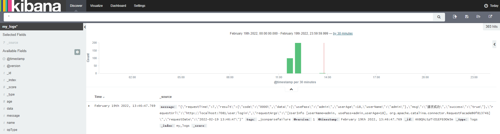

# ELK + kafka 日志方案

> 技术：spring 4.3.3 + kafka2.1 + jdk8
>
> [运行环境：zookeeper3.3.6+kafka2.1+logstash2.3.4+elasticsearch2.3.3+kibana-4.5.4-windows+jdk8 ](http://pan.baidu.com/s/1eSxLxdg)
>
> 文章转载自[Demo大师](http://www.demodashi.com/demo/10181.html)，但是本文给出了相关的相关的 SpringBoot Demo，原文中没有。

## 概述

本文介绍使用ELK（elasticsearch、logstash、kibana） +　kafka来搭建一个日志系统。主要演示使用spring aop进行日志收集，然后通过kafka将日志发送给logstash，logstash再将日志写入elasticsearch，这样elasticsearch就有了日志数据了，最后，则使用kibana将存放在elasticsearch中的日志数据显示出来，并且可以做实时的数据图表分析等等。


## 为什么用ELK

### 以前不用ELK的做法

最开始我些项目的时候，都习惯用log4j来把日志写到log文件中，后来项目有了高可用的要求，我们就进行了分布式部署web，这样我们还是用log4j这样的方式来记录log的话，那么就有N台机子的N个log目录，这个时候查找log起来非常麻烦，不知道问题用户出错log是写在哪一台服务器上的，后来，想到一个办法，干脆把log直接写到数据库中去，这样做，虽然解决了查找异常信息便利性的问题了，但存在两个缺陷：

1. log记录好多，表不够用啊，又得分库分表了，
2. 连接db，如果是数据库异常，那边log就丢失了，那么为了解决log丢失的问题，那么还得先将log写在本地，然后等db连通了后，再将log同步到db，这样的处理办法，感觉是越搞越复杂。


### 现在ELK的做法

好在现在有了ELK这样的方案，可以解决以上存在的烦恼，首先是，使用elasticsearch来存储日志信息，对一般系统来说可以理解为可以存储无限条数据，因为elasticsearch有良好的扩展性，然后是有一个logstash，可以把理解为数据接口，为elasticsearch对接外面过来的log数据，它对接的渠道，有kafka，有log文件，有redis等等，足够兼容N多log形式，最后还有一个部分就是kibana，它主要用来做数据展现，log那么多数据都存放在elasticsearch中，我们得看看log是什么样子的吧，这个kibana就是为了让我们看log数据的，但还有一个更重要的功能是，可以编辑N种图表形式，什么柱状图，折线图等等，来对log数据进行直观的展现。

ELK职能分工

- logstash做日志对接，接受应用系统的log，然后将其写入到elasticsearch中，logstash可以支持N种log渠道，kafka渠道写进来的、和log目录对接的方式、也可以对reids中的log数据进行监控读取，等等。
- elasticsearch存储日志数据，方便的扩展特效，可以存储足够多的日志数据。
- kibana则是对存放在elasticsearch中的log数据进行：数据展现、报表展现，并且是实时的。


## 怎样用ELK

首先说明一点，使用ELK是不需要开发的，只需要搭建环境使用即可。搭建环境，可以理解为，下载XX软件，然后配置下XX端口啊，XX地址啊，XX日志转发规则啊等等，当配置完毕后，然后点击XX bat文件，然后启动。


### Logstash配置

可以配置接入N多种log渠道，现状我配置的只是接入kafka渠道。

配置文件在\logstash-2.3.4\config目录下

要配置的是如下两个参数体：

- input：数据来源。
- output：数据存储到哪里。

```
input {
  kafka {
    zk_connect => "127.0.0.1:2181"
    topic_id => "mylog_topic"
 }
}
filter {
  #Only matched data are send to output.
}
output {
  #stdout{}
  # For detail config for elasticsearch as output, 
  # See: https://www.elastic.co/guide/en/logstash/current/plugins-outputs-elasticsearch.html
  elasticsearch {
    action => "index"          #The operation on ES
    hosts  => "127.0.0.1:9200"   #ElasticSearch host, can be array.
    index  => "my_logs"         #The index to write data to.
  }
}
```


### Elasticsearch配置

配置文件在\elasticsearch-2.3.3\config目录下的elasticsearch.yml，可以配置允许访问的IP地址，端口等，但我这里是采取默认配置。


### Kibana配置

配置文件在\kibana-4.5.4-windows\config目录下的kibana.yml，可以配置允许访问的IP地址，端口等，但我这里是采取默认配置。

这里有一个需要注意的配置，就是指定访问elasticsearch的地址。我这里是同一台机子做测试，所以也是采取默认值了。

```
# The Elasticsearch instance to use for all your queries.``# elasticsearch.url: "http://localhost:9200"
```


关于ELK的配置大致上，就这样就可以了，当然其实还有N多配置项可供配置的，具体可以google。这里就不展开说了。

具体的配置请下载运行环境，里面有具体的配置。


### 和spring aop日志对接

elk环境搭建完毕后，需要在应用系统做日志的aop实现。

##### 

#### Maven 依赖

```xml
<!-- aop依赖 -->
<dependency>
    <groupId>org.springframework.boot</groupId>
    <artifactId>spring-boot-starter-aop</artifactId>
</dependency>

<!--kafkaMQ-->
<dependency>
    <groupId>org.springframework.kafka</groupId>
    <artifactId>spring-kafka</artifactId>
</dependency>
```


#### Application.yml 配置文件

```yml
spring:
  # Kafka 配置信息
  kafka:
    bootstrap-servers: 127.0.0.1:9092
    consumer:
      bootstrap-servers: 127.0.0.1:9092
      # 配置消费者消息offset是否自动重置(消费者重连会能够接收最开始的消息)
      auto-offset-reset: earliest
    producer:
      bootstrap-servers: 127.0.0.1:9092
      # 发送的对象信息变为json格式
      value-serializer: org.springframework.kafka.support.serializer.JsonSerializer
kafka:
  topic:
    log-topic: mylog_topic
```


#### KafkaConfig 主要是生成了一个转换器

```java
@Configuration
public class KafkaConfig {

    @Bean
    public RecordMessageConverter jsonConverter() {
        return new StringJsonMessageConverter();
    }
}
```


#### 封装发送消息服务类

```java
@Slf4j
@Service
public class LogProducerService {

    private final KafkaTemplate<String, Object> kafkaTemplate;

    @Value("${kafka.topic.log-topic}")
    private String logTopic;

    public LogProducerService(KafkaTemplate<String, Object> kafkaTemplate) {
        this.kafkaTemplate = kafkaTemplate;
    }

    public void sendMessage(String topic, Object o) {
        try {
            SendResult<String, Object> sendResult = kafkaTemplate.send(topic, o).get();
            if (sendResult.getRecordMetadata() != null) {
                log.info("生产者成功发送消息到 {} -> {}", sendResult.getProducerRecord().topic(), sendResult.getProducerRecord().value().toString());
            }
        } catch (InterruptedException | ExecutionException e) {
            e.printStackTrace();
        }
    }

    public void saveLog(String msg) {
        sendMessage(logTopic, msg);
    }
}
```


#### Aspect切面

```java
@Aspect
@Slf4j
@Component
public class WebLogAspect {

    @Autowired
    LogProducerService logProducerService;

    /**
     * 指定 controller 包下的注解
     * 两个..代表所有子目录，最后括号里的两个..代表所有参数
     */
    @Pointcut("execution( * com.mashibing.basics.controller.*.*(..))")
    public void logPointCut() {
    }

    @Around("logPointCut()")
    public Object doAround(ProceedingJoinPoint pjp) throws Throwable {
        String requestDate = DateUtil.now();
        // 接收到请求，记录请求内容
        ServletRequestAttributes attributes = (ServletRequestAttributes) RequestContextHolder.getRequestAttributes();
        HttpServletRequest request = attributes.getRequest();
        // 请求地址
        String requestUrl = request.getRequestURL().toString();
        // 请求参数
        String requestArgs = Arrays.toString(pjp.getArgs());
        long startTime = System.currentTimeMillis();
        // res 为方法的返回值
        Object res = pjp.proceed();
        // 请求时长
        long requestTime = System.currentTimeMillis() - startTime;

        JSONObject msg = new JSONObject();
        msg.put("requestUrl", requestUrl);
        msg.put("requestArgs", requestArgs);
        msg.put("requestTime", requestTime);
        msg.put("requestDate", requestDate);
        msg.put("result", res);

        log.info(msg.toJSONString());
        logProducerService.saveLog(msg.toJSONString());
        return res;
    }
}
```


#### 最终效果

