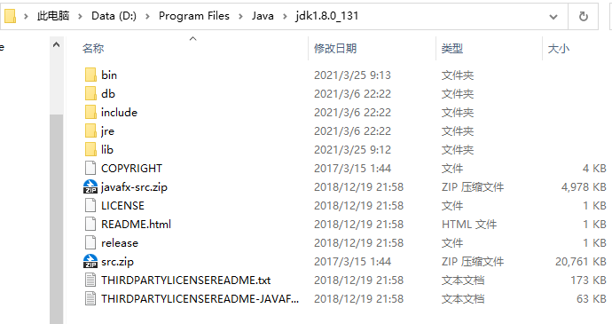

## 如何安装 JDK

### Windows 下 JDK 的安装


#### 解压压缩包到磁盘上




#### 配置环境变量

- 新建变量，变量名为： `JAVA_HOME` ，变量值为磁盘上的JDK目录 比如 `D:\Program Files\Java\jdk1.8.0_131`
- 编辑变量 `CLASSPATH `，将该变量值尾部增加 `.;%JAVA_HOME%\lib;%JAVA_HOME%\lib\tools.jar` （注意前面的有个点“.”不要漏掉）
- 编辑变量 `Path`，将该变量值尾部增加 `.;%JAVA_HOME%\lib;%JAVA_HOME%\lib\tools.jar`


#### 打开 CMD 进行查看是否安装正确

输入命令 `java -version`，返回以下内容即可说明安装正确。

```bash
java version "1.8.0_131"
Java(TM) SE Runtime Environment (build 1.8.0_131-b11)
Java HotSpot(TM) 64-Bit Server VM (build 25.131-b11, mixed mode)
```


关注我的公众号回复 001 ，或添加我的微信 即可获取到 JDK 压缩包


### Linux 下 JDK 的安装

#### 下载JDK


#### 解压 JDK

```bash
tar -zxvf jdk-8u191-linux-x64.tar.gz
```


#### 编辑 /etc/profile

```shell
vim /etc/profile
```

在文件最后添加

```shell
export JAVA_HOME=/home/jdk1.8.0_191
export PATH=$PATH:$JAVA_HOME/bin
```


#### 刷新 /etc/profile

```shell
source /etc/profile
```


#### 检查状态

输入命令 `java -version`，返回以下内容即可说明安装正确。

```bash
java version "1.8.0_131"
Java(TM) SE Runtime Environment (build 1.8.0_131-b11)
Java HotSpot(TM) 64-Bit Server VM (build 25.131-b11, mixed mode)
```

