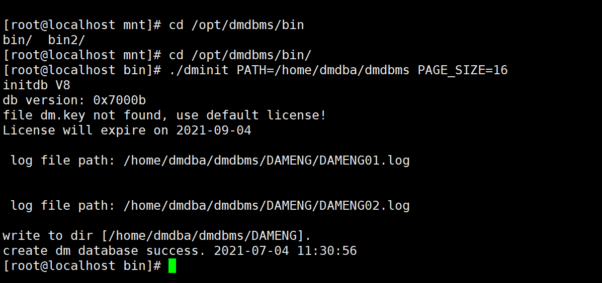
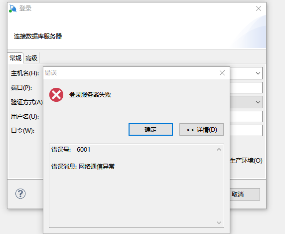

# 达梦数据库

## 简介

国产化数据库


> 达梦8安装包
> 链接：https://pan.baidu.com/s/1yfYpLlL496aBV3-3c1Uhmw
> 提取码：z10w


## 安装

把数据库安装文件挂上去，记得要点一下右上角的已连接。


挂载安装文件，执行安装文件

```
mount /dev/sr0 /mnt
cd /mnt/
ls
./DMInstall.bin -i
```


选择中文安装，其中提示可打开文件数过少，至少设置为65536或更多，我看没有报错就没有处理。


设置时区。


设置北京时间21


选择自定义安装。


全部安装就完事了。


默认安装目录，不改动。


默认安装路径，也不改动。


开始安装。


安装完成。


数据库初始化。

```
cd /opt/dmdbms/bin
```

执行初始化

```
./dminit PATH=/home/dmdba/dmdbms PAGE_SIZE=16
```

初始化有这些参数

```
[root@localhost bin]# ./dminit HELP
initdb V8
db version: 0x7000b
file dm.key not found, use default license!
License will expire on 2021-09-04
格式: ./dminit     KEYWORD=value

例程: ./dminit     PATH=/public/dmdb/dmData PAGE_SIZE=16

关键字                     说明（默认值）
--------------------------------------------------------------------------------
INI_FILE                   初始化文件dm.ini存放的路径
PATH                       初始数据库存放的路径
CTL_PATH                   控制文件路径
LOG_PATH                   日志文件路径
EXTENT_SIZE                数据文件使用的簇大小(16)，可选值：16, 32, 64，单位：页
PAGE_SIZE                  数据页大小(8)，可选值：4, 8, 16, 32，单位：K
LOG_SIZE                   日志文件大小(256)，单位为：M，范围为：64M ~ 2G
CASE_SENSITIVE             大小敏感(Y)，可选值：Y/N，1/0
CHARSET/UNICODE_FLAG       字符集(0)，可选值：0[GB18030]，1[UTF-8]，2[EUC-KR]
SEC_PRIV_MODE              权限管理模式(0)，可选值：0[TRADITION]，1[BMJ]，2[EVAL]
LENGTH_IN_CHAR             VARCHAR类型长度是否以字符为单位(N)，可选值：Y/N，1/0
SYSDBA_PWD                 设置SYSDBA密码(SYSDBA)
SYSAUDITOR_PWD             设置SYSAUDITOR密码(SYSAUDITOR)
DB_NAME                    数据库名(DAMENG)
INSTANCE_NAME              实例名(DMSERVER)
PORT_NUM                   监听端口号(5236)
BUFFER                     系统缓存大小(100)，单位M
TIME_ZONE                  设置时区(+08:00)
PAGE_CHECK                 页检查模式(0)，可选值：0/1/2
EXTERNAL_CIPHER_NAME       设置默认加密算法
EXTERNAL_HASH_NAME         设置默认HASH算法
EXTERNAL_CRYPTO_NAME       设置根密钥加密引擎
RLOG_ENC_FLAG              设置日志文件是否加密(N)，可选值：Y/N，1/0
USBKEY_PIN                 设置USBKEY PIN
PAGE_ENC_SLICE_SIZE        设置页加密分片大小，可选值：512、4096，单位：Byte
ENCRYPT_NAME               设置全库加密算法
BLANK_PAD_MODE             设置空格填充模式(0)，可选值：0/1
SYSTEM_MIRROR_PATH         SYSTEM数据文件镜像路径
MAIN_MIRROR_PATH           MAIN数据文件镜像
ROLL_MIRROR_PATH           回滚文件镜像路径
MAL_FLAG                   初始化时设置dm.ini中的MAL_INI(0)
ARCH_FLAG                  初始化时设置dm.ini中的ARCH_INI(0)
MPP_FLAG                   Mpp系统内的库初始化时设置dm.ini中的mpp_ini(0)
CONTROL                    初始化配置文件（配置文件格式见系统管理员手册）
AUTO_OVERWRITE             是否覆盖所有同名文件(0) 0:不覆盖 1:部分覆盖 2:完全覆盖
USE_NEW_HASH               是否使用改进的字符类型HASH算法(1)
DCP_MODE                   是否是DCP代理模式(0)
DCP_PORT_NUM               DCP代理模式下管理端口
ELOG_PATH                  指定初始化过程中生成的日志文件所在路径
AP_PORT_NUM                ECS模式下AP协同工作的监听端口
DFS_FLAG                   初始化时设置dm.ini中的DFS_INI(0)
DFS_PATH                   启用dfs时指定数据文件的缺省路径
DFS_HOST                   指定连接分布式系统DFS的服务地址(localhost)
DFS_PORT                   指定连接分布式系统DFS的服务端口号(3332)
DFS_COPY_NUM               指定分布式系统的副本数(3)
DFS_DB_NAME                指定分布式系统的中数据库名(默认与DB_NAME一致)
SHARE_FLAG                 指定分布式系统中该数据库的共享属性(0)
REGION_MODE                指定分布式系统中该数据库的系统表空间数据文件的区块策略(0) 0:微区策略 1:宏区策略
HUGE_WITH_DELTA            是否仅支持创建事务型HUGE表(1) 1:是 0:否
RLOG_GEN_FOR_HUGE          是否生成HUGE表REDO日志(0) 1:是 0:否
PSEG_MGR_FLAG              是否仅使用管理段记录事务信息(0) 1:是 0:否
HELP                       打印帮助信息
```

执行完后如图。



注册服务，自动注册。

DM提供了将DM服务注册成操作系统服务的脚本，也提供了卸载操作系统服务的脚本。脚本目录在安装目录/script/root下，这里是在/opt/dmdbms/script/root下

脚本名：dm_service_installer.sh

```
cd /opt/dmdbms/script/root
```

执行自动注册

```
./dm_service_installer.sh -t dmserver -p DMSERVER -dm_ini /home/dmdba/dmdbms/DAMENG/dm.ini -auto true
```

注册成功后会有提示。


启动服务。

```
systemctl start DmServiceDMSERVER.service
```

Linux连接数据库。

命令行连接工具路径：安装路径/tool/disql，这里是/opt/dmdbms/tool/disql

```
./disql
```

```
[root@localhost tool]# ./disql 
disql V8
SQL> conn SYSDBA/SYSDBA@LOCALHOST:5236

服务器[LOCALHOST:5236]:处于普通打开状态登录使用时间 : 3.381(ms)
```

查看

```
SQL> select tablespace_name from dba_tablespaces;

行号     TABLESPACE_NAME
---------- ---------------
1          SYSTEM
2          ROLL
3          TEMP
4          MAIN
5          HMAIN

已用时间: 7.033(毫秒). 执行号:499.
```

创建表空间

```
SQL> create tablespace "bookshop" datafile '/home/dmdba/dmdbms/DAMENG/bookshop.dbf' size 128 CACHE = NORMAL copy 2;

操作已执行
已用时间: 10.371(毫秒). 执行号:500.
```

创建用户

```
SQL> create user dev identified by "dev.123bug" limit password_life_time 60 default tablespace "bookshop";
操作已执行
已用时间: 4.445(毫秒). 执行号:501.
```

最后情况。

```
数据库地址：10.0.0.210
端口：5236
账号：dev
密码：dev.123bug
```


使用windows客户端连接数据库。

①下载win64服务器安装包

```
https://download.dameng.com/official/DM8/DM8-win-64.zip

或者使用百度网盘
链接：https://pan.baidu.com/s/102gxWQbOSx6QppNuCpNkbQ 
提取码：gbfv 
```

②安装选择客户端安装


③使用安装目录下/tool/manager.exe连接数据库

④连接报错，没开防火墙。



⑤关闭防火墙

查看防火墙状态

```
[root@localhost tool]# systemctl status firewalld.service 
● firewalld.service - firewalld - dynamic firewall daemon   
Loaded: loaded (/usr/lib/systemd/system/firewalld.service; enabled; vendor >   
Active: active (running) since Sun 2021-07-04 12:01:42 CST; 3min 35s ago 
    Docs: man:firewalld(1) 
Main PID: 12944 (firewalld) 
   Tasks: 2   
 Memory: 23.5M  
 CGroup: /system.slice/firewalld.service           
 └─12944 /usr/bin/python3 /usr/sbin/firewalld --nofork --nopid
 7月 04 12:01:42 localhost.localdomain systemd[1]: Starting firewalld - dynamic>
 7月 04 12:01:42 localhost.localdomain systemd[1]: Started firewalld - dynamic >
 lines 1-12/12 (END)
```

关闭防火墙

```
[root@localhost tool]# systemctl stop firewalld.service
```

关闭开机启用防火墙

```
[root@localhost tool]# systemctl disable firewalld.service 
Removed /etc/systemd/system/multi-user.target.wants/firewalld.service.
Removed /etc/systemd/system/dbus-org.fedoraproject.FirewallD1.service.
[root@localhost tool]# 
```

这样子后，可以直接连接数据库了。

⑥将5236端口打开。（这是作为不想关闭防火墙的情况下的操作，如果已经关闭了防火墙可跳过本步）

查看端口是否已开

```
[root@localhost tool]# firewall-cmd --add-port=5236/tcp --permanent
 success
```

重新载入防火墙规则

```
[root@localhost tool]# firewall-cmd --reload
 success
```

查看指定端口是否已开启

```
[root@localhost tool]# firewall-cmd --query-port=5236/tcp
yes
```

端口开放成功，windows数据库管理工具连接成功。


可能出现的问题：

报错处理：创建SOCKET连接失败。


解决办法：这是初始化数据库后，数据库服务没有启动。

```
systemctl start DmServiceDMSERVER.service
```


### Java Demo

Maven（需要在本地 maven install 驱动包，具体可以看 达梦数据库坑）

```xml
<dependency>
    <groupId>dm</groupId>
    <artifactId>dm-connector-java</artifactId>
    <version>1.0.0</version>
</dependency>
```


application.yml

```yaml
spring:
  datasource:
    url: jdbc:dm://192.168.137.131:5236/TEST
    username: TEST
    password: 1qaz2wsx3edc
    driver-class-name: dm.jdbc.driver.DmDriver
```


