# 麒麟操作系统

## 简介

国产化操作系统


> 银河麒麟系统安装包
> 链接：https://pan.baidu.com/s/1CWym2-Sj1H1u53VSE_argg
> 提取码：js4s


## 安装

使用 VMware 安装

创建虚拟机

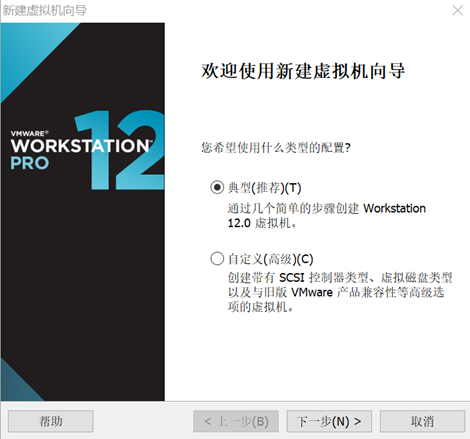

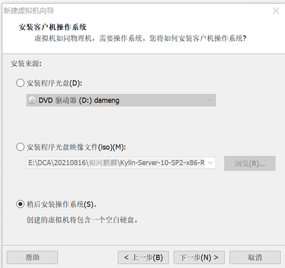

 注意版本的选择，银河麒麟10系统是Ubuntu，我之前都是创建Centos的虚拟机，第一次创建银河麒麟10，忘记修改版本了。

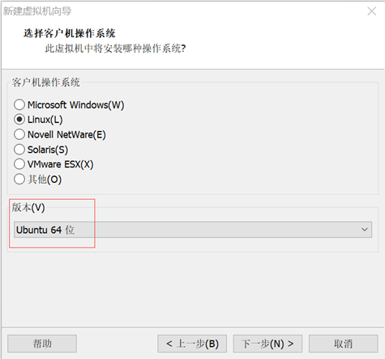

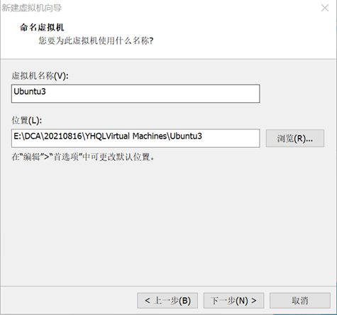

 注意：我一开始设置为12G，后面安装失败，因为银河麒麟系统最小安装需要至少13点几G，但是如果要安装达梦数据库等，我推荐磁盘空间为 40-50G。

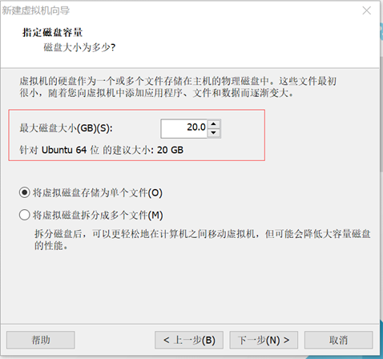

内存 2-4G

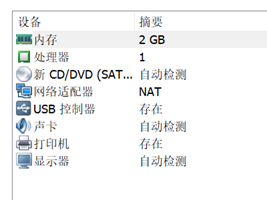

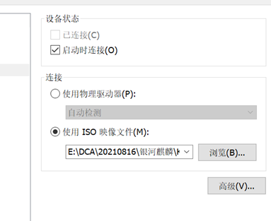

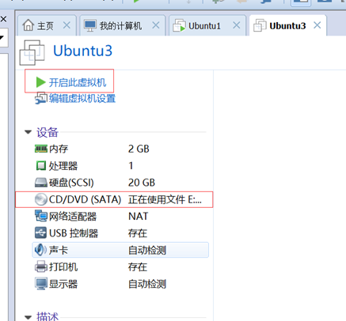

因为我本地空间不大，所有我没有用图形化，选择的最小安装。

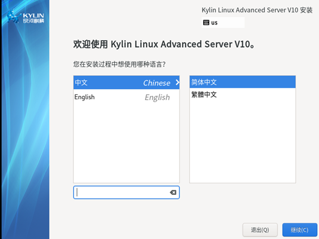

我只点了这四个地方，安装位置需要点进去看一下，不一定需要做出修改，反正不点进去看一下无法进行安装。Root密码根据需求设置，打开网络配置主机名。

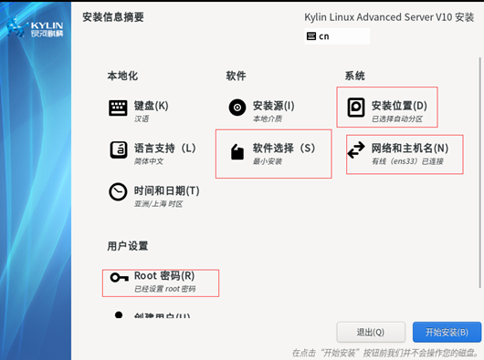

 安装好后重启，会看到下面这个界面，其他先不管，选择接受许可协议。

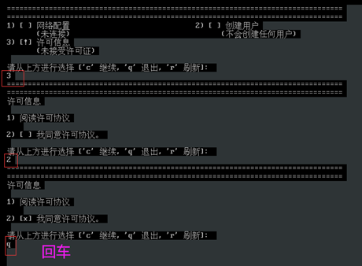

 登录进去后，发现Ifconfig用不了(试了好多种办法都安装不上)，只能用ip addr，可以看到网卡有问题。

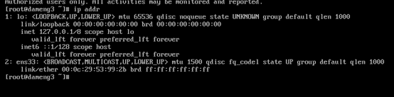

 接下来配置网卡。

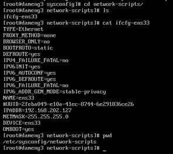

注意：一开始我ip配置成192.169.202.127了，和我主机网络不在一个网段，怎么ping都ping不通。

我重启网络感觉不起作用，reboot后再查ip就出来了。

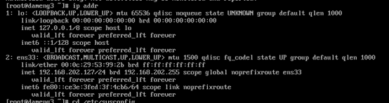

在本地ping试试，可以ping通。

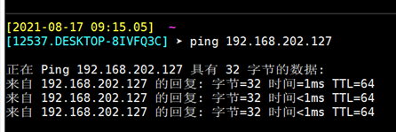


### 安装 JDK

1.下载jdk1.8安装包

[jdk-8u271-linux-x64.tar.gz](https://download.oracle.com/otn/java/jdk/8u271-b09/61ae65e088624f5aaa0b1d2d801acb16/jdk-8u271-linux-x64.tar.gz)

在这一步需要将文件上传到服务器，XShell 可能会出现无法建立 Xfpt连接，具体解决可以看这篇[文章](https://blog.csdn.net/qq_40304090/article/details/117462690)。

简单来说就是 在/etc/ssh/sshd_config最后增加以下一行（别选错了，不是ssh_config）：

```bash
KexAlgorithms curve25519-sha256@libssh.org,ecdh-sha2-nistp256,ecdh-sha2-nistp384,ecdh-sha2-nistp521,diffie-hellman-group14-sha1
```

然后重启

```bash
systemctl restart sshd
```


2.切换到安装目录

```bash
cd /opt/jdk
```

3.解压 [jdk-8u271-linux-x64.tar.gz](https://download.oracle.com/otn/java/jdk/8u271-b09/61ae65e088624f5aaa0b1d2d801acb16/jdk-8u271-linux-x64.tar.gz)

```bash
tar -zxvf jdk-8u271-linux-x64.tar.gz 
```

4.设置JDK环境变量

```bash
vim /etc/profile
# 没有 vim 可以使用 vi
```

5.编辑环境变量

```bash
export JAVA_HOME=/opt/jdk/jdk1.8.0_271
export JRE_HOME=${JAVA_HOME}/jre 
export CLASSPATH=.:${JAVA_HOME}/lib:${JRE_HOME}/lib
export PATH=${JAVA_HOME}/bin:$PATH
```

6.刷新环境变量

```bash
source /etc/profile
```

7.查看是否安装完成

```bash
[root@localhost jdk1.8.0_311]# java -version
java version "1.8.0_311"
Java(TM) SE Runtime Environment (build 1.8.0_311-b11)
Java HotSpot(TM) 64-Bit Server VM (build 25.311-b11, mixed mode)
```


### 测试DEMO

简单写了一个Demo在服务器上运行

SpringBoot + MybatisPlus + 达梦数据库

