# MySQL集群搭建

## MySQL一主一从搭建

### master配置

**在master 的配置文件（/etc/my.cnf）中，配置如下内容：**

```bash
#mysql 服务ID,保证整个集群环境中唯一
server-id=1

#mysql binlog 日志的存储路径和文件名
log-bin=mysql-bin

#设置logbin格式
binlog_format=STATEMENT

#是否只读,1 代表只读, 0 代表读写
read-only=0

#忽略的数据, 指不需要同步的数据库
binlog-ignore-db=mysql

#指定同步的数据库
binlog-do-db=db01
```

**执行完毕之后，需要重启Mysql：**

```bash
service mysql restart;
```

**创建同步数据的账户，并且进行授权操作：**

```mysql
GRANT REPLICATION SLAVE ON *.* to 
'slvv'@'%' identified by 'zgqazxsw';

# 高版本执行这个
create user 'slvv'@'%' identified by  'zgqazxsw';
grant REPLICATION SLAVE on *.* to 'slvv'@'%' with grant option;
# 修改密码权限插件
ALTER USER 'slvv'@'%' IDENTIFIED WITH mysql_native_password BY 'zgqazxsw';

flush privileges;
```

**查看master状态：**

```mysql
show master status;
```


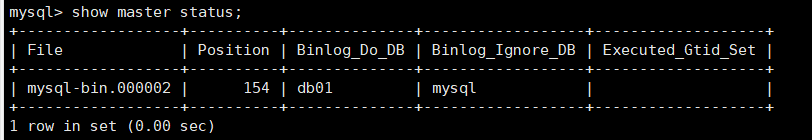

**字段含义:**

```bash
File : 从哪个日志文件开始推送日志文件 
Position ： 从哪个位置开始推送日志
Binlog_Ignore_DB : 指定不需要同步的数据库
```


### slave配置

**在 slave 端配置文件/etc/my.cnf中，配置如下内容：**

```bash
#mysql服务端ID,唯一
server-id=2

#启用中继日志
relay-log=mysql-relay
```

**执行完毕之后，需要重启Mysql：**

```mysql
service mysql restart;
```

**执行如下指令 ：**

```mysql
CHANGE MASTER TO 
MASTER_HOST='192.168.114.132',//主机IP
MASTER_USER='slvv',//之前创建的用户账号
MASTER_PASSWORD='zgqazxsw',//之前创建的用户密码
MASTER_LOG_FILE='mysql-bin.000002',//master主机的binlog日志名称
MASTER_LOG_POS=154,//binlog日志偏移量
master_port=3306;//端口
```

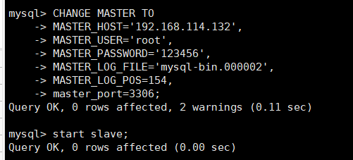

指定当前从库对应的主库的IP地址，用户名，密码，从哪个日志文件开始的那个位置开始同步推送日志。

**开启同步操作**

```mysql
start slave;

show slave status\G;
```

只需要查看IO和SQL线程是否开启就行，看到了两个YES说明主从复制搭建完成。

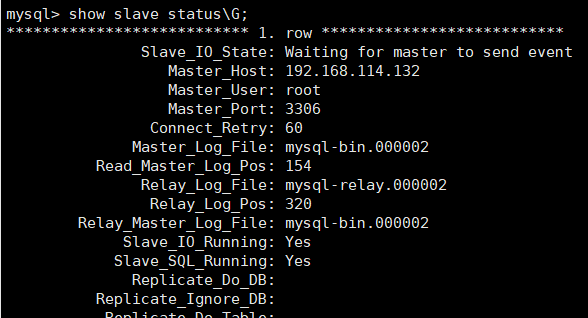

**停止同步操作**

```mysql
stop slave;
```


### 验证主从同步

**在主库中创建数据库，创建表，并插入数据 ：**

```mysql
create database db01;

user db01;

create table user(
	id int(11) not null auto_increment,
	name varchar(50) not null,
	sex varchar(1),
	primary key (id)
)engine=innodb default charset=utf8;

insert into user(id,name,sex) values(null,'Tom','1');
insert into user(id,name,sex) values(null,'Trigger','0');
insert into user(id,name,sex) values(null,'Dawn','1');
```

**在从库中查询数据，进行验证 ：**

在从库中，可以查看到刚才创建的数据库：

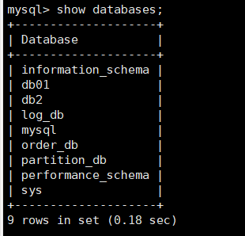


在该数据库中，查询user表中的数据：

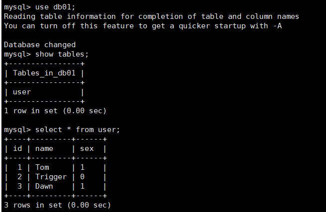

一主一从的缺点是当主机或从机宕机后则无法对外提供服务，我们可以用双主双从的架构来解决这个问题。


## MySQL双主双从搭建

### 架构

一个主机 Master1 用于处理所有写请求，它的从机 Slave1 和另一台主机 Master2 还有它的从机 Slave2 负责所有读请求。当 Master1 主机宕机后，Master2 主机负责写请求，Master1 、Master2 互为备机。架构图如下:

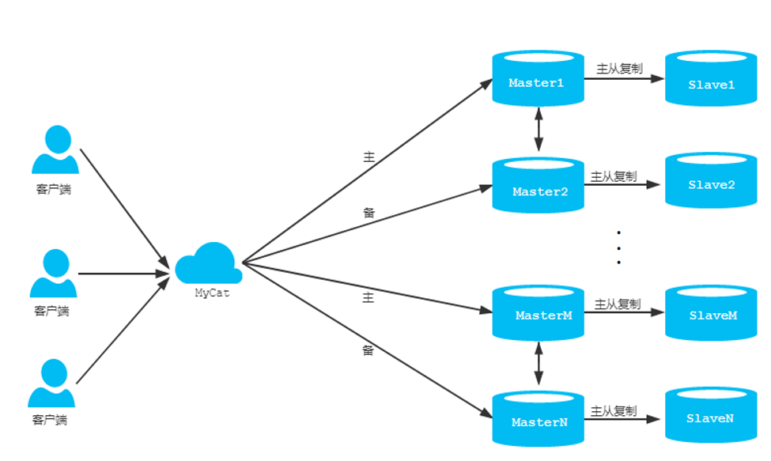

### 双主双从配置

#### 双主机配置

**Master1配置:**

```bash
#主服务器唯一ID
server-id=1

#启用二进制日志
log-bin=mysql-bin

# 设置不要复制的数据库(可设置多个)
# binlog-ignore-db=mysql
# binlog-ignore-db=information_schema

#设置需要复制的数据库
binlog-do-db=db02
binlog-do-db=db03
binlog-do-db=db04

#设置logbin格式
binlog_format=STATEMENT

# 在作为从数据库的时候，有写入操作也要更新二进制日志文件
log-slave-updates
```

**Master2配置:**

```bash
#主服务器唯一ID
server-id=3

#启用二进制日志
log-bin=mysql-bin

# 设置不要复制的数据库(可设置多个)
#binlog-ignore-db=mysql
#binlog-ignore-db=information_schema

#设置需要复制的数据库
binlog-do-db=db02
binlog-do-db=db03
binlog-do-db=db04

#设置logbin格式
binlog_format=STATEMENT

# 在作为从数据库的时候，有写入操作也要更新二进制日志文件
log-slave-updates
```

#### 双从机配置

**Slave1配置:**

```bash
#从服务器唯一ID
server-id=2

#启用中继日志
relay-log=mysql-relay
```

**Salve2配置:**

```bash
#从服务器唯一ID
server-id=4

#启用中继日志
relay-log=mysql-relay
```

**双主机、双从机重启 mysql 服务**

```bash
service mysql restart 
```

**主机从机都关闭防火墙**

```bash
systemctl stop firewalld.service
```

**在两台主机上建立帐户并授权 slave**

```mysql
#在主机MySQL里执行授权命令
GRANT REPLICATION SLAVE ON *.* TO 'slvv'@'%' IDENTIFIED BY 'zgqazxsw';

# 高版本执行这个
create user 'slvv'@'%' identified by  'zgqazxsw';
grant REPLICATION SLAVE on *.* to 'slvv'@'%' with grant option;
# 修改密码权限插件
ALTER USER 'slvv'@'%' IDENTIFIED WITH mysql_native_password BY 'zgqazxsw';

flush privileges;
```

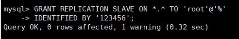

查询Master1的状态 :

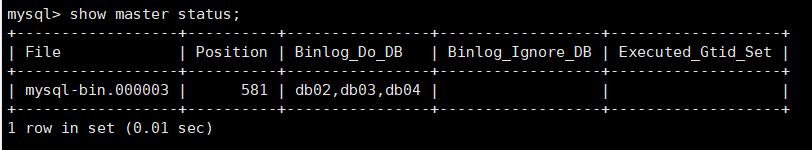

查询Master2的状态 :


**在从机上配置需要复制的主机**

Slave1 复制 Master1，Slave2 复制 Master2

**slave1 指令:**

```mysql
CHANGE MASTER TO MASTER_HOST='192.168.114.129',
MASTER_USER='slvv',
MASTER_PASSWORD='zgqazxsw',
MASTER_LOG_FILE='mysql-bin.000001',MASTER_LOG_POS=589;
```

**slave2 指令:**

```mysql
CHANGE MASTER TO MASTER_HOST='192.168.114.132',
MASTER_USER='slvv',
MASTER_PASSWORD='zgqazxsw',
MASTER_LOG_FILE='mysql-bin.000003',MASTER_LOG_POS=581;
```

**启动两台从服务器复制功能 , 查看主从复制的运行状态**

```mysql
start slave;

show slave status\G;
```

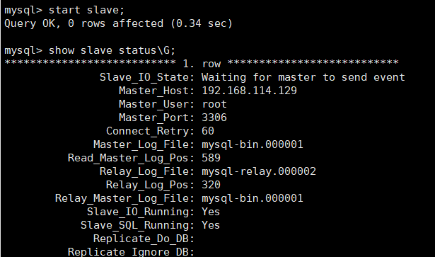


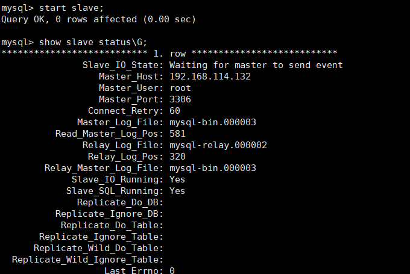


**两个主机互相复制**

Master2 复制 Master1，Master1 复制 Master2

**Master1 执行指令:**

```mysql
CHANGE MASTER TO MASTER_HOST='192.168.114.132',
MASTER_USER='slvv',
MASTER_PASSWORD='zgqazxsw',
MASTER_LOG_FILE='mysql-bin.000003',MASTER_LOG_POS=581;
```

**Master2 执行指令:**

```mysql
CHANGE MASTER TO MASTER_HOST='192.168.114.129',
MASTER_USER='slvv',
MASTER_PASSWORD='zgqazxsw',
MASTER_LOG_FILE='mysql-bin.000001',MASTER_LOG_POS=589;
```

**启动两台主服务器复制功能 , 查看主从复制的运行状态**

```mysql
start slave;

show slave status\G;
```

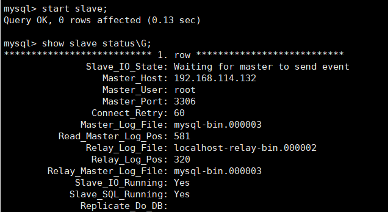

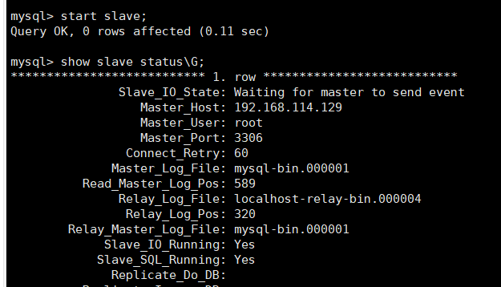

### 验证

```mysql
create database db03;

use db03;

create table user(
	id int(11) not null auto_increment,
	name varchar(50) not null,
	sex varchar(1),
	primary key (id)
)engine=innodb default charset=utf8;

insert into user(id,name,sex) values(null,'Tom','1');
insert into user(id,name,sex) values(null,'Trigger','0');
insert into user(id,name,sex) values(null,'Dawn','1');


insert into user(id,name,sex) values(null,'Jack Ma','1');
insert into user(id,name,sex) values(null,'Coco','0');
insert into user(id,name,sex) values(null,'Jerry','1');
```

**在Master1上创建数据库:**

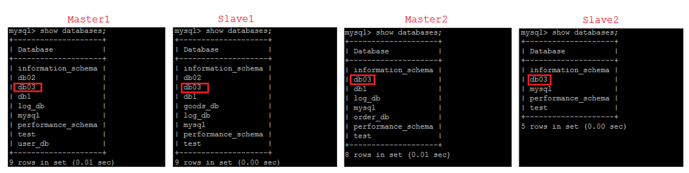

**在Master1上创建表 :**

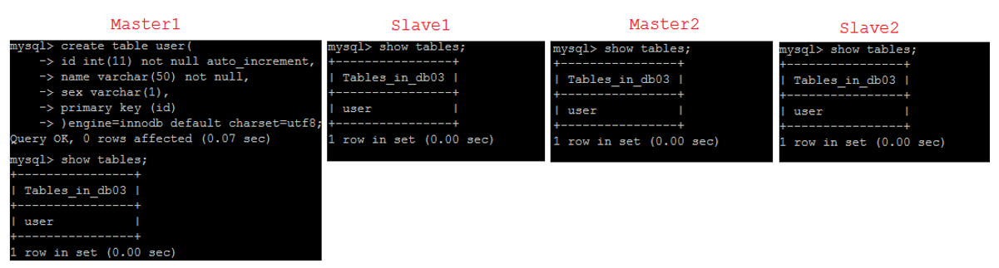

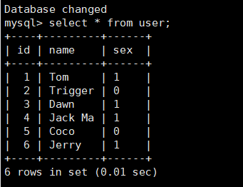


### 问题解决

```mysql
mysql> start slave;
ERROR 1872 (HY000): Slave failed to initialize relay log info structure from the repository
mysql> stop slave;
Query OK, 0 rows affected (0.10 sec)

mysql> reset slave;
Query OK, 0 rows affected (0.10 sec)

mysql> start slave;
Query OK, 0 rows affected (0.10 sec)
```

