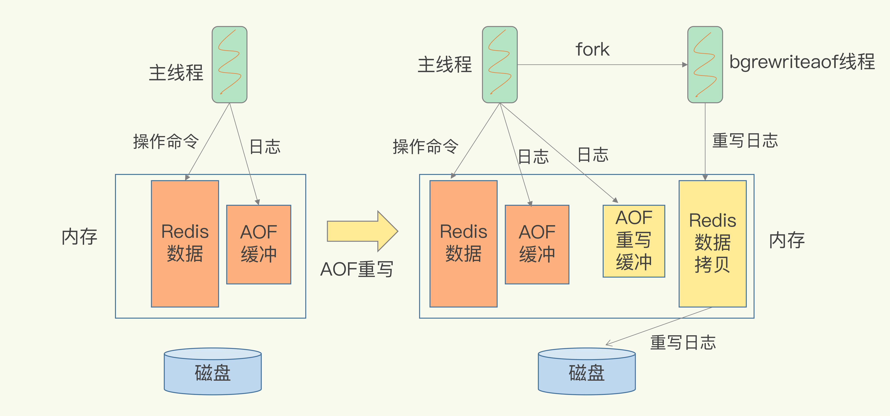
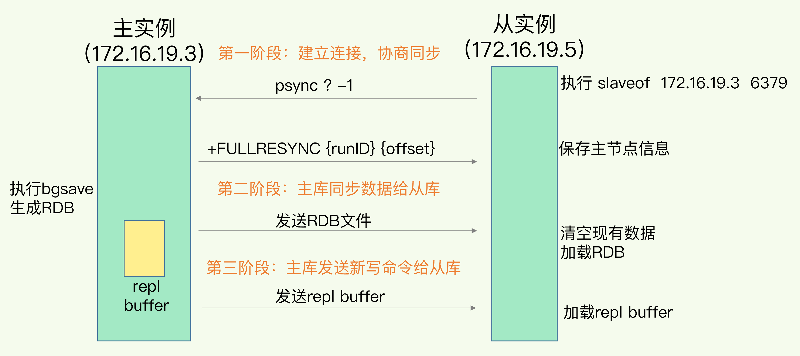

# 极客时间 Redis技术与实战


## 开篇词 | 这样学 Redis ，才能技高一筹 

很多技术人都有一个误区，那就是，只关注零散的技术点，没有建立起一套完整的知识框架，缺乏系统观，但是，系统观其实是至关重要的。


### Redis主要的四大坑。

CPU 使用上的“坑”，例如数据结构的复杂度、跨 CPU 核的访问；

内存使用上的“坑”，例如主从同步和 AOF 的内存竞争；

存储持久化上的“坑”，例如在 SSD 上做快照的性能抖动；

网络通信上的“坑”，例如多实例时的异常网络丢包。


### 慢操作

引入 **长尾延迟** 概念，比如说99%的请求都可以在10ms内返回，但是有1%的请求达到了10s，这1%的请求就属于长请求，这个问题对于系统可靠性是极为不利的。

因为 Redis 是使用单线程来处理用户请求的，所以任何堵塞的操作都会导致长尾请求的产生，比如在 Redis 使用全量查询，大集合聚合操作，操作bigkey，生成RDB快照，AOF重写，大量键值对删除等都可能会导致主线程堵塞。


### 架构图

从应用维度以及系统维度来理解 Redis


### Redis问题画像

最外层是出现的问题，第二层是稍微具体的现象（发生在哪里），最里面是具体细节。


## 01 | 基本架构：一个键值数据库包含什么？


学习一门东西的时候不要太关注于细枝末节，要养成一个系统观，大概就是先查看有哪些模块，各个模块之间的作用，最后在沉浸在模块的细节中。

### 一个简单的键值对数据库需要有什么？

下面把这个简单的键值对数据库成为 SimpleKV。

#### 怎么存数据？

数据模型和操作接口。

- 数据模型
  - key：使用 String 类型
  - val：毕竟是简单兼职数据库
- 操作接口
  - PUT：新写入或更新一个 key
  - GET：根据 key 获取一个 val 值
  - DELETE：根据 key 删除一个键值对
  - **SCNA**：
  
  

#### 键值对保存在内存还是外存？

- 保存在内存，快但是有丢失数据风险。√

- 保存在外存，慢但是不会丢失数据。

  

根据使用场景，对于对速度有要求，但是允许丢失数据所以选择内存。


### 基本组件

访问框架、索引模块、操作模块、存储模块。

- 访问框架
  - 动态库：速度快但是需要客户端植入动态库，相当于每个使用者都要加载动态库，这对于用户来说并不是很友好。
  - 网络协议：可扩展性高，只要使用相对应的网络协议即可。
- 索引模块
  - 作用：根据 key 快速获取到 val 的存储位置。
  - 类型：
    - 哈希表：一般来说内存数据库都会使用 哈希表作为索引，因为内存的高性能访问特性可以很好的与哈希表 O(1)相匹配。
    - B+树：在 MySQL 中的 InnoDB 底层使用 B+树来存储索引，主要是因为需要从磁盘中访问数据，每次都要加载一层树到内存中然后读取，而Redis并不需要从磁盘加载这一步骤，所以如果使用 B+ 树反而会降低效率。
    - 字典树。
- 操作模块
  - GET、SCAN：根据 val 的存储位置返回 val 值即可。
  - PUT：为键值对分配空间，这个过程也由分配器完成。
  - DELETE：删除键值对，并且释放对应的内存空间，这个过程由分配器完成。
- 存储模块
  - 分配器
    - glibc：malloc、free
  - 持久化：保存到文件系统
    - RDB：周期性保存所有数据。
    - AOF：每次操作落盘。


### 问题：

#### SimpleKV和Redis的对比： 

- 【数据结构】上缺乏广泛的数据结构支持：比如支持范围查询的SkipList，和Stream等等数据结构 
- 【高可用】上缺乏，哨兵或者master-slaver模式的高可用设计 
- 【横向扩展】上缺乏集群和分片功能 
- 【在内存安全性】上，缺乏内存过载时候的key淘汰算法的支持 
- 【内存利用率】没有充分对数据结构优化提高内存利用率，例如使用压缩性的数据结构 
- 【数据过期】过期机制、数据淘汰策略
- 【功能扩展】需要具备后续功能的拓展 
- 【不具备事务性】无法保证多个操作的原子性
- 【内存分配器】SimpleKV就是glibc，Redis的分配器选择更多


## 02 | 数据结构：快速的 Redis 有哪些慢操作？

Redis为什么那么快？

基于内存，数据结构，搞笑的数据结构是redis快速处理数据的基础。

数据类型

- String：字符串或整数类型。
- List：FILO的数据结构，用于存放需要保持插入顺序的元素。
- Hash：也是 K,V 结构，可以保存多属性。
- Sorted Set：有序的 Set 类型，用来保存需要有序不可重复的数据类型。
- Set：无序的 Set 类型，晕来保存去重的数据。


数据结构

- 简单动态字符串
- 双向链表
- 压缩链表
- 哈希表
- 跳表
- 整数数组


**键和值用什么结构组织？**

哈希表

一个**哈希表**其实就是一个数组，其中的每一个元素称为**哈希桶**，每个哈希桶中保存了键值对数据，这里指的键值对数据其实是具体值的指针，所以可以存放单值或者集合。


因为这个哈希表存放了所有的键值对数据，所以我们把它称之为**全局哈希表**。哈希表的最大好处很明显，就是可以 O(1) 复杂度快速寻找到键值对，我们只要计算键的哈希值，就能找到对应的哈希桶位置，然后访问相应的 entry 元素。

当写入大量数据的时候，Redis可能会变慢，因为这样会导致哈希冲突和rehash 而造成堵塞。

为什么哈希表操作变慢了？

当往哈希表中写入大量的数据后，哈希冲突是不可避免的。这里的哈希冲突是指在哈希桶中会出现多个键值对，所以要链式存储所有的键值对。


这里虽然解决了冲突问题，但是又会出现新的问题，那就是当链表的长度越来越长的时候，查找效率就会越来越差，这对于 Redis 来说是不能接受的。所以 Redis 会对哈希表做 rehash 操作。


rehash

rehash就是增加现有桶的数量，让组件增多的 entry 元素能在更多的桶之间分散保存，减少单个桶的元素数量，从而减少单个桶中的冲突。

具体实现方式就是，为了使 rehash 更加高效，redis 默认会使用两个 全局哈希表来存储数据，哈希表1和哈希表2。一开始使用 哈希表1 来存储键值对数据，当数据不断增多，Redis 开始执行 rehash，这个过程分为三步。

1. 给 哈希表2 分配更大空间，例如当前 哈希表1 的两倍。
2. 把 哈希表1 的数据重新映射并拷贝到 哈希表2 中
3. 释放 哈希表1 的空间

到此，我们就可以使用哈希表2继续来存储数据，因为长度更大所以说定位速度更快。而原来的 哈希表1 可以作为下一次 rehash 使用。

这个过程看似简单，但是第二部涉及到大量数据的拷贝，如果一次性将 哈希表1 的数据全部迁移，会导致 线程堵塞，无法服务其他请求。此时，Redis就无法快速访问数据了。


为了避免这个问题，Redis使用了**渐进式rehash**

简单来说就是在步骤2的时候不堵塞，而是采用逐步迁移的方式，在哈希表1开始迁移时记录一个下标，每次处理请求都会吧该下标下的所有元素迁移到新的哈希表，然后对下标自增。这样就将一个大操作分成了多个小操作，分摊到多个请求中，避免了耗时操作，而且 Redis 也会采用后台线程来迁移数据，所以不用担心如果开始迁移后没有其他请求怎么办。


#### 集合操作效率

集合类型基本数据结构有五种：整数数组，双向链表，哈希表，压缩列表，跳表。

##### 哈希表

上面说过了。

##### 整数数组和双向链表

都是比较常见的数据结构，一般来说就是根据下标获取或者是前后遍历获取元素。

##### 压缩列表

压缩列表实际上类似于一个数组，数组中的每一个元素都对应保存一个数据。和数组不同的是，压缩列表在表头有三个字段 zlbytes、zltail 和 zllen，分别表示列表长度、列表尾的偏移量和列表中的 entry 个数；压缩列表在表尾还有一个 zlend，表示列表结束。


使用压缩列表时，获取首元素和尾元素的操作复杂度是 O(1)，而获取其他元素的操作复杂度是 O(N)

##### 跳表

简单来说跳表就是有序链表的升级版，在各个元素之间提取出节点作为新的链表，以此重复几次。

**增加了多级索引，通过索引位置的几个跳转，实现数据的快速定位**，


#### 集合数据结构查找单个元素复杂度


#### 不同操作的复杂度

##### 四句口诀

- 单元素操作是基础；
  - 单元素增删改查一般很快。
- 范围操作非常耗时；
  - 因为范围操作涉及到多个 key，就算是 O(1) 操作复杂度也变成 O(n)了，更不要操作 keys 
- 统计操作通常高效；
  - 压缩列表双向链表一般都记录了集合元素个数，直接获取即可。
- 例外情况只有几个。
  - 比如 List 获取首元素和尾元素，其实都是蛮快的。


### 小结

首先就是 Redis 为啥快，因为底层大量的使用到了哈希表，比如 String、Hash 、HashSet 操作复杂度都是 O(1)，避免操作时间慢的方法，比如说少使用耗时 命令一次性操作大量元素，比如 get keys，可以使用 scan 来代替。

还有就是根据集合的底层结构和特点来使用，比如耗时 O(n) 的List，但是获取首元素和尾元素的复杂度都是 O(1)，所以可以使用在队列场景，这样就减少了随机获取的需求。

当然最主要的还是 **掌握原理，以不变应万变。**


### 问题：

整数数组和压缩列表在查找时间复杂度方面并没有很大的优势，那为什么 Redis 还会把它们作为底层数据结构呢？

1. 内存利用率，数组和压缩列表都是非常紧凑的数据结构，它比链表占用的内存要更少。Redis是内存数据库，大量数据存到内存中，此时需要做尽可能的优化，提高内存的利用率。 
2. 数组对CPU高速缓存支持更友好，所以Redis在设计时，集合数据元素较少情况下，默认采用内存紧凑排列的方式存储，同时利用CPU高速缓存不会降低访问速度。当数据元素超过设定阈值后，避免查询时间复杂度太高，转为哈希和跳表数据结构存储，保证查询效率。


## 03 | 高性能IO模型：为什么单线程Redis能那么快？

### Redis真的是单线程吗？

其实这里说的单线程并不完全是单线程，单线程主要是值网络IO处理和键值对读写是用一个线程来完成的，这也是Redis对外提供简直对存储服务的主要流程。但是Redis的其他功能，比如 持久化、异步删除、集群数据同步等，其实都是由额外的线程执行的。


### **Redis** **为什么用单线程？**

多线程的开销

多线程要保证数据的可见性，所以要引入额外的锁或者同步原语，所以会导致效率变低，这就是**多线程编程模式面临的共享资源的并发访问控制问题**


### **单线程** **Redis** **为什么那么快？**

一方面是因为 Redis 是在内存进行操作的，

还有一方面是因为引入了多路复用机制，多路复用技术可以让单个线程处理多个IO请求。


#### **基本IO模型与阻塞点**

SimpleKV处理Get请求

SimpleKV为了处理Get请求，需要监听客户端请求（bind/listen），和客户端建立请求（accept），从 socket 中读取请求（recv），根据请求类型读取键值对数据（get），最后给客户端返回结果，即向 socket 中写回数据（send）。

这里面 bind/listen、accept、recv、send 属于IO操作，而 get 属于键值对数据读写操作。既然 Redis 是单线程，那么，最基本的一种实现是在一个线程中依次执行上面说的这些操作。


但是 accept 和 recv 是可能堵塞的，比如客户端发起连接请求但是一直没有建立连接，accept 就会堵塞住，而当 Redis 通过 recv 从一个客户端读取数据的时候，如果数据一直没有到达，Redis 也会堵塞在 recv。

这就会导致 Redis 堵塞，无法处理其他客户端请求，效率很低，但是比较幸运的是 socket 网络模型支持非堵塞模式。


##### 非堵塞模式

在 socket 模型中，不同操作调用后会产生不同的套接字类型。socket 方法会主动返回套接字，然后调用 listen 方法，将主动套接字转为监听套接字，此时可以监听来自客户端的连接请求。最后调用 accept 方法接受到达的客户端连接，并返回已连接套接字。

针对监听套接字我们可以设置非堵塞模式：当 Redis 调用 accept 但一直未有连接请求到达时，Redis 线程可以返回去处理其他操作，而不用一直堵塞等待。但是你要注意的是，调用 accept 时，已存在监听套接字了。

虽然 Redis 线程不用继续等待，但是总要有机制继续在监听套接字上等待后续连接，并在有请求的时候通知 Redis。

类似的，我们也可以对已连接套接字设置非阻塞模式：Redis 调用 recv 后，如果已连接套接字上一直没有数据到达，Redis 线程同样可以返回处理其他操作。我们也需要有其他机制来继续监听该已连接套接字，并在有数据达到时通知 Redis。

这样才能保证 Redis 线程，既不会像基本 IO 模型一样一直在堵塞点等待，也不会导致 Redis 无法处理实际到达的连接请求或数据。

到此，Linux 中的 IO 多路复用技术就要登场了。


#### **基于多路复用的高性能** **I/O** **模型**

Linux 中的 IO 多路复用机制是指一个线程处理多个 IO 流，就是我们经常听到的 select/epoll机制。简单来说，在 Redis 只运行单线程的情况下，该机制允许内核中，同时存在多个监听套接字和已连接套接字。内核会一直监听这些套接字上的连接请求或数据请求。一旦有请求到达就会交给 Redis 线程处理，这就实现了一个 Redis 线程处理多个 IO 流的效果。

下图就是基于多路复用的 Redis IO 模型。途中的多个 FD 就是刚才所说的多个套接字。

Redis 网络框架调用 epoll机制，让内核来监听这些套接字。此时 Redis 不会堵塞在某一个特定的监听或已连接的套接字上，也就是说，不会堵塞在某一个客户端的请求处理上。正因为此，Redis 可以与多个客户端连接并处理请求，从而提升并发性。


为了在请求到达时能够通知到 Redis 线程，select/epoll 提供了基于事件回调机制，即针对不同事件发生，调用相应的处理函数。

这些是怎样实现的呢？其实 select/epoll 一旦监测到 FD 上有请求到达，就会触发相应的事件。

这些事件会放进一个事件队列，Redis 单线程对该事件队列不断处理，这样一来，Redis 无需一直轮询是否有请求实际发生，这样可以避免造成 CPU 资源的浪费。同时，Redis 在对事件队列里的事件进行处理的时候，会调用对应的函数，这就实现了基于事件的回调。因为 Redis 一直在对事件队列进行处理，所以能及时响应客户端请求，提升 Redis 的响应性能。

简单来说，Redis 会在非堵塞的时候注册事件的处理函数，然后当 select/epoll  收到消息的时候放入事件队列就直接可以执行回调函数了。

不过需要注意的是 不一定非要是 select/epoll 来实现IO多路复用，既有基于 Linux 系统下的 select 和 epoll 实现，也有基于 FreeBSD 的 kqueue 实现，以及基于 Solaris 的 evport 实现，这样，你可以根据 Redis 实际运行的操作系统，选择相应的多路复用实现。

### 小结

这节主要有三个问题：“Redis 真的只有单线程吗？”

redis 只有主要IO操作和读写键值对数据是单线程的，对于持久化、异步删除、集群同步都是使用额外线程的。

“Redis 为什么用单线程？”，

减少了多线程之间的资源竞争，避免了锁操作和同步原语。

“单线程为什么那么快？”。

IO多路复用，这样Redis只用专心处理事件队列里的事件就好。


### 问题：

Redis单线程处理IO请求性能瓶颈主要包括2个方面： 

1. 任意一个请求在server中一旦发生耗时，都会影响整个server的性能，也就是说后面的请求都要等前面这个耗时请求处理完成，自己才能被处理到。耗时的操作包括以下几种： 
   1. 操作bigkey：写入一个bigkey在分配内存时需要消耗更多的时间，同样，删除bigkey释放内存同样会产生耗时； 
   2. 使用复杂度过高的命令：例如SORT/SUNION/ZUNIONSTORE，或者O(N)命令，但是N很大，例如lrange key 0 -1一次查询全量数据； 
   3. 大量key集中过期：Redis的过期机制也是在主线程中执行的，大量key集中过期会导致处理一个请求时，耗时都在删除过期key，耗时变长； 
   4. 淘汰策略：淘汰策略也是在主线程执行的，当内存超过Redis内存上限后，每次写入都需要淘汰一些key，也会造成耗时变长； 
   5. AOF刷盘开启always机制：每次写入都需要把这个操作刷到磁盘，写磁盘的速度远比写内存慢，会拖慢Redis的性能； 
   6. 主从全量同步生成RDB：虽然采用fork子进程生成数据快照，但fork这一瞬间也是会阻塞整个线程的，实例越大，阻塞时间越久； 
2. 并发量非常大时，单线程读写客户端IO数据存在性能瓶颈，虽然采用IO多路复用机制，但是读写客户端数据依旧是同步IO，只能单线程依次读取客户端的数据，无法利用到CPU多核。


针对问题1，一方面需要业务人员去规避，一方面Redis在4.0推出了lazy-free机制，把bigkey释放内存的耗时操作放在了异步线程中执行，降低对主线程的影响。

针对问题2，Redis在6.0推出了多线程，可以在高并发场景下利用CPU多核多线程读写客户端数据，进一步提升server性能，当然，只是针对客户端的读写是并行的，每个命令的真正操作依旧是单线程的。


## 04 | AOF 日志：宕机了， Redis 如何避免数据丢失？

Redis 是将数据保存在内存中的，所以当服务端宕机了，就会丢失所有的数据。

当所有数据都丢失了的时候，我们可以从后端数据库恢复数据，但是频繁操作会非常影响性能，本来就是使用 Redis 作为缓存的场景，此时又需要从数据库中重新读取，那真是埋了个大坑，使用 Redis 单纯作为数据库的更不用说了，那是更不能接受的。

所以此时 持久化就显得尤为重要，目前 Redis 持久化有两种方式，AOF 和  RDB。


AOF

如何实现的？

我们比较熟悉的是数据库的写前日志（Write Ahead Log, WAL），也就是说，在实际写入数据前，先把修改的数据写入到日志文件中，以便故障时进行恢复。不过，AOF日志正好相反，他是写后日志，“写后”的意思是指 Redis 先执行命令，把数据写入到内存，然后才记录日志。


那 AOF 为什么要先执行命令再记日志呢？要回答这个问题，我们要知道AOF里记录了什么？

传统的数据库日志，例如 redo log（重做日志），记录的是修改后的数据，而 AOF 记录的是 Redis 收到的每一条命令，这些命令是以文本形式保存的。

比如 Redis 收到了 set testkey testvalue 命令，这条命令在 AOF 里存储的格式为 下图所示，*3表示当前命令有3部分，每部分以$+数字开头，后面紧跟着命令题，数字是指命令所占字节。$3 set，是指 set 占用3个字节。


但是为了避免额外的检查开销，Redis在向 AOF写入日志的时候不会检查语法，所以 Redis 使用先记日志再执行命令的话，日志中就可能记录了错误的语句而影响执行。

除此之外就是 Redis 使用后记日志不会堵塞当前线程的写操作。

但是，也有两个潜在的风险，一是写日志时宕机了，就会丢失一次操作的命令。二是虽然不会堵塞当前写操作，但是可能会堵塞下一个操作。

所以就引入了三种写回策略，


- Always 同步写回：每个写操作执行完，立马同步的将日志写回磁盘。
- Everysec 每秒写回：每个写操作执行完，先把日志写到 AOF 文件的内存缓冲区，每隔一秒将缓冲区里的数据写入到磁盘。
- No 操作系统决定写回：每个写操作执行完，先把日志写到 AOF 文件的内存缓冲区，由操作系统决定什么时候将缓冲区里的数据写入到磁盘。


AOF是将写操作以文件的形式存储，随着接收的写命令越来越多，AOF文件越来越大。这就意味着我们要小心 AOF 文件过大带来的性能问题。

- 文件大小超出操作系统限制
- 文件过大导致追加命令效率低
- 数据库重启执行效率低（重复命令或无效命令太多）

这个时候 AOF 重写机制就登场了

日志文件太大了怎么办？

其实主要是很多重复命令导致的，我们可以使用多变一的方式来解决。


AOF重写会堵塞吗？

其实 Redis 使用了 一个拷贝，两处日志。一个拷贝是指，主线程会 fork 出后台的 bgwriteaof 子进程，子进程共享父进程的内存，这样子进程就可以在不影响主线程的情况下记录日志，两处日志是指重写时如果有操作日志将会写在新老AOF日志的缓冲区中。




在 fork 的时候可能会堵塞，但是 fork 后是不会堵塞的，具体可以看问题。


### 小结

三种写回策略体现了系统设计中的一个重要原则 ，即 trade-off，或者称为“取舍”，指的就是在性能和可靠性保证之间做取舍。我认为，这是做系统设计和开发的一个关键哲学，我也非常希望，你能充分地理解这个原则，并在日常开发中加以应用。


### 问题

#### 问题1 Redis采用fork子进程重写AOF文件时，潜在的阻塞风险

包括：fork子进程 和 AOF重写过程中父进程产生写入的场景，下面依次介绍。 	

a、fork子进程，fork这个瞬间一定是会阻塞主线程的（注意，fork时并不会一次性拷贝所有内存数据给子进程，老师文章写的是拷贝所有内存数据给子进程，我个人认为是有歧义的），fork采用操作系统提供的写实复制(Copy On Write)机制，就是为了避免一次性拷贝大量内存数据给子进程造成的长时间阻塞问题，但fork子进程需要拷贝进程必要的数据结构，其中有一项就是拷贝内存页表（虚拟内存和物理内存的映射索引表），这个拷贝过程会消耗大量CPU资源，拷贝完成之前整个进程是会阻塞的，阻塞时间取决于整个实例的内存大小，实例越大，内存页表越大，fork阻塞时间越久。拷贝内存页表完成后，子进程与父进程指向相同的内存地址空间，也就是说此时虽然产生了子进程，但是并没有申请与父进程相同的内存大小。那什么时候父子进程才会真正内存分离呢？“写实复制”顾名思义，就是在写发生时，才真正拷贝内存真正的数据，这个过程中，父进程也可能会产生阻塞的风险，就是下面介绍的场景。 	

b、fork出的子进程指向与父进程相同的内存地址空间，此时子进程就可以执行AOF重写，把内存中的所有数据写入到AOF文件中。但是此时父进程依旧是会有流量写入的，如果父进程操作的是一个已经存在的key，那么这个时候父进程就会真正拷贝这个key对应的内存数据，申请新的内存空间，这样逐渐地，父子进程内存数据开始分离，父子进程逐渐拥有各自独立的内存空间。因为内存分配是以页为单位进行分配的，默认4k，如果父进程此时操作的是一个bigkey，重新申请大块内存耗时会变长，可能会产阻塞风险。另外，如果操作系统开启了内存大页机制(Huge Page，页面大小2M)，那么父进程申请内存时阻塞的概率将会大大提高，所以在Redis机器上需要关闭Huge Page机制。Redis每次fork生成RDB或AOF重写完成后，都可以在Redis log中看到父进程重新申请了多大的内存空间。 

#### 问题2 AOF重写不复用AOF本身的日志

一个原因是父子进程写同一个文件必然会产生竞争问题，控制竞争就意味着会影响父进程的性能。二是如果AOF重写过程中失败了，那么原本的AOF文件相当于被污染了，无法做恢复使用。所以Redis AOF重写一个新文件，重写失败的话，直接删除这个文件就好了，不会对原先的AOF文件产生影响。等重写完成之后，直接替换旧文件即可。


## 05 | 内存快照：宕机后，Redis 如何实现快速恢复

上面说了 AOF，Redis 还有一种数据持久化方式就是 RDB，顾名思义就是 内存快照，将某一时刻的数据库状态存储到磁盘里，服务宕机后只需要将持久化文件加载到内存里即可。但是对当前所有数据进行快照，因为数据量比较大，所以会堵塞住主线程，这个时候可以使用异步的方式来持久化数据，也就是 BGSAVE。使用异步持久化数据虽然不会堵塞住现场，那如果在持久化期间数据发生了改变怎么办，Redis 使用了操作系统提供的写时复制技术（Copy-On-Write，COW）在执行快照的同时，正常处理写操作。因为 bgsave 子进程是由主线程 fork 出来的所以可以共享内存空间。当有数据被修改的时候，主线程会复制一份该数据的副本，然后对原本数据进行修改。这样既保证了数据可修改，又保证了快照的完整性。

上面说的看上去好像已经很完美了，但是又有一个问题了，多少秒做一次快照？如果每秒做一次快照的话性能跟得上吗？如果数据量比较大的话频繁做快照只会导致当前快照未生成完毕又开始生成下一个快照这样的恶性循环，直到 Redis 宕机，那样有没有比较好的解决方法呢？答案是有的，那就是结合 RDB 和 AOF，RDB在一个不是很短的周期内生成快照，而AOF则只保存上一次生成快照前的数据，生成快照后清空AOF日志，这样未生成下一次快照的时候宕机，Redis 也能正确的恢复。


### 什么是内存快照？

所谓内存快照就是指内存中的数据某一时刻下的状态记录。Redis会将内存快照写到磁盘上，这样即使宕机快照文件也不会丢失，这个文件就称为 RDB（Redis DataBase）。

和AOF相比，RDB记录的是某一时刻的数据，并不是操作，所以在做数据恢复的时候，我们可以直接将RDB读入内存，很快的完成恢复。这听起来很棒，但是这会有两个问题。

对哪些数据做快照？这关系到快照的执行效率问题。

做快照时数据还能增删改吗？这关系到 Redis 是否阻塞，能否同时正常处理请求。


第一个问题来说，Redis 执行的是 全量快照，但是问题也随之而来，那就是数据多的情况下快照会很慢，RDB文件也会很大。

对于 Redis 而言，他的单线程模型就注定了，我们要尽可能避免任何堵塞主线程的操作，所以对于任何操作我们都会提一个灵魂拷问：“他会堵塞主线程吗？”。RDB文件生成是否会堵塞主线程，这样关系到是否会降低 Redis的性能。

Redis 提供了两个命令来生成 RDB 文件，分别是 save 和 bgsave。

save：在主线程执行，会导致堵塞。

bgsave：fork 一个子进程，专门写入 RDB 文件，避免了主线程的堵塞，这也是 Redis RDB 文件生成的默认配置。


### 快照时数据能修改吗？

有一个常见的误区就是，避免堵塞和可以修改。避免堵塞指的是主线程仍能接收处理请求，但是为了保证快照的完整性，他只能处理读操作，因此不修改正在执行快照的数据。

为了快照而暂停写操作，这肯定是不能接受的，所以这个时候，Redis 就会借助操作系统提供的写时复制技术（Copy-On-Write，COW），在执行快照的同时，正常处理写操作。

简单来说，bgsave子进程是由主线程fork生成的，所以可以共享主线程的所有内存数据。bgsave 子进程运行后，开始读取主线程的内存数据，并把它们写入到 RDB 文件中。

此时如果这个时候都是读操作，则主线程和bgsave子进程互不影响，但是，如果主线程要修改一块数据，那么这块数据就会被复制一份副本，然后bgsave子进程会把这个副本写入 RDB 文件，在这个过程中 主线程仍能对这块数据进行修改。


### 可以每秒做一次快照吗？

快照间隔短，那样即使宕机了丢失的数据也不多，但是这其中的快照间隔就很重要了。

如图，T0时刻做了快照，在做下一次快照的时候发生了宕机，那么则会丢失 5、 9 这两个数据的修改。


所以要向尽可能的恢复数据，就要保证 t 尽可能的小，t 越小 丢失的数据也就越多，而且内存快照是由后台子进程生成的，也不会堵塞主线程。那岂不是完美方案。其实并不是这样的，虽然 bgsave 不会堵塞主线程，但是会带来两方面的开销。

一方面，频繁将全量数据写入磁盘，会给磁盘带来很大压力，多个快照竞争有限的磁盘贷款，前一个快照没有生成完，后一个快照又开始了，容易造成恶性循环。

另一方面，fork 子进程会堵塞住主线程，而且主线程内存越大，这个堵塞的时间越长，所以频繁 fork 还是会堵塞主线程的。


那么还有比较好的办法吗？

此时我们可以使用增量快照，所谓增量快照就是值做了一次全量快照后，后续的快照只对修改的数据进行快照记录，这样可以避免每次全量快照的开销。

在做玩第一次全量快照之后，T1和T2时刻再做快照，我们只需要将修改的数据写入到快照文件即可，但是这样做的前提就是，我们需要记住哪些数据被修改了。这个功能听起来很简单，但是要对于 Redis 实现来说，需要用额外的元空间来记录哪些数据被修改了，这会带来额外的空间开销问题。


对于内存使用敏感的 Redis 来说，这显然不能接受。

Redis 4.0 之后提出了一个 混合使用 AOF 日志和内存快照的方法，简单来说就是内存快照以一定频率执行，两次内存快照之间使用 AOF 记录这期间的所有命令操作。

这样一来全量快照不用频繁执行，也就避免了频繁 fork 对主线程的影响。而且，AOF日志只记录两次快照间的操作，不需要记录所有操作，也就避免了日志重写。


如下图所示，T1 和 T2 时刻的修改，用 AOF 日志记录，等到第二次做全量快照时，就可以清空 AOF 日志，因为此时的修改都已经记录到快照中了，恢复时就不再用日志了。


这个方法既能享受到 RDB 文件快速恢复的好处，又能享受到 AOF 只记录操作命令的简单优势，颇有点“鱼和熊掌可以兼得”的感觉，建议你在实践中用起来。


### 小结

RDB提供了save（在主线程执行内存快照，会堵塞住主线程），bgsave（fork子进程进行内存快照，fork时会堵塞主线程，内存越大堵塞越久），当bgsave时候想要修改数据则会借助操作系统的写时复制技术cow，复制副本供子进程写，主线程修改原本的数据。AOF和RDB可以组合使用，在两次全量快照间使用AOF记录操作。

三点建议：

数据不能丢失的时候，使用 AOF+RDB比较合适

允许分钟级别丢失可以使用 RDB，恢复速度和内存快照效率快。

如果只用 AOF，可以考虑 everysec ，因为这个选项是介于性能和可靠性之间的平衡选项。


### 问题

2核CPU、4GB内存、500G磁盘，Redis实例占用2GB，写读比例为8:2，此时做RDB持久化，产生的风险主要在于 CPU资源 和 内存资源 这2方面： 	

a、内存资源风险：Redis fork子进程做RDB持久化，由于写的比例为80%，那么在持久化过程中，“写实复制”会重新分配整个实例80%的内存副本，大约需要重新分配1.6GB内存空间，这样整个系统的内存使用接近饱和，如果此时父进程又有大量新key写入，很快机器内存就会被吃光，如果机器开启了Swap机制，那么Redis会有一部分数据被换到磁盘上，当Redis访问这部分在磁盘上的数据时，性能会急剧下降，已经达不到高性能的标准（可以理解为武功被废）。如果机器没有开启Swap，会直接触发OOM，父子进程会面临被系统kill掉的风险。 	

b、CPU资源风险：虽然子进程在做RDB持久化，但生成RDB快照过程会消耗大量的CPU资源，虽然Redis处理处理请求是单线程的，但Redis Server还有其他线程在后台工作，例如AOF每秒刷盘、异步关闭文件描述符这些操作。由于机器只有2核CPU，这也就意味着父进程占用了超过一半的CPU资源，此时子进程做RDB持久化，可能会产生CPU竞争，导致的结果就是父进程处理请求延迟增大，子进程生成RDB快照的时间也会变长，整个Redis Server性能下降。 	

c、另外，可以再延伸一下，老师的问题没有提到Redis进程是否绑定了CPU，如果绑定了CPU，那么子进程会继承父进程的CPU亲和性属性，子进程必然会与父进程争夺同一个CPU资源，整个Redis Server的性能必然会受到影响！所以如果Redis需要开启定时RDB和AOF重写，进程一定不要绑定CPU。


## 06 |数据同步：主从库如何实现数据一致？

Redis的可靠性是指数据少丢失和服务少中断，上面的持久化可以保证数据少丢失，但是并不能解决服务少中断的问题。如果想解决服务终端问题可以使用多份数据然后多个实例，这就是现在要说的主从架构，这样的话在多个实例都保存了数据，如果其中某一个节点挂了可以用其他的节点保证业务使用。这就牵扯到一个问题，数据是否干净，如果读写分散到各个实例，那子节点上的数据就会和主节点的有所不同，所以一般我们用读写分离，也就是主写从读。在 Redis 也可以设置从只读的选项。然后我们来看看主从同步是怎么实现的，简单来说就是从库使用命令连接到主库，在第一次连接的时候主库会生成当前的全量快照然后发送给从节点，从节点接收到快照之后清空当前库，然后加载快照。当主节点生成快照期间接收到的写命令会使用 replication_buffer 来接收，也会发送给从节点。之后主从节点会保持一个长连接，这样当主库接收到写命令会发送给从库执行，从库记录当前自己读取到的记录数（slave_repl_offset）。当主从库断开的时候，从库会在重新连接时将自己读取到的记录数发送给主库，主库会将记录数往后的数据发送给从库执行，这样从库执行完就又跟上了主库的进度，不过 replica_backlog_buffer 是一个环形缓冲区，也就是说当从库长时间断开连接则会丢失一部分被覆盖的数据。当子节点太多的时候，主库的压力会非常大，因为要保持长连接和生成和传输全量快照。这个时候就可以考虑使用 主从从 架构，也就是说在从库中挑选性能较好的实例作为二级主库，也就是 一对多对多的关系。


### Redis的可靠性

数据少丢失

前面说的持久化就是属于这一块，保证实例在宕机后能恢复大部分数据。


服务尽量少中断

对于这个，Redis的做法是增加副本冗余量。也就是一份数据保存在多个实例上，即使有一个实例出现了故障需要一段时间来修复，其他的实例也可以对外提供服务，不会影响业务使用。

新问题就是那么多实例怎么保证数据一致？数据读写操作可以发给所有实例吗？

Redis 提供了主从库模式，以保证数据副本的一致，主从库之间采用的是读写分离模式。

读操作：主从库都可以。

写操作：首先到主库执行，然后，主库将写操作同步给从库。


### 为什么要采用读写分离模式呢？

很简单，如果在从库中写入数据如何同步到其他节点是个问题，如果每个节点都要和所有的节点保持一个长连接会非常的消耗性能。另外如果从节点已经有了或者正在读写该数据还会涉及到数据修改前后加锁问题。


### 主从库间如何进行第一次同步？

当我们启动多个 Redis 实例的时候，他们相互可以使用 replicaof（Redis 5.0 之前可以使用 slaveof ）命令行程主从库的关系，之后会按照三个步骤完成数据的第一次同步。

例如 在从实例上执行命令

```
replicaof 172.16.19.3 6379
```




第一阶段是主从库建立连接，写上同步的过程，主要是为全量复制做准备。在这一步，从库和主库建立连接，并告诉主库即将进行同步，主库确认回复后，主从库就可以开始同步了。

具体来说 从库给主库发送 psync 命令，表示要进行数据同步，主库根据这个启动参数来启动复制。psync Ingles包含了主库的 runID 和 复制进度 offset 两个参数。

runID 是每个实例启动后自动生成的一个随机ID，用来唯一标识这个实例。当主从库第一次复制时，因为不知道主库的 runID，所以将 runID 设置为 “？”。

offset 此时设置为 -1，表示第一次复制。

这里有个地方需要注意的是，FULLRESYNC 响应标识第一次复制采用全量复制，也就是说主库会把当前所有数据都复制给从库。

在第二阶段，主库将所有数据同步给从库。从库接收到数据后，在本地完成数据加载。这个过程依赖于内存快照生成的 RDB 文件。

具体来说，主库执行 bgsave 命令，生成 RDB 文件，接着将文件发送给从库。从库接收到 RDB 文件后，会先清空当前数据库，然后加载 RDB 文件。这是因为 从库通过 replicaof 命令开始和主库同步前，可能保存了其他的数据，为了避免之前数据的影响，从库需要先把当前的数据库清空。

在主库将数据同步给从库的操作中，主库不会被堵塞， 仍然可以正常接收请求。否则 Redis 的服务就被中断了。但是这些请求中的写操作命令并没有记录到刚刚生成的 RDB 文件中，为了保持主从同步的数据一致性，主库会在内存中用专门的 replication buffer，记录 RDB 文件生成后收到的所有写操作。

最后也就是第三个阶段，主库会把第二阶段执行过程中新收到的写操作命令，再发送给从库。具体的操作是，当主库完成 RDB 文件发送后，就会把此时 replication buffer中的修改操作发给从库，从库再执行这些操作，这样一来，主从库就实现同步了。


### 主从级联模式分担全量复制时的主库压力

主库和从库第一次同步的时候有两个耗时操作就是 生成 RDB 文件和传输 RDB文件。

从库数量很多的话就是频繁生成和传输，不仅占用磁盘带宽还会占用网络带宽，而且频繁 fork 也会使主线程堵塞。

这个时候就可以使用 主从从模式，将主库中的从节点作为二级主库，由他来生成和传输RDB文件给其他节点。**通过“主 - 从 - 从”模式将主库生成 RDB 和传输 RDB 的压力，以级联的方式分散到从库上**。


在完成第一次同步后主从库之间会持有一个长连接来将后续操作传输给从库，这个过程也称为 基于长连接的命令传播，可以避免频繁建立连接的开销。

听上去很简单，但是有一个风险点就是主从库之间网络断连或堵塞。这样主从库之间的数据可能就不是一致的。


### 主从库间网络断了怎么办？

Redis 2.8之前网络断开就会开始一次全量同步（相当于第一次同步），2.8及之后则是采用增量复制方法。

增量同步是指将断开期间的数据同步给从库。

~~当主从断连后，主库会把断连期间~~ **当有从库时，主库会将**所有的写操作，写入 replication buffer 和 repl_backlog_buffer 这个缓冲区。

repl_backlog_buffer 是一个环形缓冲区，主库会记录自己写到的位置，而从库会记录到自己读到的位置。

刚开始的时候主从库的进度是一样的，随着主库不断接收写操作，他的记录值单调递增，这个记录值用 master_repl_offset 来表示。而从库读到写命令后也会刷新偏移量 slave_repl_offset，正常情况下这两个值基本相等。


主从库连接恢复之后，从库首先会给主库发送 psync 命令，并把自己的 slave_repl_offset 发送给主库，主库会判断自己的 master_repl_offset 和 slave_repl_offset  之间的差距。

所以一般来说，主库可能会收到新的写操作命令，所以一般来说 master_repl_offset  > slave_repl_offset  ，需要恢复的时候只需要将 主从库之间的差值部分数据发送给从库执行即可。


不过需要注意的是，由于 repl_backlog_buffer 是一个环形缓冲区，所以长时间断连会导致数据被覆盖，最后从库不得不进行全量同步来保证数据的一致性。

因此我们要尽量避免这种情况的产生，通过设置 **repl_backlog_size** 这个参数来控制缓冲区大小。缓冲控件计算方式是：缓冲空间大小 = 主库读写命令速度 * 操作大小 - 主从库之间网络命令传输速度 * 操作大小。实际应用中为了考虑存在的一些突发请求压力，我们通常可以将这个缓冲空间扩大一倍，即 repl_backlog_size = 缓冲空间 * 2，这也就是 repl_backlog_size 的最终值。

举个例子，如果主库每秒写入 2000 个操作，每个操作大小为 2KB，网络传输每秒能传输 1000 个操作，那么有 1000 个操作需要缓存起来，这就至少需要 2MB 的缓冲空间。否则新写入的命令就把之前的命令覆盖了。面对可能的突发压力，我们最终将 repl_backlog_size 设为 4MB。redis 默认配置项 repl-backlog-size 1mb


### 小结

Redis 主从库同步的基本原理，总结来说有三个模式：全量复制，基于长连接的命令传播，以及增量复制。

全量复制虽然耗费时间，但是由于是第一次同步，所以是无法避免的。建议一个 Redis 实例的数据不要太大，这样可以减少RDB生成传输和重新加载的开销。为了避免一个主库有很多从库所以主库压力很大的情况可以使用 主从从模式，来缓解主库的压力。

长连接是主从库正常运行后的常规同步阶段。在这个阶段中，主从库之间采用了命令传播实现同步，不过，这期间中如果遇到了网络短连，增量复制就派上用场了，在实践中可以通过调整 repl_backlog_size  的大小来减少命令覆盖情况。


### 问题

主从全量同步使用RDB而不使用AOF的原因： 

1、RDB文件内容是经过压缩的二进制数据（不同数据类型数据做了针对性优化），文件很小。而AOF文件记录的是每一次写操作的命令，写操作越多文件会变得很大，其中还包括很多对同一个key的多次冗余操作。在主从全量数据同步时，传输RDB文件可以尽量降低对主库机器网络带宽的消耗，从库在加载RDB文件时，一是文件小，读取整个文件的速度会很快，二是因为RDB文件存储的都是二进制数据，从库直接按照RDB协议解析还原数据即可，速度会非常快，而AOF需要依次重放每个写命令，这个过程会经历冗长的处理逻辑，恢复速度相比RDB会慢得多，所以使用RDB进行主从全量同步的成本最低。 

2、假设要使用AOF做全量同步，意味着必须打开AOF功能，打开AOF就要选择文件刷盘的策略，选择不当会严重影响Redis性能。而RDB只有在需要定时备份和主从全量同步数据时才会触发生成一次快照。而在很多丢失数据不敏感的业务场景，其实是不需要开启AOF的。 另外，需要指出老师文章的错误：“当主从库断连后，主库会把断连期间收到的写操作命令，写入 replication buffer，同时也会把这些操作命令也写入 repl_backlog_buffer 这个缓冲区。” 

1、主从库连接都断开了，哪里来replication buffer呢？ 

2、应该不是“主从库断连后”主库才把写操作写入repl_backlog_buffer，只要有从库存在，这个repl_backlog_buffer就会存在。主库的所有写命令除了传播给从库之外，都会在这个repl_backlog_buffer中记录一份，缓存起来，只有预先缓存了这些命令，当从库断连后，从库重新发送psync $master_runid $offset，主库才能通过$offset在repl_backlog_buffer中找到从库断开的位置，只发送$offset之后的增量数据给从库即可。 有同学对repl_backlog_buffer和replication buffer理解比较混淆，我大概解释一下： 

1、repl_backlog_buffer：就是上面我解释到的，它是为了从库断开之后，如何找到主从差异数据而设计的环形缓冲区，从而避免全量同步带来的性能开销。如果从库断开时间太久，repl_backlog_buffer环形缓冲区被主库的写命令覆盖了，那么从库连上主库后只能乖乖地进行一次全量同步，所以repl_backlog_buffer配置尽量大一些，可以降低主从断开后全量同步的概率。而在repl_backlog_buffer中找主从差异的数据后，如何发给从库呢？这就用到了replication buffer。 

2、replication buffer：Redis和客户端通信也好，和从库通信也好，Redis都需要给分配一个 内存buffer进行数据交互，客户端是一个client，从库也是一个client，我们每个client连上Redis后，Redis都会分配一个client buffer，所有数据交互都是通过这个buffer进行的：Redis先把数据写到这个buffer中，然后再把buffer中的数据发到client socket中再通过网络发送出去，这样就完成了数据交互。所以主从在增量同步时，从库作为一个client，也会分配一个buffer，只不过这个buffer专门用来传播用户的写命令到从库，保证主从数据一致，我们通常把它叫做replication buffer。 

3、再延伸一下，既然有这个内存buffer存在，那么这个buffer有没有限制呢？如果主从在传播命令时，因为某些原因从库处理得非常慢，那么主库上的这个buffer就会持续增长，消耗大量的内存资源，甚至OOM。所以Redis提供了client-output-buffer-limit参数限制这个buffer的大小，如果超过限制，主库会强制断开这个client的连接，也就是说从库处理慢导致主库内存buffer的积压达到限制后，主库会强制断开从库的连接，此时主从复制会中断，中断后如果从库再次发起复制请求，那么此时可能会导致恶性循环，引发复制风暴，这种情况需要格外注意。


## **07 |** **哨兵机制：主库挂了，如何不间断服务**

上面说了Redis的主从同步，可以有效的增加可靠性和读写效率（压力分散到了多台机器）。但是我们忽视了一个问题那就是如果主从模式下的主库挂了怎么办，这个时候如果是纯读写操作那其实没影响，因为读的是从库，但是如果有写操作那么客户端将写操作交给谁来执行？Redis提供了哨兵机制来解决这个问题，哨兵机制是一个特殊模式下的进程，作用就是监控主从库状态，选主（选择一个新的主库），通知（将新主库的信息发给其他从库其他从库来跟新主库做同步）。

监控主从库状态是指每个哨兵实例会定时向所有主从库之间的节点发送 ping，需要由主从节点返回 pong 消息，如果没有收到节点的 pong 消息则会将该节点标记为 主观下线。

选主是指当有哨兵实例检测到有主库主观下线了，那么就会给其他哨兵实例发送确认主库是否挂了的消息，如果大部分（ > 哨兵数量 / 2）哨兵判断主库客观下线，此时主库就会被标识为主观下线。这个时候哨兵之间又要考试投票选择一个库作为 leader 来进行主从库切换。这个时候需要先选择新主库，一般有两个步骤，那就是筛选和评分，先把已经下线的和网络不好的给筛选掉，然后再进行评分。评分第一阶段，选取优先级最高的节点。评分第二阶段，选取复制进度最多的节点。评分第三阶段，选取ID最小的节点。

通知是指将新主库信息发送给原有主库的从库，这样之前的从库就会收到通知执行 slaveof 命令进行主从同步了。


上面说了主从库集群模式，如果从库发生了故障，客户端可以向主库和其他从库发送请求，但是如果主库发生了故障怎么办呢？


无论是写服务中断还是无法和从库同步都是我们无法接受的，所以就需要在主库发生故障时运行一个新主库，比如说可以将一个从库切换成新主库。

但是这会涉及到三个问题：

1. 主库真的挂了吗？
2. 该选择哪个从库作为主库？
3. 怎么把新主库的相关信息通知给从库和客户端呢？

在 Redis 主从集群中，哨兵模式是实现主从库切换的关键机制，它有效的解决了主从复制下故障转移的的这三个问题。


### 哨兵模式的基本流程

哨兵其实是一个运行在特殊模式下的Redis进程，主从实例运行的同时，他也在运行。哨兵主要负责的就是三个任务：监控，选主（选择主库）和通知。

监控：监控是指哨兵进程在运行时周期性的给所有主从库发送 PING 命令，检测他们是否仍然在线运行。如果从库在规定时间内没有响应哨兵的 PING 命令，哨兵就会将他标识为 “下线状态”；同样，如果主库没有在规定时间内响应哨兵的 PING 命令，哨兵就会判断主库下线，并且开始 自动切换主库 的流程。

这个流程首先是执行哨兵的第二个任务，选主。主库挂了之后，哨兵就需要从很多个从库里按照一定的规则选择一个从库实例，把它作为主库。这一步完成之后现在的集群里就有了新主库。

然后哨兵就会执行最后一个任务，通知。在执行通知任务时，哨兵会把新主库的连接信息发送给其他从库，让他们执行 replicaof 命令，和新主库进行连接，并进行数据复制。同时，哨兵会把新主库的连接信息发送给客户端，让他们把请求发送到新主库上。


这三个内务那个，通知比较简单，哨兵只需要把新主库的连接信息发给从库和客户端，让他们和新主库建立连接就行，并不设计决策逻辑。但是在监控和选主中，哨兵需要做出两个决策：

在监控任务中，哨兵需要判断主库是否处于下线状态。

在选主任务中，哨兵也要判断哪个从库作为新主库。

首先要了解一个知识点就是，什么是 “主观下线” 和 “客观下线”


#### **主观下线和客观下线**

哨兵进程会使用 PING 命令检测他自己和主、从库的网络连接情况，用来判断实例的状态。如果哨兵发现主库或从库 PING 命令响应超时了，那么，哨兵就会先把它标记为 “主观下线”。

如果检测的是从库，那么哨兵简单的把他标记为 “主观下线” 就行了，因为从库的下线影响不是很大。

但是如果检测的是主库，那么哨兵还不能简单的把他标记为 “主观下线”，开启主从切换，因为有可能存在这种情况，那就是哨兵误判了，其实主库并没有发生故障，可是一旦开始主从切换，后续的选主和同志操作都会产生额外的计算和通信开销。

误判的原因一般是集群网络压力大，网络拥塞，主库本身压力大所以未及时响应。

一旦哨兵判断主库下线了，就会开始选择新主库，并且通知其他从库和新主库进行同步，这个过程本身就有开销，而且这个开销是没必要的。所以我们要减少误判。

这个时候我们可以通过使用 哨兵集群，引入多个哨兵实例一起来判断，这样就可以避免单个哨兵因为网络不好而误判主库下线的情况，多个哨兵同时网络不好的概率比较低，所以减少了误判率。

在判断主库是否下线时，不能由一个哨兵说了算，只有大多数哨兵都判断了主库已经 “主观下线”，主库才会被标记为 “客观下线”，这个叫法也是表名了主库下线已经成为了一个客观事实。这个判断原则就是少数服从多数。同时这会进一步触发哨兵开始主从切换流程。


简单来说有 N 个哨兵实例，需要有 N / 2 + 1 个实例判断主观下线才会判定为客观下线，当然具体的阈值由 Redis 管理员自行决定。


### 如何选定主库？

哨兵选主过程分为 筛选 + 打分。简单来说先从多个从库中根据一定的条件进行筛选，把条件不符合的去掉。然后再按照一定的规则对剩下的从库逐个打分，将得分最高的从库选为新主库。


#### 筛选

在选主是，除了要检查从库的在线状态，还要检查网络质量，不然刚主从切换之后从库又挂了。如果从库总是和主库断联，而且断联次数超过一定的阈值，我们就有理由相信，这个从库的网络情况并不是很好。就可以把这个从库筛选掉了。

具体怎么判断呢？你是用配置项 down-after-milliseconds * 10。其中， down-after-milliseconds是我们认定主从库断连的最大连接超时时间。如果在  down-after-milliseconds 毫秒内，主从节点都没有通过网络连接上，我们就可以认为主从断连了，如果发生的次数超过了 10 次，那就说明这个从库网络状态不是很好，不适合作为新主库。


#### 打分

##### 第一轮：优先级最高的从库

通过 salve-priority 配置项，给不同的从库设置不同的优先级。


##### 第二轮：和旧从库同步程度最接近的从库得分高

简单来说就是比较 slave_repl_offset 的值谁最大


##### 第三轮：ID号最小的从库

每个实例都会有一个默认的 ID，这个ID就类似于从库的编号。


### 小结

哨兵是 Redis 不断服务的重要保证，具体来说，主从集群的数据同步，是数据可靠的基础保障，自动的主从切换是服务不间断的保障。

Redis 哨兵机制自动完成了以下三大功能，从而降低Redis 集群的运维开销：

监控主库状态，并判断主库是否客观下线；

在主库客观下线后，选取新的主库；

选出新主库后，通知从库和客户端。


为了降低误判断率可以使用哨兵集群，哨兵通过少数服从多数的原则，来判断主库是否客观下线。

一般来说我们会部署三个哨兵实例，当然更精确可以用五个。


### 问题

哨兵在操作主从切换的过程中，客户端能否正常地进行请求操作？

 如果客户端使用了读写分离，那么读请求可以在从库上正常执行，不会受到影响。但是由于此时主库已经挂了，而且哨兵还没有选出新的主库，所以在这期间写请求会失败，失败持续的时间 = 哨兵切换主从的时间 + 客户端感知到新主库 的时间。

 如果不想让业务感知到异常，客户端只能把写失败的请求先缓存起来或写入消息队列中间件中，等哨兵切换完主从后，再把这些写请求发给新的主库，但这种场景只适合对写入请求返回值不敏感的业务，而且还需要业务层做适配，另外主从切换时间过长，也会导致客户端或消息队列中间件缓存写请求过多，切换完成之后重放这些请求的时间变长。 

哨兵检测主库多久没有响应就提升从库为新的主库，这个时间是可以配置的（down-after-milliseconds参数）。配置的时间越短，哨兵越敏感，哨兵集群认为主库在短时间内连不上就会发起主从切换，这种配置很可能因为网络拥塞但主库正常而发生不必要的切换，当然，当主库真正故障时，因为切换得及时，对业务的影响最小。如果配置的时间比较长，哨兵越保守，这种情况可以减少哨兵误判的概率，但是主库故障发生时，业务写失败的时间也会比较久，缓存写请求数据量越多。

 应用程序不感知服务的中断，还需要哨兵和客户端做些什么？当哨兵完成主从切换后，客户端需要及时感知到主库发生了变更，然后把缓存的写请求写入到新库中，保证后续写请求不会再受到影响，具体做法如下： 

哨兵提升一个从库为新主库后，哨兵会把新主库的地址写入自己实例的pubsub（switch-master）中。客户端需要订阅这个pubsub，当这个pubsub有数据时，客户端就能感知到主库发生变更，同时可以拿到最新的主库地址，然后把写请求写到这个新主库即可，这种机制属于哨兵主动通知客户端。 

如果客户端因为某些原因错过了哨兵的通知，或者哨兵通知后客户端处理失败了，安全起见，客户端也需要支持主动去获取最新主从的地址进行访问。 所以，客户端需要访问主从库时，不能直接写死主从库的地址了，而是需要从哨兵集群中获取最新的地址（sentinel get-master-addr-by-name命令），这样当实例异常时，哨兵切换后或者客户端断开重连，都可以从哨兵集群中拿到最新的实例地址。 

一般Redis的SDK都提供了通过哨兵拿到实例地址，再访问实例的方式，我们直接使用即可，不需要自己实现这些逻辑。当然，对于只有主从实例的情况，客户端需要和哨兵配合使用，而在分片集群模式下，这些逻辑都可以做在proxy层，这样客户端也不需要关心这些逻辑了，Codis就是这么做的。 

另外再简单回答下哨兵相关的问题： 

1、哨兵集群中有实例挂了，怎么办，会影响主库状态判断和选主吗？ 

这个属于分布式系统领域的问题了，指的是在分布式系统中，如果存在故障节点，整个集群是否还可以提供服务？而且提供的服务是正确的？ 这是一个分布式系统容错问题，这方面最著名的就是分布式领域中的“拜占庭将军”问题了，“拜占庭将军问题”不仅解决了容错问题，还可以解决错误节点的问题，虽然比较复杂，但还是值得研究的，有兴趣的同学可以去了解下。 简单说结论：存在故障节点时，只要集群中大多数节点状态正常，集群依旧可以对外提供服务。具体推导过程细节很多，大家去查前面的资料了解就好。 

2、哨兵集群多数实例达成共识，判断出主库“客观下线”后，由哪个实例来执行主从切换呢？ 

哨兵集群判断出主库“主观下线”后，会选出一个“哨兵领导者”，之后整个过程由它来完成主从切换。 但是如何选出“哨兵领导者”？这个问题也是一个分布式系统中的问题，就是我们经常听说的共识算法，指的是集群中多个节点如何就一个问题达成共识。共识算法有很多种，例如Paxos、Raft，这里哨兵集群采用的类似于Raft的共识算法。 简单来说就是每个哨兵设置一个随机超时时间，超时后每个哨兵会请求其他哨兵为自己投票，其他哨兵节点对收到的第一个请求进行投票确认，一轮投票下来后，首先达到多数选票的哨兵节点成为“哨兵领导者”，如果没有达到多数选票的哨兵节点，那么会重新选举，直到能够成功选出“哨兵领导者”。


## **08 |** **哨兵集群：哨兵挂了，主从库还能切换吗？**

这节的主要内容是说明哨兵集群是怎么工作的。

1.哨兵之间是如何通讯的

2.哨兵如何判断主节点是真的下线了

3.哨兵是怎么判断从库可以当新主库的

4.哨兵是怎么选取主哨兵进行主从切换

下面一个一个说，Redis 提供了一个功能那就是发布订阅（PUB、SUB），哨兵在启动的时候并不会绑定其他哨兵实例信息，只要绑定主库信息即可 也就是 

```bash
sentinel monitor <master-name> <ip> <redis-port> <quorum>
```

- master-name：主库名，自定义取一个名字
- ip：主库的ip
- redis-port：主库的 Redis 实例端口号
- quorum：客观下线阈值，当有这个数及以上的哨兵实例判断主观下线，那么将主库设置为客观下线。

当启动会会自动订阅该节点的 `__sentinel__:hello` 频道，所有订阅该频道的哨兵实例都会往里面定时写入自己的个人信息，其他哨兵实例订阅后接收到信息就可以和该哨兵建立连接。

```
3)  "__sentinel__:hello"
4) "192.168.137.128,26379,b2b886a86cddd611cd778ac75c8af9fdb13e3772,21,mymaster,192.168.137.130,6379,21"
1) "pmessage"
2) "*"
```

第一个问题解决了下面就是第二个问题

哨兵节点会在自己判断主库主观下线后向其他哨兵实例发起投票，其他节点将返回目前主库对于当前实例的在线状态，当收到的票数达到 quorum 值，哨兵就会判断主库主观下线，

当判断主库主观下线后，哨兵之间需要选出一个 leader，来进行主从切换和通知。向其他哨兵实例发起投票，所有没投过票的实例第一次默认通过，如果第一轮投票没有成功继续（没有节点获取到 quorum 及以上票数）那么过段时间后会重新开始投票。


单哨兵情况下如果哨兵实例发生了故障，那个主从架构就无法实现主从切换和状态检测等。而业务中一般使用哨兵集群，即使有哨兵挂了也不影响整个集群。

通过下面这个配置项可以配置哨兵的主库信息。

```bash
sentinel monitor <master-name> <ip> <redis-port> <quorum>
```

但是并没有配置其他哨兵的信息，又是怎么组成的集群呢？


### 基于 pub/sub 机制的哨兵集群组成

哨兵实例之间可以互相发现，要归功于 Redis 提供的 pub/sub 机制，也就是 发布订阅机制。

哨兵只要和主库之间建立了连接，就可以在主库上发送消息了，比如发布自己的连接信息（IP 和 端口）、同时也可以从主库上订阅信息，获得其他邵兵发布的连接信息，当多个哨兵实例都在主库上做了发布订阅消息，他们之间就能知道彼此的连接信息。

处理哨兵实例，我们也可以通过 Redis 进行消息的发布订阅。所以 为了区分不同的消息，Redis 会以频道的方式，对这些小心进行分门别类的管理。所谓的频道就是消息的类别，当消息类别相同时他们就处于同一个频道，反之这就属于不同的频道，只有订阅了同一个频道的应用，才能通过发布的消息进行信息交换。

在主从集群中，主库上就有一个 `__sentinel__:hello` 频道，不同哨兵就是通过这个频道来互相发现，互相通信的。


哨兵之间不光要和主库进行连接，还要和从库进行连接。因为哨兵在监控任务中，需要对主从库都进行心跳检测，而且在主从库切换后，还要通知给其他从库，让他们和新主库进行同步。

**哨兵是如何知道从库的 IP 和端口呢？**

哨兵会向主库发送 INFO 命令来获取主库下的从库连接信息。接着，哨兵就可以根据从库列表中的连接信息，和从库进行连接并在这个连接上对从库进行持续的监控。哨兵 1 和 3 可以通过相同的方法和从库建立连接。


所以说哨兵之间通过 pub sub 机制来建立集群，又通过 INFO 命令来和从库建立连接。

哨兵还有一个重要的特性就是需要通知，比如主从库之间的切换需要将新主库的消息通知给其他从库，或者是客户端想要查看主从库集群中发生了那些事？


#### 基于 pub/sub 机制的客户端事件通知

哨兵是一个特殊模式下的 Redis 实例，所以当然也提供 pub/sub 机制，并且他会将发生的事情作为事件发送到不同的频道。


客户端可以通过订阅上面的频道来获取消息。具体的操作步骤是，客户端读取哨兵的配置文件后，可以获取哨兵的地址和端口，和哨兵建立网络连接。然后我们可以通过在客户端执行订阅命令，来获取不同事件消息。

比如通过这个命令来订阅 “所有实例进入客观下线状态的事件”

```
SUBSCRIBE +odown
```

当然也可以订阅所有事件

```
PSUBSCRIBE *
```

当哨兵把新主库选择出来后，客户端就可以看到下面的 switch-master 事件。这个事件表示主库已经切换了，新主库的 IP 地址和端口都有了，这个时候客户端就可以用这里的新地址进行通信了。

```
switch-master <master name> <oldip> <oldport> <newip> <newport>
```

通过订阅哨兵的指定或所有频道就可以看到哨兵此时在处理什么，以及发生什么事件。

但是还有一个问题，那就是当主库发生了故障由哪个哨兵进行主从切换呢？


### 由哪个哨兵 执行主从切换

确定由哪个哨兵执行主从切换的过程，实际上和判断主库是否“客观下线”一样，也是一个 “投票仲裁” 的过程，在了解这个过程前，先了解一下如何判断主库 客观下线。

哨兵集群要判断主库客观下线，需要有一定数量的实例任务该主库已经 “主观下线” 了。

任何一个实例只要判断主库 “主观下线”后，就会给其他实例发送 is-master-down-by-addr 命令。接着，其他哨兵实例就会根据自己和主库之间的网路情况给出 Y 或 N 响应，Y表示赞同，N表示反对。


一个哨兵获得了仲裁需要的赞成票后，就可以标记主库为 “客观下线”。这个所需的票数是通过配置文件中的 quorum 设定的，例如当前哨兵集群中有 5 个哨兵实例，quorum 配置的是 3，那么一个哨兵需要 3 张赞成票就可以标记主库为 “客观下线”了。这两张赞成票包括自己的 1 张赞成票和另外 两个实例的赞成票。

此时，这个哨兵就可以给其他哨兵发送命令，表示希望自己来执行主从切换，并让其他所有哨兵投票。这个过程称之为 Leader 选举，因为最终执行主从切换的哨兵就称之为 Leader，而这个过程就是为了确定 Leader。

在投票过程中，任何一个想成为 Leader 的哨兵，必须要满足两个条件：第一，拿到半数以上的赞成票；第二，拿到的赞成票大于等于配置文件中的quorum值。以3个哨兵为例，假设此时的 quorum 设置为 2，那么任何一个想成为 Leader 的哨兵只要拿到2张赞成票就可以了。


如果一轮投票没有产生 Leader，哨兵集群会等待一段时间（也就是哨兵故障转移时间的 2 倍），再重新选举。这是因为哨兵集群能够成功投票，很大程度依赖于选举命令的正常网络传播。如果压力较大或较短的堵塞，就可能导致没有一个哨兵拿到半数以上的赞成票。所以等网络拥塞好转的时候，在进行选举投票，这个时候成功率就会大部分增加。

需要注意的是，如果我们集群中只有 2 个哨兵，而且 quorum 设置为 2，此时主库发生故障是无法切换的，所以我们通常集群使用单数（3 个 或 5 个），quorum 值设置为 N / 2  + 1，这样就会减少因为单个实例挂掉而导致无法切换。


### 小结

通常，我们在解决一个系统问题的时候，会引入一个新的机制，或者设计一层新功能。就像是这两节的内容：为了实现主从切换，引入了哨兵；为了避免单个哨兵故障后无法主从切换，以及为了减少误判率，引入了哨兵集群；哨兵集群又需要有一些机制来支撑他的正常运行。

基于 pub/sub机制的哨兵集群组成过程；

基于 INFO 命令的从库列表，这可以帮助哨兵和从库建立起连接；

基于 哨兵的 pub/sub 功能，这实现了客户端和哨兵之间的事件通知。


对于主从切换需要有一个 Leader 来执行，这就需要投票选举。

建议所有哨兵实例的配置是一样的，尤其是主观下线的判断值 **down-after-milliseconds**。


### 问题

Redis 1主4从，5个哨兵，哨兵配置quorum为2，如果3个哨兵故障，当主库宕机时，哨兵能否判断主库“客观下线”？能否自动切换？ 

经过实际测试，我的结论如下： 

1、哨兵集群可以判定主库“主观下线”。由于quorum=2，所以当一个哨兵判断主库“主观下线”后，询问另外一个哨兵后也会得到同样的结果，2个哨兵都判定“主观下线”，达到了quorum的值，因此，哨兵集群可以判定主库为“客观下线”。 

2、但哨兵不能完成主从切换。哨兵标记主库“客观下线后”，在选举“哨兵领导者”时，一个哨兵必须拿到超过多数的选票(5/2+1=3票)。但目前只有2个哨兵活着，无论怎么投票，一个哨兵最多只能拿到2票，永远无法达到多数选票的结果。 但是投票选举过程的细节并不是大家认为的：每个哨兵各自1票，这个情况是不一定的。下面具体说一下： 

场景a：哨兵A先判定主库“主观下线”，然后马上询问哨兵B（注意，此时哨兵B只是被动接受询问，并没有去询问哨兵A，也就是它还没有进入判定“客观下线”的流程），哨兵B回复主库已“主观下线”，达到quorum=2后哨兵A此时可以判定主库“客观下线”。此时，哨兵A马上可以向其他哨兵发起成为“哨兵领导者”的投票，哨兵B收到投票请求后，由于自己还没有询问哨兵A进入判定“客观下线”的流程，所以哨兵B是可以给哨兵A投票确认的，这样哨兵A就已经拿到2票了。等稍后哨兵B也判定“主观下线”后想成为领导者时，因为它已经给别人投过票了，所以这一轮自己就不能再成为领导者了。 

场景b：哨兵A和哨兵B同时判定主库“主观下线”，然后同时询问对方后都得到可以“客观下线”的结论，此时它们各自给自己投上1票后，然后向其他哨兵发起投票请求，但是因为各自都给自己投过票了，因此各自都拒绝了对方的投票请求，这样2个哨兵各自持有1票。 

场景a是1个哨兵拿到2票，场景b是2个哨兵各自有1票，这2种情况都不满足大多数选票(3票)的结果，因此无法完成主从切换。 

经过测试发现，场景b发生的概率非常小，只有2个哨兵同时进入判定“主观下线”的流程时才可以发生。我测试几次后发现，都是复现的场景a。 

哨兵实例是不是越多越好？

 并不是，我们也看到了，哨兵在判定“主观下线”和选举“哨兵领导者”时，都需要和其他节点进行通信，交换信息，哨兵实例越多，通信的次数也就越多，而且部署多个哨兵时，会分布在不同机器上，节点越多带来的机器故障风险也会越大，这些问题都会影响到哨兵的通信和选举，出问题时也就意味着选举时间会变长，切换主从的时间变久。 

调大down-after-milliseconds值，对减少误判是不是有好处？ 

是有好处的，适当调大down-after-milliseconds值，当哨兵与主库之间网络存在短时波动时，可以降低误判的概率。但是调大down-after-milliseconds值也意味着主从切换的时间会变长，对业务的影响时间越久，我们需要根据实际场景进行权衡，设置合理的阈值。


## **09 |** **切片集群：数据增多了，是该加内存还是加实例？**

本节内容主要说切片集群，简单来说就是多实例来存放数据。

数据多了之后一般有两种方法来解决，那就是横向扩展和纵向扩展。

横向扩展的意思是增加单个实例的配置，比如从8G变为16G内存，优点和缺点都很明显。优点是很简单，实体机可以通过增加内存条来实现，云主机直接修改配置即可。而缺点也很多，比如配置总会达到上限，比如1T的内存其实就不是很好配了，而且在数据持久化的时候比较慢，RDB生成快照的时候 fork 子进程时间会很久，AOF重写日志的时候同样也会很久。所以在不考虑持久化或数据不是那么高的情况下提高单实例配置确实可以很好的解决问题。

纵向扩展是指使用多个实例来存放数据，优缺点基本与上面相反，需要配置和新增主机所以比较麻烦，但是在持久化的时候就比较快了，因为单个实例存储的数据并不是很多。

切片集群是一个概念，指的就是多个实例来存储数据，具体的实现方式有 Redis 3.0之后的 Redis Cluster，以及 Codis 等其他的。

RedisCluster 实现方式也不难，简单来说就是分配出16384个hash槽，然后将这些槽分给集群中的实例，具体分部可以通过自动分配或者手动分配，将 key 通过 CRC16 算法 来获取一个 hash 值，然后再求模到具体的槽，根据槽的分配情况来具体将数据存放到哪个实例上。

数据的重定向，这个的意思是每个实例都通过共识协议维护了所有的hash槽信息，当你使用这个实例存储数据的时候，如果key对应的槽不在当前实例上，将返回 MOVED 错误给客户端，具体返回消息格式为

```
(error) MOVED 13320 172.16.19.5:6379
(error) MOVED 对应的槽 实例IP:实例端口
```

客户端就可以在对应实例上获取到数据，当数据正在迁移的时候，用户访问则会报另一种错误

```
GET hello:key
(error) ASK 13320 172.16.19.5:6379
(error) ASK 对应的槽 实例IP:实例端口
```

意思是数据迁移到另一个地方了，客户端需要发送 ASKING 命令之后才能继续操作。


### 问题

Redis Cluster不采用把key直接映射到实例的方式，而采用哈希槽的方式原因： 

1、整个集群存储key的数量是无法预估的，key的数量非常多时，直接记录每个key对应的实例映射关系，这个映射表会非常庞大，这个映射表无论是存储在服务端还是客户端都占用了非常大的内存空间。 

2、Redis Cluster采用无中心化的模式（无proxy，客户端与服务端直连），客户端在某个节点访问一个key，如果这个key不在这个节点上，这个节点需要有纠正客户端路由到正确节点的能力（MOVED响应），这就需要节点之间互相交换路由表，每个节点拥有整个集群完整的路由关系。如果存储的都是key与实例的对应关系，节点之间交换信息也会变得非常庞大，消耗过多的网络资源，而且就算交换完成，相当于每个节点都需要额外存储其他节点的路由表，内存占用过大造成资源浪费。 

3、当集群在扩容、缩容、数据均衡时，节点之间会发生数据迁移，迁移时需要修改每个key的映射关系，维护成本高。 

4、而在中间增加一层哈希槽，可以把数据和节点解耦，key通过Hash计算，只需要关心映射到了哪个哈希槽，然后再通过哈希槽和节点的映射表找到节点，相当于消耗了很少的CPU资源，不但让数据分布更均匀，还可以让这个映射表变得很小，利于客户端和服务端保存，节点之间交换信息时也变得轻量。 

5、当集群在扩容、缩容、数据均衡时，节点之间的操作例如数据迁移，都以哈希槽为基本单位进行操作，简化了节点扩容、缩容的难度，便于集群的维护和管理。 

另外，我想补充一下Redis集群相关的知识，以及我的理解： 

Redis使用集群方案就是为了解决单个节点数据量大、写入量大产生的性能瓶颈的问题。多个节点组成一个集群，可以提高集群的性能和可靠性，但随之而来的就是集群的管理问题，最核心问题有2个：请求路由、数据迁移（扩容/缩容/数据平衡）。 

​	1、请求路由：一般都是采用哈希槽的映射关系表找到指定节点，然后在这个节点上操作的方案。 Redis Cluster在每个节点记录完整的映射关系(便于纠正客户端的错误路由请求)，同时也发给客户端让客户端缓存一份，便于客户端直接找到指定节点，客户端与服务端配合完成数据的路由，这需要业务在使用Redis Cluster时，必须升级为集群版的SDK才支持客户端和服务端的协议交互。 其他Redis集群化方案例如Twemproxy、Codis都是中心化模式（增加Proxy层），客户端通过Proxy对整个集群进行操作，Proxy后面可以挂N多个Redis实例，Proxy层维护了路由的转发逻辑。操作Proxy就像是操作一个普通Redis一样，客户端也不需要更换SDK，而Redis Cluster是把这些路由逻辑做在了SDK中。当然，增加一层Proxy也会带来一定的性能损耗。 

​	2、数据迁移：当集群节点不足以支撑业务需求时，就需要扩容节点，扩容就意味着节点之间的数据需要做迁移，而迁移过程中是否会影响到业务，这也是判定一个集群方案是否成熟的标准。 Twemproxy不支持在线扩容，它只解决了请求路由的问题，扩容时需要停机做数据重新分配。而Redis Cluster和Codis都做到了在线扩容（不影响业务或对业务的影响非常小），重点就是在数据迁移过程中，客户端对于正在迁移的key进行操作时，集群如何处理？还要保证响应正确的结果？ Redis Cluster和Codis都需要服务端和客户端/Proxy层互相配合，迁移过程中，服务端针对正在迁移的key，需要让客户端或Proxy去新节点访问（重定向），这个过程就是为了保证业务在访问这些key时依旧不受影响，而且可以得到正确的结果。由于重定向的存在，所以这个期间的访问延迟会变大。等迁移完成之后，Redis Cluster每个节点会更新路由映射表，同时也会让客户端感知到，更新客户端缓存。Codis会在Proxy层更新路由表，客户端在整个过程中无感知。 除了访问正确的节点之外，数据迁移过程中还需要解决异常情况（迁移超时、迁移失败）、性能问题（如何让数据迁移更快、bigkey如何处理），这个过程中的细节也很多。 Redis Cluster的数据迁移是同步的，迁移一个key会同时阻塞源节点和目标节点，迁移过程中会有性能问题。而Codis提供了异步迁移数据的方案，迁移速度更快，对性能影响最小，当然，实现方案也比较复杂。


