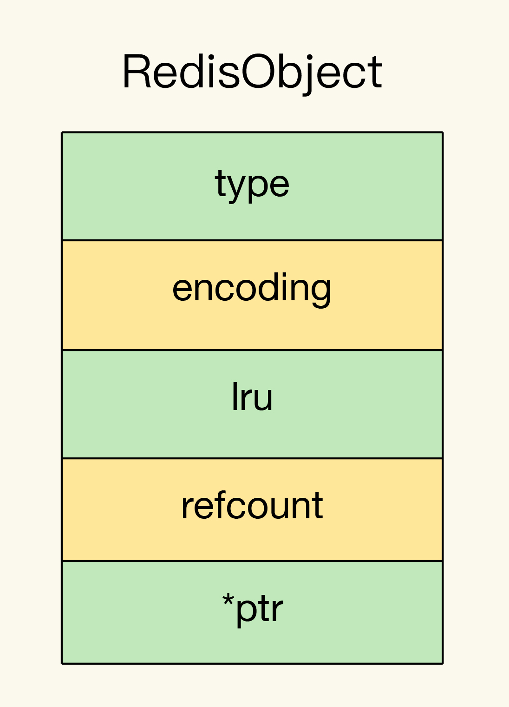

## 11 | “万金油“的 String ，为什么不好用了？

总结一下，文章中以一个真实的案例来陈述 String 类型存储数据的短板，就是值浪费空间大。保存数据的元空间甚至比真实数据还要多，存储一亿个 十位整数的Key以及val，一般情况用 16字节即可存储所有数据，但是因为 存储数据用到 RedisObject 所以要浪费掉一部分空间来存储元空间信息，len，alloc，这两位大概占用8字节，Key和Val单独存储，所以 (8+8) * 2 两个 RedisObject 占用了 32字节，另外数据在全局哈希表上也需要记录，记录上一个元素位置，和key，val地址，3 * 8=24字节，但是由于 Redis 使用的内存分配器，所以会分配2的次方的空间，也就是实际上分配了 32字节，32+32=64，存储一个10位整数的key、val String 需要占用64字节，而真实元素大小只需要 16字节。浪费了大部分在元空间上。一亿个大概就是 5.96G，这个时候浪费的空间就达到了 4.4G。所以再存储一大批整数数据的时候尽量不使用 String 类型。而 Redis 有一种节省内存开销的数据类型，那就是 ziplist 压缩列表，压缩列表将元素连续的存储在一个数组中，减少了许多的元空间以及内存碎片。但是有个问题就是ziplist只能使用在集合中，比如 list、sortset、hash，但是明显key、val是一一对应的，这个时候可以使用二级编码，及使用hash集合类型，key前7位代表hash集合的key，而后3位代表子集的key。这样就能使用集合类型来存储一对一情况下的数据，这里有个细节就是redis中有个参数控制集合类型存放多少元素的时候将底层结构使用压缩列表，超过这个值的话就会转为其他的结构。

```bash
-- 集合元素小于这个数则用压缩列表存储
hash-max-ziplist-entries 512
-- 集合元素占用字节小于这个数则用压缩列表存储
hash-max-ziplist-value 64
```

下面详细说一下其中的细节

### **为什么** **String** **类型内存开销大？**

String 类型是怎么保存数据的，一般会有 int、SDS、

当保存64位有符号整数时，String类型会把这个数当成8字节的 Long 类型整数保存，这种方法叫做 int 编码方式。

当保存的数据中有其他字符，字母特殊符号啥的，String 类型就会用简单动态字符串来保存（Simple Dynamic String、SDS），下面是 SDS 内部存储结构


- **len：**占用4个字节，代表字符串已用的大小。
- **alloc：**给SDS分配了多少空间，也是以字节为单位。
- **buf：**字节数组，Redis会在数组结尾自动加上 \0代表结束，所以说会多占用1个字节。

对于上面这个结构来说，len 和 alloc 属于额外开销，而且每个结构都会多出来这样一些。

而 SDS 外面其实还有一层 RedisObject，他作为一种基类，其中包含了最后一次访问时间，被引用的次数等，里面有个指针指向真实的数据。

下面是RedisObject 的结构展示。


- 元数据：包含最后一次访问时间等...
- ptr：其实就是指向真实数据的指针

为了节省空间，Redis为Long整数和SDS专门做了设计。

简单来说就是 int、embstr、raw编码方式

- **int：**当 String 保存的是整数数据，则直接存储整数数据。
- **embstr：**当存放的是字符串而且小于等于44字节则将sds和RedisObject 存储在一起，快速访问减少内存碎片。
- **raw：**当字符串大于44字节，则不存放一起。


当然浪费空间的地方还没完，当数据想要被Redis快速检索到，就要在全局哈希表上报道，也就是创建一个 dictEntry 的对象，dictEntry  的数据结构图如下所示。


- ***key：**存放 key 的 RedisObject 内存地址
- ***value：**存放 value的 RedisObject 内存地址
- ***next：**存放链表下一个元素的地址

虽然这三个指针是每个占用 8字节，3*8=24字节，但是由于 Redis 内存分配器使用的是 jemalloc 所以说分配为大于等于该大小的最小二次幂，24 -> 32。

好家伙，这就发现原来不知不觉每个对象浪费这么多空间，对于内存非常敏感的 Redis 那必然是不能接受的。


### **用什么数据结构可以节省内存？**

Redis 中有一种数据结构叫做 ziplist 压缩列表，底层数据结构如下图


- zlbytes：列表长度。
- zltail：列表尾的偏移量、
- zllen：列表元素个数。
- entry：
  - prev_len：前一个 entry 的大小，值为1字节或5字节，前一个元素小于254字节用1字节，反之用5字节。
  - encoding：表示编码方式，1字节。
  - len：表示自身长度，4字节。
  - content（上图写错成了 key）：保存实际数据。
- zlend：表示列表结束。

因为数据是在数组中存储的，不需要指针连接来占用额外开销。

下面计算一下用 entry 来保存一个对象占用的大小，prev_len 使用1，encoding 也是1，自身长度为 4，content 也是 8，所以 1+1+4+8=14，实际分配16。

而且使用二级编码的方式，减少了 key 和 dictEntry  的产生，而 key 依旧使用 int 编码方式的 RedisObject 表示，这是没法避免的。也减少了一部分的额外空间。


### **如何用集合类型保存单值的键值对？**

简单来说就是二级编码，将单值的key进行拆分，前7位作为 hash 的 key，后3位作为hash内部元素的 key，当然为什么使用后 3位作为内部元素的 key 是有讲究的，因为 Redis 中的 Hash 是使用 ziplist 压缩列表或 hashtable 哈希表来存储的，具体转化逻辑是使用下面这个配置项来决定。此时我们设置的 1000，所以要保证子元素个数在 1000 以内，3 位的话最多 999，所以满足我们的需求。


### 问题

保存图片的例子，除了用String和Hash存储之外，还可以用Sorted Set存储（勉强）。

 Sorted Set与Hash类似，当元素数量少于zset-max-ziplist-entries，并且每个元素内存占用小于zset-max-ziplist-value时，默认也采用ziplist结构存储。我们可以把zset-max-ziplist-entries参数设置为1000，这样Sorted Set默认就会使用ziplist存储了，member和score也会紧凑排列存储，可以节省内存空间。 

使用zadd 1101000 3302000080 060命令存储图片ID和对象ID的映射关系，查询时使用zscore 1101000 060获取结果。 

但是Sorted Set使用ziplist存储时的缺点是，这个ziplist是需要按照score排序的（为了方便zrange和zrevrange命令的使用），所以在插入一个元素时，需要先根据score找到对应的位置，然后把member和score插入进去，这也意味着Sorted Set插入元素的性能没有Hash高（这也是前面说勉强能用Sorte Set存储的原因）。而Hash在插入元素时，只需要将新的元素插入到ziplist的尾部即可，不需要定位到指定位置。 

不管是使用Hash还是Sorted Set，当采用ziplist方式存储时，虽然可以节省内存空间，但是在查询指定元素时，都要遍历整个ziplist，找到指定的元素。所以使用ziplist方式存储时，虽然可以利用CPU高速缓存，但也不适合存储过多的数据（hash-max-ziplist-entries和zset-max-ziplist-entries不宜设置过大），否则查询性能就会下降比较厉害。整体来说，这样的方案就是时间换空间，我们需要权衡使用。 

当使用ziplist存储时，我们尽量存储int数据，ziplist在设计时每个entry都进行了优化，针对要存储的数据，会尽量选择占用内存小的方式存储（整数比字符串在存储时占用内存更小），这也有利于我们节省Redis的内存。还有，因为ziplist是每个元素紧凑排列，而且每个元素存储了上一个元素的长度，所以当修改其中一个元素超过一定大小时，会引发多个元素的级联调整（前面一个元素发生大的变动，后面的元素都要重新排列位置，重新分配内存），这也会引发性能问题，需要注意。 

另外，使用Hash和Sorted Set存储时，虽然节省了内存空间，但是设置过期变得困难（无法控制每个元素的过期，只能整个key设置过期，或者业务层单独维护每个元素过期删除的逻辑，但比较复杂）。而使用String虽然占用内存多，但是每个key都可以单独设置过期时间，还可以设置maxmemory和淘汰策略，以这种方式控制整个实例的内存上限。 所以在选用Hash和Sorted Set存储时，意味着把Redis当做数据库使用，这样就需要务必保证Redis的可靠性（做好备份、主从副本），防止实例宕机引发数据丢失的风险。而采用String存储时，可以把Redis当做缓存使用，每个key设置过期时间，同时设置maxmemory和淘汰策略，控制整个实例的内存上限，这种方案需要在数据库层（例如MySQL）也存储一份映射关系，当Redis中的缓存过期或被淘汰时，需要从数据库中重新查询重建缓存，同时需要保证数据库和缓存的一致性，这些逻辑也需要编写业务代码实现。 

总之，各有利弊，我们需要根据实际场景进行选择。


Redis 配置文件

```bash
# Redis hash数据类型中单个对象的 hashKey个数 超过这个阈值则从 ziplist 转化为 hash 表，默认值 512
hash-max-ziplist-entries 1000
hash-max-ziplist-value 64
```


JavaDemo

```java
private static void allString() {
    int n = 1000000;
    Jedis jedis = new Jedis("127.0.0.1",6379);
    for (int i = 0; i < n; i++) {
        String allKey = RandomUtil.randomNumbers(8);
        String val = RandomUtil.randomNumbers(8);
        jedis.set(allKey,val);
    }
}

private static void hSet() {
    int n = 1000000;
    Jedis jedis = new Jedis("127.0.0.1",6379);
    for (int i = 0; i < n; i++) {
        String allKey = RandomUtil.randomNumbers(8);
        String val = RandomUtil.randomNumbers(8);
        String key = allKey.substring(0, 5);
        String hashKey = allKey.substring(5);
        jedis.hset(key, hashKey, val);
    }
}
```


实测效果

```bash
# 在插入100w个String键值对之前
used_memory:742824
# 插入100w个String键值之后
used_memory:88782264
# 最终占用 83M

# 清空数据库
used_memory:710416
# 使用二级编码后插入 100w对元素
used_memory:19956208
# 最终占用 18M
```


## **12 |** 有一亿个 keys 要统计，应该用哪种集合？

这节的主要内容是集合，首先说了集合的使用场景，一对多的情况下大部分都可以使用集合。还有几种统计需求，比如聚合统计 交并补差集，以及排序需求 按插入顺序或权重排序，二值存储，常见的有签到情况、性别、等true、false 的场景都可以使用 Bitmap来存储，因为底层使用的是位来进行数据存储，单个数据只用占一位。最后还有一个基数统计，比如UV，统计某个页面一天内被多少人访问了，没有使用整数自增是因为单个用户需要去重，所以说可以使用 Set，但是 Set 存储很耗费空间，如果不是需要对数据做精细化管理，可以使用 Redis 提供的 Hypperloglog 但是由于 Hyperloglog是使用概率统计，所以会有一点的误差率。


### **常用的集合统计模式**

#### **聚合统计**

对数据进行交并差补集，

如果想记录一个网站的，累计用户信息，以及每日新增用户，和每日留存用户。

可以使用一个 key 为 user:id 的 Set 集合来保存所有用户id。


每日登录的用户信息用一个 key 为 `user:id:时间戳` 的 Set 集合来保存


当需要累计用户的时候可以使用并集命令，将每天的访问用户统计到累计访问用户中。

```bash
# 并集计算
# SUNIONSTORE 输出到key(会覆盖原来的内容) 源key1、源key2...
SUNIONSTORE user:id user:id user:id:20200803
```

当需要计算每日新增用户的时候可以计算累计用户和当日用户的差集

```bash
# 差集计算
# SDIFFSTORE 输出到key(会覆盖原来的内容) 源key1、源key2...
SDIFFSTORE user:new user:id:20200804 user:id
```

当需要统计留存数的时候可以计算前天和昨天的交集

```bash
# 交集计算
# SINTERSTORE 输出到key(会覆盖原来的内容) 源key1、源key2...
SINTERSTORE user:id:rem user:id:20200803 user:id:20200804
```

如果数据量比较小的话获得计算后的数据确实很好，但是计算量比较大的情况下就不建议直接在Redis处理了，因为 Redis 是单线程处理数据的，复杂的计算会堵塞住主线程，导致无法响应其他客户端，如果有主从库的情况下可以单独用一个从库进行聚合运算，或者直接在客户端对数据进行局和处理。


#### **排序统计**

Redis 集合类型中支持排序的只有两种，List 和 SortedSet

- List：按插入顺序排序，有一个弊端就是当新增或删除其中一个元素的时候，再次按照区间读取可能会出问题，不适合以具体值为区间排序，比如时间、温度等。
- SortedSet：按权重排序，这样也就规避了范围读取中的问题，适合在按照时间排序获取等场景下使用。


#### 二值状态统计

Redis 中的 Bitmap 可以记录二值状态，意思就是 true false，比如用户的签到记录，每一天的签到记录只需要使用一位来记录，而一年只需要 365位来记录，相对于 String 类型非常的节省内存空间，数据越大越明显。

Bitmap 底层使用 String 类型作为数据结构，把 String 底层的字节数组中的每个 bit 利用起来，用来表示一个元素的二值状态。所以在操作的时候我们需要传入 offset 偏移量来作为下标。

另外 Bitmap 提供了 BitCount 来计算单个对象中 1 的个数。


**设置用户签到状态**

```bash
# SETBIT key offset 值(0|1)
SETBIT uid:sign:3000:202008 2 1
```

**获取用户签到状态**

```bash
# GETBIT key offset
GETBIT uid:sign:3000:202008 2
```

**统计用户签到状态**

```bash
# BITCOUNT key
BITCOUNT uid:sign:3000:202008
```


Bitmap 还提供了 BITOP 方法，可以对 Bitmap 进行与或非的运算。


**有个问题是统计一亿个人有多少是连续签到的？**

这个问题用上面的 BITOP 方法可以解决，每天的所有人签到情况作为一个 key，每个 key 有一亿个 位，相当于一个月就有30个key，将所有的 key 进行与操作，也就是说每一列只要有一个 0 那么最终结果就是 0，最后统计与之后结果中 1 的个数，就是这个月连续签到的人的个数。


#### **基数统计**

很多网站都能看到被访问量（独立访客）等信息，简单的实现方式可以用 Set  将用户id存储起来来实现，或者使用 Hash 设置 key:userid 来实现，但是如果数据量太大的情况下使用 Set 或 Hash 存储就会很头疼了，比如上亿的数据量，会消耗太多的空间。

Redis 提供了一种扩展类型 HyperLogLog，每个 HyperLogLog 只占用 12KB的内存，但是可以存储 2^64个元素基数。

**新增页面 uv**

```bash
# PFADD key value...
PFADD page1:uv user1 user2 user3 user4 user5
```

**统计页面 uv**

```
# PFCOUNT key
PFCOUNT page1:uv
```


### 小结


### 问题

使用Sorted Set可以实现统计一段时间内的在线用户数：用户上线时使用zadd online_users $timestamp $user_id把用户添加到Sorted Set中，使用zcount online_users $start_timestamp $end_timestamp就可以得出指定时间段内的在线用户数。 

如果key是以天划分的，还可以执行zinterstore online_users_tmp 2 online_users_{date1} online_users_{date2} aggregate max，把结果存储到online_users_tmp中，然后通过zrange online_users_tmp 0 -1 withscores就可以得到这2天都在线过的用户，并且score就是这些用户最近一次的上线时间。 

还有一个有意思的方式，使用Set记录数据，再使用zunionstore命令求并集。例如sadd user1 apple orange banana、sadd user2 apple banana peach记录2个用户喜欢的水果，使用zunionstore fruits_union 2 user1 user2把结果存储到fruits_union这个key中，zrange fruits_union 0 -1 withscores可以得出每种水果被喜欢的次数。 

使用HyperLogLog计算UV时，补充一点，还可以使用pfcount page1:uv page2:uv page3:uv或pfmerge page_union:uv page1:uv page2:uv page3:uv得出3个页面的UV总和。 

另外，需要指出老师文章描述不严谨的地方：“Set数据类型，使用SUNIONSTORE、SDIFFSTORE、SINTERSTORE做并集、差集、交集时，选择一个从库进行聚合计算”。这3个命令都会在Redis中生成一个新key，而从库默认是readonly不可写的，所以这些命令只能在主库使用。想在从库上操作，可以使用SUNION、SDIFF、SINTER，这些命令可以计算出结果，但不会生成新key。 

最后需要提醒一下： 

1、如果是在集群模式使用多个key聚合计算的命令，一定要注意，因为这些key可能分布在不同的实例上，多个实例之间是无法做聚合运算的，这样操作可能会直接报错或者得到的结果是错误的！ 

2、当数据量非常大时，使用这些统计命令，因为复杂度较高，可能会有阻塞Redis的风险，建议把这些统计数据与在线业务数据拆分开，实例单独部署，防止在做统计操作时影响到在线业务。


## 13 | GEO 是什么？还可以定义新的数据类型吗？

这节的内容是介绍了Redis中扩展类型 GEO 的使用和原理，对于经纬度存储查询非常的方便，后面还介绍了如何在Redis 中定义一个自定义类型，但是我觉得...目前来说对我还不是很用的上，暂时不总结这个了。


### **面向** **LBS** **应用的** **GEO** **数据类型**

现在的软件开发越来越离不开位置服务，附近的人、附近的餐厅、附近吃饭的地。这些其实都是位置信息服务（Location-Based Service，LBS）的应用。所以说了解 LBS 对软件开发有很好的帮助。

#### **GEO** **的底层结构**

想要了解一个东西的底层结构，可以先了解该结构的访问特点。

以叫车服务为例，我们一般需要知道乘客、车各自的位置信息和id。

1. 乘客发送自己的位置信息到后端服务
2. 后端服务根据位置信息查询附近的车辆信息，并发送接单或根据最近车辆派单服务
3. 后端将车辆和用户进行绑定，给用户发送车辆信息及路程信息。

对于车辆的信息，其实就是 车辆的id和经纬度的存储，将所有车辆位置信息保存在一个 key 里用 **Hash** 类型存储可以有效的减少内存占用（参考上面 ziplist 使用）以及查询速度（不需要 keys 检索）。


Hash 类型似乎能满足我们的存储需求，但是如果要进行范围查询岂不是需要将所有的元素都拿出来匹配一次，这样其实效率会特别差，并且 Redis 也无法完成这个操作，所以我们相当于将所有数据拿到后端处理，效率肯定会特别差。

那使用 **SortedSet** 效果如何

下图可以看到其实已经差不多了，只不过 SortedSet 的权重不能是一组数据或者是字符串数据，我们需要将经纬度转化为具体的权重值，这样就能满足我们的使用了。


#### **GeoHash** **的编码方法**

经纬度转化为权重其实是使用的 GeoHash 方法，这个方法的基本原理就是“二分区间，区间编码”。

简单来说就是对 经纬度分别进行 N 次二分，在左区间就将该次值设置为0，反之为1，最后将经纬度编码值组合一下。

以 (116.37,39.86) 为例


刚刚计算出 (116.37,39.86) 编码为 11010 和 10111，然后将其进行组合得到 1110011101


这个值就可以当做 SortedSet 的权重了

其实编码就是将经纬度变成了一个个小格子，每个格子代表一个分区。相邻方格的编码也是相近的。


#### **如何操作** **GEO** **类型？**


- GEOADD：添加经纬度
- GEORADIUS：根据范围查询经纬度

按照叫车场景举例

添加车辆位置信息

```bash
# GEOADD key longitude latitude member [longitude latitude member ...]
GEOADD cars:locations 116.034579 39.030452 33
```

查询用户经纬度附近的车辆

```bash
# GEORADIUS key longitude latitude radius m|km|ft|mi [WITHCOORD] [WITHDIST] [WITHHASH] [COUNT count] [ASC|DESC] [STORE key] [STOREDIST key]
GEORADIUS cars:locations 116.054579 39.030452 5 km ASC COUNT 10
```


**JavaDemo**

```java
private static void testGeo() {
        Jedis jedis = new Jedis("127.0.0.1", 6379);
        jedis.geoadd("cars:locations", 116.034579, 39.030452, "20");
        GeoRadiusParam geoRadiusParam = new GeoRadiusParam();
        geoRadiusParam.sortAscending();
        geoRadiusParam.count(10);
        List<GeoRadiusResponse> geoRadius = jedis.georadius("cars:locations", 116.054579, 39.030452, 5, GeoUnit.KM, geoRadiusParam);
        geoRadius.stream().forEach(e -> {
            log.info("geoRadius：{}，member：{}，distance：{}，coordinate：{}，rawScore：{}", e.toString(), e.getMemberByString(), e.getDistance(), e.getCoordinate(), e.getRawScore());
        });
    }
```


### **如何自定义数据类型？**

当Redis的基本类型和扩展类型不能满足我们需求的时候，我们就可以考虑自定义数据类型了。


#### **Redis** **的基本对象结构**

基本对象指的是 RedisObject


```c
typedef struct redisObject {
    unsigned type:4; // 值的类型，一般就是五大基本类型
    unsigned encoding:4;  // 具体实现结构
    unsigned lru:LRU_BITS;  // 最后一次访问时间
    int refcount; // 引用次数
    void *ptr; // 指向数据的指针
} robj;
```




#### **开发一个新的数据类型**


### 问题

Redis也可以使用List数据类型当做队列使用，一个客户端使用rpush生产数据到Redis中，另一个客户端使用lpop取出数据进行消费，非常方便。但要注意的是，使用List当做队列，缺点是没有ack机制和不支持多个消费者。没有ack机制会导致从Redis中取出的数据后，如果客户端处理失败了，取出的这个数据相当于丢失了，无法重新消费。所以使用List用作队列适合于对于丢失数据不敏感的业务场景，但它的优点是，因为都是内存操作，所以非常快和轻量。 

而Redis提供的PubSub，可以支持多个消费者进行消费，生产者发布一条消息，多个消费者同时订阅消费。但是它的缺点是，如果任意一个消费者挂了，等恢复过来后，在这期间的生产者的数据就丢失了。PubSub只把数据发给在线的消费者，消费者一旦下线，就会丢弃数据。另一个缺点是，PubSub中的数据不支持数据持久化，当Redis宕机恢复后，其他类型的数据都可以从RDB和AOF中恢复回来，但PubSub不行，它就是简单的基于内存的多播机制。 

之后Redis 5.0推出了Stream数据结构，它借鉴了Kafka的设计思想，弥补了List和PubSub的不足。Stream类型数据可以持久化、支持ack机制、支持多个消费者、支持回溯消费，基本上实现了队列中间件大部分功能，比List和PubSub更可靠。 

另一个经常使用的是基于Redis实现的布隆过滤器，其底层实现利用的是String数据结构和位运算，可以解决业务层缓存穿透的问题，而且内存占用非常小，操作非常高效。


## **14 |** 如何在 Redis 中保存时间序列数据？

本节主要是按照业务场景来开展的，有一个机房设备监控需求，需要对大数据进行记录并聚合计算。Redis 目前没有专门的类型来对时间序列数据进行记录计算等。

所以可以使用 Hash 配合 SortedSet 来对数据进行存储计算。


### **时间序列数据的读写特点**

首先根据数据大规模一直写入的需求，我们要让写操作尽可能的快，Redis 的 String 和 Hash 写复杂度都是 O（1），但是 String 不适合大批量数据的写入，因为元空间会浪费很多一部分的内存。时间序列的读操作需要涉及到范围查询，所以值可以用 SortedSet 来存储。所以暂定为两种方案，1.基于Hash和SortedSet存储数据，2.基于 RedisTimeSeries 模块实现。

#### **基于** **Hash** **和** **Sorted Set**  保存时间序列数据

为什么要使用两种类型来保存一组数据？以为要借助两个类型的优点，组合模式来使用。

Hash类型查询比较快，我们可以将时间戳作为 Hash 的 key，


这样的话我们想查询某个设备多个时间点的状态只需要使用 HGET 或 HMGET 即可。

但是这样有个弊端就是，如果我们想查询 某个时间段的状态，Hash 类型是没法实现的。如果只用 Hash 就想实现范围查询就必须要将所有时间戳返回给客户端，客户端处理完之后再到 Redis 去获取。

为了支持范围查询我们可以使用 SortedSet 来拟补这个短板。

使用时间戳作为权重，这样就可以使用 ZRANGE 进行范围查询了。


现在多个时间点和范围查询都可以完成了，不过又有了一个问题，同一份数据要写到两个地方，我们就要保证数据的原子性。Redis 是支持事务的，不过不支持回滚，详细内容后面再讲。

- MULTI：声明一个事务的开始，后续所有命令都将存放到一个队列里执行。
- EXEC：统一执行队列中的命令。

下面是事务执行流程


```bash
127.0.0.1:6379> MULTI 
OK
127.0.0.1:6379> HSET device:hash:temperature 202008030911 26.8 
QUEUED 
127.0.0.1:6379> ZADD device:zset:temperature 202008030911 26.8 
QUEUED
127.0.0.1:6379> EXEC 
1) (integer) 1 
2) (integer) 1
```

通过事务也能保证了原子性，但是 聚合计算貌似就无法保证了。

如果只用 Hash + SortedSet 方案，聚合计算就只能交给客户端去处理，频繁的传输大量数据会占用带宽甚至会堵塞线程。


#### 基于 RedisTimeSeries 模块保存时间序列数据

RedisTimeSeries 是 Redis 的一个扩展模块。它专门面向时间序列数据提供了数据类型和访问接口，并且支持在 Redis 实例上直接对数据进行按时间范围的聚合计算。

因为 RedisTimeSeries 不属于 Redis 的内建功能模块，在使用时，我们需要先把它的源码单独编译成动态链接库 redistimeseries.so，再使用 loadmodule 命令进行加载，如下所示：

```
loadmodule redistimeseries.so
```

当用于时间序列数据存取时，RedisTimeSeries 的操作主要有 5 个：

- 用 TS.CREATE 命令创建时间序列数据集合
- 用 TS.ADD 命令插入数据
- 用 TS.GET 命令读取最新数据
- 用 TS.MGET 命令按标签过滤查询数据集合
- 用 TS.RANGE 支持聚合计算的范围查询


**1. 用 TS.CREATE 命令创建一个时间序列数据集合**

在 TS.CREATE 命令中，我们需要设置时间序列数据集合的 key 和数据的过期时间（以毫秒为单位）。此外，我们还可以为数据集合设置标签，来表示数据集合的属性。

例如，我们执行下面的命令，创建一个 key 为 device:temperature、数据有效期为 600s的时间序列数据集合。也就是说，这个集合中的数据创建了 600s 后，就会被自动删除。最后，我们给这个集合设置了一个标签属性{device_id:1}，表明这个数据集合中记录的是属于设备 ID 号为 1 的数据。

```
TS.CREATE device:temperature RETENTION 600000 LABELS device_id 1 
OK
```


**2. 用 TS.ADD 命令插入数据，用 TS.GET 命令读取最新数据**

我们可以用 TS.ADD 命令往时间序列集合中插入数据，包括时间戳和具体的数值，并使用TS.GET 命令读取数据集合中的最新一条数据。

例如，我们执行下列 TS.ADD 命令时，就往 device:temperature 集合中插入了一条数据，记录的是设备在 2020 年 8 月 3 日 9 时 5 分的设备温度；再执行 TS.GET 命令时，就会把刚刚插入的最新数据读取出来。

```
TS.ADD device:temperature 1596416700 25.1 
1596416700 
TS.GET device:temperature 
25.1
```


**3. 用 TS.MGET 命令按标签过滤查询数据集合**

在保存多个设备的时间序列数据时，我们通常会把不同设备的数据保存到不同集合中。此时，我们就可以使用 TS.MGET 命令，按照标签查询部分集合中的最新数据。在使用TS.CREATE 创建数据集合时，我们可以给集合设置标签属性。当我们进行查询时，就可以在查询条件中对集合标签属性进行匹配，最后的查询结果里只返回匹配上的集合中的最新数据。

举个例子。假设我们一共用 4 个集合为 4 个设备保存时间序列数据，设备的 ID 号是 1、2、3、4，我们在创建数据集合时，把 device_id 设置为每个集合的标签。此时，我们就可以使用下列 TS.MGET 命令，以及 FILTER 设置（这个配置项用来设置集合标签的过滤条件），查询 device_id 不等于 2 的所有其他设备的数据集合，并返回各自集合中的最新的一条数据。

```
TS.MGET FILTER device_id!=2 
1) 1) "device:temperature:1" 
	2) (empty list or set) 
	3) 1) (integer) 1596417000 
	2) "25.3" 
2) 1) "device:temperature:3" 
	2) (empty list or set) 
	3) 1) (integer) 1596417000 
		2) "29.5" 3) 1) "device:temperature:4" 2) (empty list or set) 
		3) 1) (integer) 1596417000 2)
```


**4. 用 TS.RANGE 支持需要聚合计算的范围查询**

最后，在对时间序列数据进行聚合计算时，我们可以使用 TS.RANGE 命令指定要查询的数据的时间范围，同时用 AGGREGATION 参数指定要执行的聚合计算类型。RedisTimeSeries 支持的聚合计算类型很丰富，包括求均值（avg）、求最大 / 最小值（max/min），求和（sum）等。

例如，在执行下列命令时，我们就可以按照每 180s 的时间窗口，对 2020 年 8 月 3 日 9时 5 分和 2020 年 8 月 3 日 9 时 12 分这段时间内的数据进行均值计算了。

```
TS.RANGE device:temperature 1596416700 1596417120 AGGREGATION avg 180000 
1) 1) (integer) 1596416700 
	2) "25.6" 
2) 1) (integer) 1596416880 
	2) "25.8" 
3) 1) (integer) 1596417060 
	2) "26.1"
```

与使用 Hash 和 Sorted Set 来保存时间序列数据相比，RedisTimeSeries 是专门为时间序列数据访问设计的扩展模块，能支持在 Redis 实例上直接进行聚合计算，以及按标签属性过滤查询数据集合，当我们需要频繁进行聚合计算，以及从大量集合中筛选出特定设备或用户的数据集合时，RedisTimeSeries 就可以发挥优势了。


### **小结**

主要内容是如何存储时间序列数据，有两种方案 1.Hash+SortedSet，2.扩展项目 RedisTimeSeries 。

其中 Hash+SortedSet 需要保证原子性而引入了事务，而 RedisTimeSeries 是外部项目需要编译链接到 Redis 中。如果数据量不是很大可以勉强用第一种方案，因为实施起来比较简单，而且基本类型的质量也保证了可用性。数据库大以及频繁聚合可以使用第二种方案。


### 问题

使用Sorted Set保存时序数据，把时间戳作为score，把实际的数据作为member，有什么潜在的风险？ 

我目前能想到的风险是，如果对某一个对象的时序数据记录很频繁的话，那么这个key很容易变成一个bigkey，在key过期释放内存时可能引发阻塞风险。所以不能把这个对象的所有时序数据存储在一个key上，而是需要拆分存储，例如可以按天/周/月拆分（根据具体查询需求来定）。当然，拆分key的缺点是，在查询时，可能需要客户端查询多个key后再做聚合才能得到结果。 

如果你是Redis的开发维护者，你会把聚合计算也设计为Sorted Set的内在功能吗？ 

不会。因为聚合计算是CPU密集型任务，Redis在处理请求时是单线程的，也就是它在做聚合计算时无法利用到多核CPU来提升计算速度，如果计算量太大，这也会导致Redis的响应延迟变长，影响Redis的性能。Redis的定位就是高性能的内存数据库，要求访问速度极快。所以对于时序数据的存储和聚合计算，我觉得更好的方式是交给时序数据库去做，时序数据库会针对这些存储和计算的场景做针对性优化。 

另外，在使用MULTI和EXEC命令时，建议客户端使用pipeline，当使用pipeline时，客户端会把命令一次性批量发送给服务端，然后让服务端执行，这样可以减少客户端和服务端的来回网络IO次数，提升访问性能。


## 15 | 消息队列的考验： Redis 有哪些解决方案？

这节的主要内容就是用 Redis 来实现消息队列，首先第一个问题就是消息队列是什么，消息队列中一般分为三个东西，生产者、消费者、消息中间件，也就是说生产者将消息发送到消息存储体，然后消费者到消息中间件里拉。但是最基础的一个消息队列都要有三点要求，1.数据的有序性，2.不可重复消费，3.异常宕机之后能恢复消费。Redis中有两个数据类型可以完成上面三点要求，List 和 Streams（Redis5.0之后的，Windows版本的Redis就用不上了）。首先就是 List实现，生产者使用 LPUSH 将消息插入到 List 中，消费者通过 RPOP 来拿到最右端（最早的）的一条消息，之后进行处理，这样就完成了消息的有序性。客户端在消费消息的时候一般是循环遍历是否有消息，也就是不停地调用 RPOP，这样会浪费CPU资源，Redis提供了 BRPOP 命令，堵塞提取消息，这样就不会浪费CPU资源，Redis通过自增ID或者在客户端生成唯一ID，然后在 Redis 中维护一个已消费消息 ID 的 Set，消费者在消费前先校验ID是否在 IDSet 中，如果不在则可以消费。灾难恢复实际上是使用了一个备份队列，在消费者提取消息的时候使用 RPOPLPSH 或 BRPOPLPSH 将已经拿到的数据新增到备份队列，异常宕机后可以从备份队列中重新消费。Streams 是 Redis5.0 专门为了消息队列而设计的一个数据类型，不仅支持生产者消费者一对一，还支持 GROUP 类型的一对多，但是这并不是 topic，GROUP 的出现只是因为消费者的速度跟不上生产者所以设计的。Streams 常用的命令 XADD 添加一条消息，在添加一条消息的时候可以指定一个消息 ID，也可以使用参数 * 自动生成一个 ID，自动生成的数据格式为 当前服务器时间毫秒数-当前时间点第几个消息，比如 1650114504881-0；XREAD 提取消息，XACK确认消费消息。


### **消息队列的消息存取需求**

**分布式系统**中，两个组件之间通讯，完成**异步任务**。


生产者 --> 消息队列 --> 消费者


消息队列主要是为了 异步架构、服务解耦、削峰填谷等，是分布式系统中非常重要的中间件。

不过保证消息队列正常使用要满足三个需求。

#### 需求一：消息保序

如果存取之间没有顺序，可能会造成业务上的异常。如果是对数据进行修改的操作，不保序的情况下可能会发生读取数据异常。


